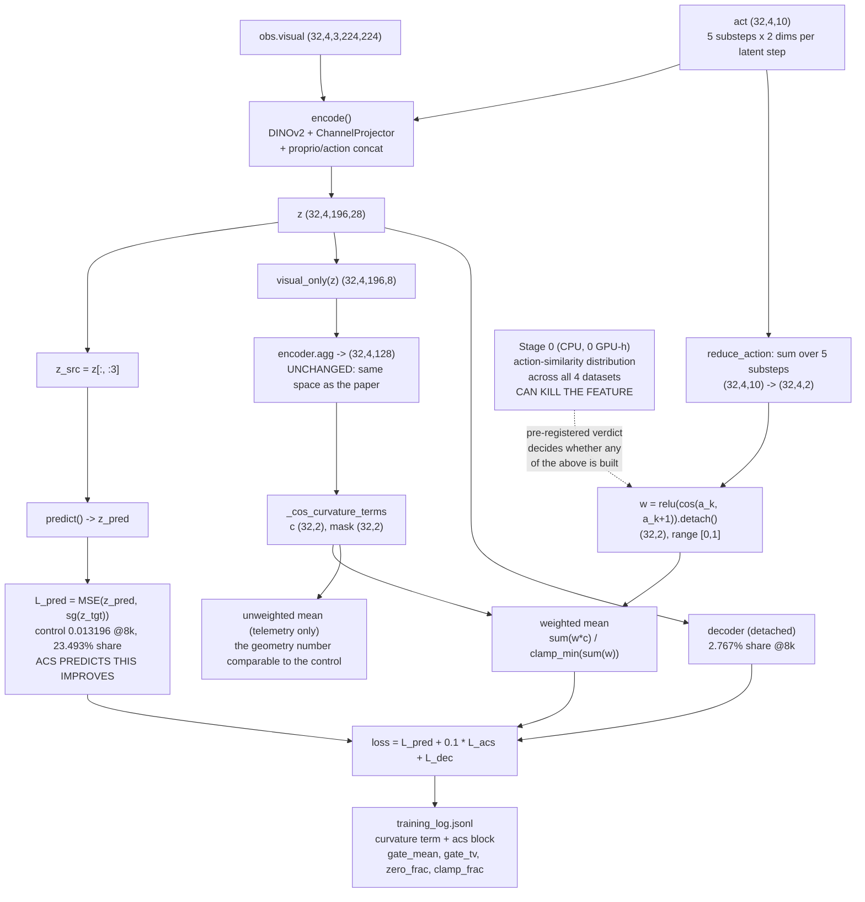
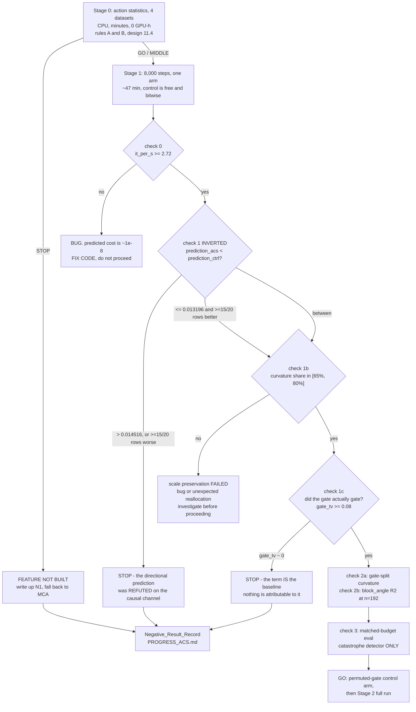

# Design Document: Action-Conditioned Straightening (ACS)

## Overview

ACS modifies the paper's straightening regularizer so that the straightening pressure on a latent
transition is **weighted by how similar the controlling actions are**. The paper's term is

```
L_curv = mean_t [ 1 - cos(v_t, v_{t+1}) ],     v_t = z_{t+1} - z_t   (aggregated 128-d space)
```

ACS replaces the plain mean with a gate-weighted mean over the same per-triple values:

```
L_acs = Σ_t w_t · c_t / Σ_t w_t,   c_t = 1 - cos(v_t, v_{t+1}),   w_t = relu(cos(a_t, a_{t+1})) ∈ [0,1]
```

**The gap this targets is in the paper's premise, not its formula.** Perceptual straightening is a
hypothesis about **passive natural video**
([Hénaff et al. 2019](https://link.springer.com/10.1038/s41593-019-0377-4);
[V1 straightens natural movie trajectories](https://link.springer.com/10.1038/s41467-021-25939-z)).
There is no controller: the world evolves smoothly on its own and straightness is the right prior.
The paper transplants that prior to an **actively controlled agent trained on random, suboptimal
rollouts**, where a direction change in the latent velocity is often the *correct* representation of
a change in action. `1 - cos(v_t, v_{t+1})` penalizes it regardless, so the regularizer asks the
encoder to make differently-acted transitions look collinear — destroying exactly the
action-discriminability the predictor needs.

**Relationship to the on-hold sibling spec.** `.kiro/specs/temporal-metric-regularization/design.md`
(TMR) is **on hold**; ACS supersedes it as the primary direction. This design reuses TMR's
infrastructure verbatim where it applies: the bitwise-matched 8k control (`checkpoints_ctrl8k`), the
early-read gate's checks 0-3 and their mechanization through `summarize_training_log.py
--prediction-gate`, the measured-not-derived calibration discipline, the default-off / additive-only
scope rules, the operational traps, the honesty conventions and the Negative_Result_Record shape.
**One thing is inverted, and it is the most important difference in this document: prediction loss
changes from a guard into a positive directional prediction** (§13.2).

**TMR's MCA arm remains available as a cheap orthogonal fallback.** `compute_mca` is already written
in `models/visual_world_model.py`, has never been run, costs `<0.1%` overhead and 0.8 GPU-h to a
verdict, targets a *different* gap (the regularization-space versus planning-space mismatch), and is
rotation-neutral. If ACS fails its gate, MCA is the next cheapest informative experiment in the
repository and requires no new code.

Target cell: PushT, `DINOv2 (patch)+proj, 14x14x8, L_curv ✓`. Paper 77.33 OL / 85.33 MPC; our
verified reproduction 75.33 ± 6.11 OL (74, 82, 70) / 82.00 ± 2.00 MPC (82, 80, 84). Operational bar
**79.33 OL and 87.00 MPC**, 3 data-sampling seeds, `n_evals=50`.

**Notation convention.** Python signatures for interfaces and data models, `pascal` blocks for
algorithms — the same convention as the sibling TMR design, so the two documents read as a pair.

---

## Verified Findings (read out of the code, not assumed)

### F1 — what `a_t` actually is at frameskip 5. CONFIRMED.

| what | where | value |
|---|---|---|
| window slicing | `datasets/traj_dset.py:71` | `(i, start, start + num_frames * frameskip)`; frames taken every `frameskip` |
| action packing | `datasets/traj_dset.py:112` | `rearrange(act, "(n f) d -> n (f d)", n=self.num_frames)` |
| `num_frames` | `datasets/pusht_dset.py` `load_pusht_slice_train_val` | `num_hist + num_pred = 3 + 1 = 4` |
| resulting `act` | batch | `(32, 4, 10)` = 4 latent steps × (5 substeps × 2 dims) |

`act[:, t]` holds the **5 env actions taken between frame `t` and frame `t+1`**, because the frames
are at `start, start+5, start+10, start+15` and the action slice is `actions[i, start:start+20]`
reshaped with `n=4`. Therefore `act[:, t]` is exactly the control that produces `v_t = z_{t+1} - z_t`.
`act[:, 3]` drives the transition *out* of the window and is never seen by any curvature triple; the
gate correctly ignores it. (It is still fed to the encoder as the action channels of frame 3 — an
existing quirk of the architecture, not something ACS changes.)

### F2 — PushT actions are *relative displacements*, and normalization nearly preserves direction. CONFIRMED.

`datasets/pusht_dset.py`: `relative=True` by default loads `rel_actions.pth`, divided by
`action_scale=100.0`, then normalized with the hardcoded constants
`ACTION_MEAN = [-0.0087, 0.0068]`, `ACTION_STD = [0.2019, 0.2002]`.

Two consequences that the gate design rests on:

1. Each 2-d env action is a **displacement command for the pusher**, so summing the 5 substeps of a
   latent step is the *net commanded displacement over that step* — a physically meaningful vector,
   not an average of unrelated quantities.
2. `ACTION_STD` is near-isotropic (0.2019 vs 0.2002, a 0.85% anisotropy) and `ACTION_MEAN` is small
   relative to it, so `cos(a_t, a_{t+1})` measured on normalized actions is within a fraction of a
   percent of the same cosine on raw displacements. The gate is not an artifact of the
   normalization.

**And a limitation the motivating story does not mention.** The other three environments carry
*different physical quantities* in `act`: `datasets/point_maze_dset.py` and `datasets/wall_dset.py`
load `actions.pth` and normalize by **data-computed** per-dim mean/std, and PointMaze actions are
forces/velocity commands on a point mass rather than displacement commands. So a cross-environment
comparison of `cos(a_t, a_{t+1})` compares differently-typed variables. This weakens the Stage-0
correlation test beyond the `n = 4` problem and is recorded as such (§11.5, N1).

### F3 — exactly 2 curvature triples per sample, and the existing mask shape. CONFIRMED.

`models/visual_world_model.py`:

- `total_curvature` raises below 3 frames; with `t = 4` it forms `v1 = z[:, 1:-1] - z[:, :-2]` and
  `v2 = z[:, 2:] - z[:, 1:-1]`, both `(b, 2, ·)`.
- In `mode="aggcos"` these live in the **128-d aggregated space** after
  `z = self.encoder.agg(tokens).reshape(b, t, -1)`.
- `_cos_curvature` computes `cos` over `dim=-1`, giving `(b, 2)`; then
  `mask = (step1 > 1e-6) & (step2 > 1e-6)` and `loss = loss[mask]; loss.mean()`.

So the per-triple loss tensor at the target cell is `(32, 2)` = **64 scalars per batch**, and ACS
needs exactly **64 weights** shaped identically, masked identically. Triple `k ∈ {0, 1}` is gated by
`cos(a_k, a_{k+1})`.

`step_thresh=1e-6` is a **hardcoded** constant, not a config knob. That is the precedent this design
follows for the ACS constants.

### F4 — the `straighten` parser silently disables straightening on an unrecognized string. CONFIRMED, and it is a landmine.

`VWorldModel.__init__`:

```python
if isinstance(straighten, str):
    if straighten.startswith("aggcos"): ...
    elif straighten.startswith("cos"):  ...
# no else
self.straighten = self.curvature_mode is not None and self.straighten_scale > 0
```

A typo — or a new mode string added to the config before the parser knows it — leaves
`curvature_mode = None`, `straighten = False`, and the run trains **with no curvature term at all**
while logging `"Straightening disabled"` in a wall of startup lines. That is a silent 12-hour null
run. ACS adds a branch to this parser, so the design must also close the hole (§4.5, §8.3, P13).

### F5 — `probe_ccr_curvature.load_windows` cannot be reused unchanged across environments. CONFIRMED.

```python
if dset.state_dim < len(STATE_DIM_NAMES):
    raise RuntimeError(f"env={train_cfg.env.name} has state_dim={dset.state_dim}, but this probe
                        reports the PushT dimensions ...")
```

`STATE_DIM_NAMES` is the 5-dim PushT pose layout. Wall's `state_dim` is 4, so a naive Stage-0 reuse
of `load_windows` across all four environments **raises on Wall** before measuring anything. Stage 0
therefore adds a separate, action-only loader rather than loosening that guard (§11.2).

### F6 — a new `straighten` mode string gets a distinct run directory for free. CONFIRMED.

`conf/train.yaml` `hydra.run.dir` interpolates
`${replace_substring:${training.straighten},agg,agg${oc.select:encoder.agg_type,}}`. With
`straighten=aggcos1e-1` and `agg_type=mlp` this resolves to `aggmlpcos1e-1`, giving the recorded
baseline directory `pusht_aggmlpcos1e-1_agg32_projchannel_dim8_hw14_sgTrue_lr1e-05`. With
`straighten=acsaggcos1e-1` it resolves to `acsaggmlpcos1e-1` and therefore to a **different
directory**, with **no change to the baseline's name** and no new resolver required for the primary
knob.

### F7 — `run_ccr_pilot.sh` launches an ACS arm with no launcher edit. CONFIRMED.

`add_default training.straighten=aggcos1e-1` goes through `_user_overrides_key`, so a user-supplied
`training.straighten=acsaggcos1e-1` suppresses the default. The whole protocol block (env, encoder,
lr, stop_grad, iteration cap, epochs) applies unchanged.

### F8 — `--prediction-gate` does not exist yet. CONFIRMED.

`summarize_training_log.py` has `--compare`, `--collapse-check`, `--iter`, `--reference-it-per-s`,
`--strict` and others, but **no `--prediction-gate`**. TMR proposed it and TMR was never built, so
ACS must build it. It is the mechanization of the gate's central check and must not be a manual eyeball.

### F9 — the run-collision guard already distinguishes an ACS arm from the baseline. CONFIRMED.

`train.py: LOSS_SIGNATURE_KEYS` already contains `"straighten"`, so `_guard_run_dir` sees
`aggcos1e-1` vs `acsaggcos1e-1` as differing signatures and refuses a silent cross-resume. No work
needed for the primary knob.

---

## Architecture



Everything on the solid paths is inside `models/visual_world_model.py` except telemetry, which is
`train.py`. The dotted path is Stage 0: it writes no code into the model and runs before the loss
exists.

**What is *not* in this diagram, deliberately.** No extra encoder pass. No extra predictor call. No
new module, parameter or buffer. No change of space. No second loss term. The only structural change
to the objective is the reduction used inside the existing curvature term.

---

## Sequence: One Training Step with ACS Enabled

```mermaid
sequenceDiagram
    participant T as Trainer.train_epoch
    participant M as VWorldModel.forward
    participant E as encoder
    participant P as predictor
    participant A as compute_acs

    T->>M: forward(obs, act)
    M->>E: encode(obs, act)
    E-->>M: z (32,4,196,28)
    M->>P: predict(z[:, :3])
    P-->>M: z_pred
    M->>M: z_loss = MSE(z_pred, sg(z_tgt))
    Note over M: curvature_mode == "acsaggcos"
    M->>A: compute_acs(z, act)
    A->>E: agg(visual_only(z)) via _agg_velocities
    E-->>A: v1, v2 (32,2,128)
    A->>A: _cos_curvature_terms -> c (32,2), mask (32,2)
    A->>A: a = reduce_action(act) (32,4,2)
    A->>A: w = relu(cos(a_k,a_k+1)).detach() (32,2)
    A->>A: wm = w[mask]; num = (wm*c[mask]).sum()
    A->>A: den = wm.sum().clamp_min(1e-3)
    A-->>M: acs_loss = num/den, plus gate telemetry
    M->>M: loss += acs_loss * 0.1
    M-->>T: loss, loss_components{curvature_loss_used_for_training,<br/>curvature_loss_scaled, curvature_loss_unweighted,<br/>acs_gate_mean, acs_gate_tv, acs_gate_zero_frac,<br/>acs_denom_clamped_frac, acs_masked_frac}
    T->>T: gather -> _write_telemetry -> training_log.jsonl
```

Note the key naming: the **scaled loss key stays `curvature_loss_scaled`**, because ACS *replaces*
the curvature term rather than adding one. That is what keeps `summarize_training_log.py --compare`
able to diff the arm's curvature row against the control's at matched `global_iter` (§4.7).

---

## Design Decisions Settled by Argument

### 4.1 The normalization — weighted mean, and this is the crux of attributability

**Decision: weighted mean, `L_acs = Σ w c / Σ w`. Not the plain sum `(1/N) Σ w c`.**

**Why the plain sum is confusable with lowering λ, concretely.** With `w` detached, the gradient of
the plain-sum form is

```
∂/∂θ [ (1/N) Σ_t w_t c_t ] = (1/N) Σ_t w_t ∂c_t/∂θ
```

Take the special case `w_t ≡ ŵ` for some constant `ŵ < 1` (which is not a strawman — it is exactly
what happens if the gate turns out to be nearly flat, and the whole point of Stage 0 is that we do
not yet know it is not). Then the plain-sum gradient is `ŵ · ∂L_curv/∂θ`, i.e. **identical to the
baseline term at `λ' = ŵ · 0.1`**. The paper already swept λ and reports `λ = 0.1` as its best value
for the `[agg]` variant (`paper_tex/sec/2_appendix.tex` §`app:straightening`), so a plain-sum arm that
wins is answerable with "you found a better λ, and the authors already looked there". Distinguishing
the two would require training an extra `aggcos` arm at `λ_eff = 0.1 · mean(w)` — one full 12.1 h run
plus eval, for an objection that is avoidable by construction.

**The weighted mean removes that component exactly, not approximately.** If `w_t ≡ ŵ` for any
`ŵ > 0`:

```
Σ_t ŵ c_t / Σ_t ŵ = ŵ Σ_t c_t / (ŵ N) = (1/N) Σ_t c_t = L_curv
```

So the weighted-mean form is **invariant to any uniform rescaling of the gate** and reduces to the
paper's term *bitwise-in-exact-arithmetic* whenever the gate is flat. It has no λ-lowering component
to confound: ACS can only **reallocate** pressure — away from action-reversing triples, onto
action-constant ones — never reduce it in aggregate. `Σ (w_t / Σw) = 1` always, so the term is a
convex combination of the same per-triple values the baseline averages uniformly.

**What this does and does not do for the control arm.** It makes the λ-matched control's
interpretation clean: the λ-matched plain-`L_curv` arm at `λ = 0.1` **is the existing baseline**,
already trained, already evaluated (75.33 / 82.00), with a bitwise 8k prefix sitting in
`checkpoints_ctrl8k`. So the mandatory control costs **zero**. It does **not** remove the need for a
control — it removes the need for a *new* one, and it leaves a second, different objection open
("any curvature-correlated reweighting would help"), which needs a different arm (§12.2).

**Batch-level normalization, not per-sample.** `Σ` runs over all unmasked triples in the batch (64 at
the target cell), matching the baseline's own reduction (`loss[mask].mean()` is already a batch
statistic). Per-sample normalization over a sample's 2 triples would collapse to a near-binary "keep
the rougher of the two" and is high-variance; more decisively, only batch-level normalization makes
"flat gate ⟹ identical to baseline" hold as stated. Batch-permutation invariance of the reduction
survives either way and is asserted as a property (P8).

**Handling `Σ w → 0`.** A batch whose every unmasked triple is action-reversing gives a `0/0`. The
denominator is clamped:

```
den = w_masked.sum().clamp_min(WEIGHT_SUM_FLOOR),   WEIGHT_SUM_FLOOR = 1e-3   (hardcoded)
```

Numerator → 0 as well, so `L_acs → 0` and there is **no pressure on a batch with nothing to
straighten**. That is the intended semantics, not a numerical patch: the whole hypothesis is that
action-reversing transitions should not be straightened, and a batch made entirely of them should
therefore contribute nothing. `1e-3` is chosen so that a total weight below it — less than 0.0016% of
the uniform total across 64 triples — cannot dominate the gradient through a vanishing denominator.
Hardcoded, with precedent `step_thresh=1e-6` and `eps=1e-6` in `_cos_curvature`. **The clamp
frequency is logged** as `acs_denom_clamped_frac`; a sustained nonzero value is a dataset finding
(and, at the gate, a red flag that the gate is far harsher than Stage 0 measured).

**Consequence that must not be misread at the gate.** Because ACS downweights exactly the triples the
ACS hypothesis says are the *most curved*, the reported `curvature` telemetry under ACS is a
different average of the same quantity and will read **lower than the control's even if the geometry
is identical**. Comparing the two rows as if they measured geometry is a misread waiting to happen.
Fixed structurally in §4.7 by logging an unweighted diagnostic.

### 4.2 The gate function `g` — `relu(cos)`, detached, no exponent

**Decision: `w_t = relu(cos(a_t, a_{t+1})).detach()`. Hardcoded. No `p`, no threshold constant.**

Requirements, all met: range `[0, 1]`; `w = 1` iff the actions are parallel; `w = 0` for every
action pair in the reversing half-space; no differentiability required, because `w` is a *weight* and
is detached.

**Against `(1 + cos)/2`.** It is an affine, strictly positive function of `cos`, so
`w ∈ [0, 1]` but `w = 0` only at *exact* antiparallelism and `w = 0.5` for orthogonal actions.
Substituting it makes `L_acs` a mixture whose first component is a full-strength unconditional
straightening term:

```
w = (1 + cos)/2  ⟹  Σ w c / Σ w  =  (Σ c + Σ cos·c) / (N + Σ cos)
```

which for `Σ cos ≈ 0` (a roughly symmetric action-similarity distribution) is
`mean(c) + mean(cos·c)` — i.e. the baseline plus a small correction. It states the hypothesis weakly
and is harder to interpret. `relu(cos)` zeroes the entire reversing half-space, which is the
hypothesis stated sharply and is the version worth testing first.

**Against `relu(cos)^p`.** `p` is a continuous constant with no evidence available to set it. That is
exactly the CCR calibration error class: `rho = 0.05` was *derived* rather than measured and cost a
probe round (`PROGRESS_CCR.md` §5a). `p = 1` is the identity and needs no justification. If Stage 1
says the gate is too soft, sharpening is the cheapest available remedy and can be added then, on
evidence, as one extra 0.8 GPU-h rung.

**Against a hard threshold `1[cos > 0]`.** It is `relu(cos)` with the graded middle thrown away.
Transitions where the control turns by 30° and by 89° would be treated identically, and the
reallocation becomes coarse and jumpier batch-to-batch. `relu(cos)` costs nothing extra and keeps the
grading. (It is also worth noting that `relu(cos)` and the hard threshold have the same *support*, so
they agree on which triples get zero pressure; they differ only in how the surviving mass is
distributed.)

**Detachment, and why it is not cosmetic.** The gate is computed from the **raw `act` tensor of the
batch**, not from `action_encoder(act)`. Two facts follow:

1. `act` is data. Nothing the encoder can learn changes `w`. So the only descent direction available
   through `L_acs` is the *geometry*, which is the same guarantee TMR stated as its Property 7 and is
   the correct semantics for a weight.
2. Had the gate been computed on the **encoded** action embedding, `self.action_encoder` — which *is*
   trained (`action_encoder_lr: 5e-4`) — could reduce the loss by driving `w → 0` on hard triples.
   That is a leak: it lowers total pressure without improving geometry, and it re-introduces exactly
   the λ-reduction confound §4.1 was built to eliminate, only invisibly and adaptively.

So the design gates on raw actions **and** calls `.detach()` anyway, as an executable contract
(P4 asserts `w.requires_grad is False`). Two lines; removes a whole failure class.

**Recorded as configurable, and why that is not a contradiction.** `acs_gate` ships as a **closed
enum** `{relu_cos, affine_cos, hard}` with default `relu_cos`. The "fewest knobs" principle is about
*continuous constants that must be derived* — those are what CCR got wrong. A three-member enum with
a pre-registered default is not that: it is a pre-declared fallback ladder, and forbidding it would
mean that if Stage 1 says "the gate is too harsh / too soft", the cheapest remedy requires a code
change instead of an override. `p` stays excluded because it is continuous.

### 4.3 What `a_t` is — the sum over the 5 substeps

**Decision: `a_t = Σ_{s=0}^{4} act[:, t, 2s:2s+2]`, i.e. the net commanded displacement over the
latent step. Config name `acs_action_reduce=sum` (default).**

Read out of the code, not guessed: F1 establishes that `act[:, t]` is the 5 env actions driving
`z_t → z_{t+1}`, and F2 that for PushT each of those is a *relative displacement command*, normalized
almost isotropically.

**Sum and mean are the same gate, and that is a fact worth stating.** `mean = sum / 5`, a single
positive scalar applied to *both* vectors in the cosine, and `cos(αu, αv) = cos(u, v)` for `α > 0`.
So `cos(sum_t, sum_{t+1}) = cos(mean_t, mean_{t+1})` exactly. Two of the four candidate definitions
collapse into one, which removes a decision rather than settling it. Asserted as P5.

**Why the net displacement is the right quantity.** The latent velocity `v_t` spans exactly the 5 env
steps that `act[:, t]` covers. The state change over that interval is, to first order, the *sum* of
the commanded displacements. So the sum is the action variable whose direction change is the
hypothesis about `v_t`'s direction change. Any other reduction answers a different question.

**Why not the raw 10-d vector.** `cos` between two 10-d concatenations measures similarity of the
whole *action profile*, substep by substep, not of the net motion. Two latent steps with identical net
displacement but a different internal ordering of the 5 substeps would score a low cosine and be
downweighted — which is not the hypothesis. Worse, in a random-action dataset the within-step jitter
dominates the concatenation's norm, so the raw-10d cosine is pushed toward 0 for almost every pair,
which would drive `mean(w)` down for reasons that have nothing to do with control reversal. It is
measured at Stage 0 anyway, because it is free and because its value bounds how much of any effect is
jitter (§11.3).

**Why not the first substep.** It discards 80% of the information and makes the gate a function of a
single 2-d sample of a noisy control signal.

**The honest caveat about what the gate actually proxies.** PushT actions command the *pusher*, while
the latent velocity is dominated by the whole visual scene, which includes the T-block. When the
pusher circles the block without contact, `cos(a_t, a_{t+1})` can be high while the block does not
move at all; when the pusher reverses to re-approach, the block is static and the latent velocity is
almost entirely pusher motion. So the gate says "the *controlled* part of the scene reversed
direction", not "the latent velocity's direction change is action-explained". Those coincide often
enough on PushT (the pusher is the only actuated object) for the mechanism story to be plausible, and
they are not the same statement. Recorded as risk (f) in §18.2.

**Configurable, same reasoning as the gate.** `acs_action_reduce ∈ {sum, raw, first}`, default `sum`.
Stage 0 measures all three at zero cost, and if the selected reduction under-gates, switching is an
override rather than an edit.

### 4.4 Which space — the paper's, unchanged

**Decision: keep `aggcos`. The curvature is computed in the same 128-d aggregated space, through the
same `encoder.agg`, on the same `visual_only(z)` channels, with the same `eps` and the same
`step_thresh` mask.**

This is a deliberate scope decision, and it is what buys ACS its interpretability. The entire value of
ACS as a controlled comparison is that the **only** change against a bitwise-deterministic control is
the action gating. Moving the space at the same time would produce a two-variable experiment whose
result could not be attributed to either variable — and the space question is precisely what the
on-hold TMR spec exists to answer, with its own arguments (TMR §4.1) and its own risks (the paper's
`[flatten]` ablation, TMR Gap 3). Those two questions must not be entangled.

Consequence: `_agg_velocities` and `_cos_curvature_terms` are shared by the baseline and ACS paths, so
the geometry half of the term is **literally the same code** (§5.1), and P12 asserts the unweighted
diagnostic is bitwise equal to `total_curvature(..., "aggcos")` on the same tensor.

### 4.5 Replace or add, and the config surface — a new `straighten` mode string

**Decision: ACS is a new `straighten` mode string, `acsaggcos<scale>` (e.g. `acsaggcos1e-1`), parsed
as a sibling branch in `VWorldModel.__init__`. It *replaces* the curvature term; it does not add a
second one. Rejected: an `acs_gate` boolean that modulates the existing term.**

Judged against the three criteria:

**(a) Default-off bitwise reproduction of the baseline.** The mode string wins *structurally*. With
`straighten=aggcos1e-1` the existing branch is taken, `curvature_mode == "aggcos"`, and not one line
of ACS code is reachable — the disabled path is the *unmodified* path, so "adds no tensor work" is a
statement about control flow rather than a claim to be argued. A boolean knob would require a branch
*inside* the live curvature path (`if self.acs_gate: ... else: ...`), which is still cheap but makes
the bitwise guarantee contingent on that branch being correct, and puts new code on the baseline's
hot path.

**(b) A distinct run directory.** Free, and verified in F6: `hydra.run.dir` already interpolates
`${training.straighten}` through `replace_substring`, so `acsaggcos1e-1` resolves to
`pusht_acsaggmlpcos1e-1_agg32_projchannel_dim8_hw14_sgTrue_lr1e-05`. The baseline's directory name is
byte-identical because nothing about it changed. A boolean knob would resolve to the *same* directory
as the baseline unless a new tag resolver were added — i.e. it needs extra machinery to get what the
mode string gets for nothing, and until that machinery exists it silently auto-resumes the baseline's
checkpoint, which is the exact failure `_guard_run_dir` was built for after it cost this project a
run.

**(c) Smallest change to the existing parser.** One `elif`:

```python
elif straighten.startswith("acsaggcos"):
    suffix = straighten.replace("acsaggcos", "")
    self.straighten_scale = float(suffix) if suffix else 1.0
    self.curvature_mode = "acsaggcos"
```

Order is irrelevant: `"acsaggcos1e-1".startswith("aggcos")` is `False` and `.startswith("cos")` is
`False`, so the new branch cannot be shadowed by, and cannot shadow, either existing branch. **But
the parser must also gain an `else: raise ValueError`** for any non-empty string matching no known
prefix — F4's silent-disable landmine. Without it, a typo like `acsagcos1e-1` trains a 12-hour run
with no curvature term at all and reports `"Straightening disabled"` in the startup log. This is
strictly a bug fix on a path that was already broken; no shipped config or recorded command uses an
unrecognized string, so nothing that currently works changes behavior. Eagerly validated in
`__init__`, matching the `ccr_action_source` precedent (P13).

**(d) A fourth criterion the mode string also wins: it makes the illegal states unrepresentable.**
ACS is defined on the aggregated geometry. A boolean `acs_gate` would admit `straighten=cos1e-1,
acs_gate=true` — a gated patch-space term nobody designed, argued for or calibrated — and it would
admit "both terms at once", which is not what ACS is. A mode string can only be one thing.

**The sibling run-directory resolver.** Two knobs survive §4.2/§4.3 (`acs_action_reduce`, `acs_gate`),
and they change the objective, so they must appear in both the run directory and the loss signature.
`acs_tag` is added to `custom_resolvers.py` as a **sibling** of `ccr_tag`:

```python
ACS_TAG_DEFAULTS = ("sum", "relu_cos")     # (acs_action_reduce, acs_gate)

def acs_tag(action_reduce, gate) -> str:
    filled = tuple(d if v is None else v for v, d in zip((action_reduce, gate), ACS_TAG_DEFAULTS))
    values = (str(filled[0]), str(filled[1]))
    if values == ACS_TAG_DEFAULTS:
        return ""
    return "_ar{}_g{}".format(*values)
```

`ccr_tag`'s arity, defaults and behavior are **untouched** — that is what keeps the baseline
directory name byte-identical and the existing `model_2.pth` addressable. `${acs_tag:...}` is
appended after `${ccr_tag:...}` in both `hydra.run.dir` and `hydra.sweep.dir`, and returns `""` at
defaults, so at the baseline nothing is appended (P17).

**Required test edit, recorded rather than discovered later.** `tests/test_run_naming.py` derives its
"pre-feature template" by stripping the `ccr_tag` interpolation and asserts `ccr_tag` is appended **at
the very end**. Appending `acs_tag` breaks that assertion, so the test must be updated to strip both
interpolations and to assert the pair is at the end. `tests/*` is in the scope allowlist; this is an
expected, in-scope edit, not a scope violation.

**Loss signature and telemetry keys.** `LOSS_SIGNATURE_KEYS` gains `"acs_action_reduce"` and
`"acs_gate"`; `LOSS_SIGNATURE_DEFAULTS` gains `"sum"` and `"relu_cos"`. `straighten` is already there
(F9). Legacy `loss_config.json` files that predate these keys read the defaults and therefore still
compare equal to a default launch, so the baseline stays resumable (P18) — and resume must be
verified before any 12-hour run, because `train.py` resume was silently broken for DINOv2 runs once
and nobody noticed since every run had started fresh.

### 4.6 The weight λ — unchanged at 0.1, and there is nothing to calibrate

**Decision: `λ = 0.1`, i.e. the mode string is `acsaggcos1e-1`. No calibration ladder, no measured
`c_acs`, no share target.**

This follows from §4.1 and it is the single largest advantage ACS has over the on-hold TMR spec.

- The weighted-mean form is **scale-preserving by construction**: `L_acs` is a convex combination of
  the *same* per-triple `1 - cos` values the baseline averages, so it lives on the same numerical
  scale, bounded in `[0, 2]` exactly as `L_curv` is, with no dependence on `mean(w)`.
- Therefore the ACS term's share of the objective should land where the baseline curvature term's
  share lands — **73.741% at `global_iter` 8000** on the measured control row — up to the second-order
  effect of reallocation, and there is no free constant whose mis-setting could move it.
- TMR needed a three-rung share ladder (`σ = 0.02 / 0.05 / 0.15`) resolved against a *measured*
  `c_tmr`, precisely because its raw term was a new quantity on an unknown scale. ACS has no new
  quantity. **The CCR calibration error class is not guarded against here; it is absent**, because
  there is no magnitude to derive. That is a structural difference, not a discipline difference.

**But it is a prediction, so it is a gate check.** "The share is preserved" is a falsifiable claim
about a number we will read at step 200 and step 8000. If the curvature share leaves `[65%, 80%]`,
either the reallocation is far more consequential than expected or the implementation is wrong; either
way it is not a thing to shrug at. Numbered as check 1b in §13.3.

**If a future variant adopts the plain-sum form** (it should not, per §4.1, but recording the
contingency keeps the decision honest), a calibration becomes mandatory and must reuse TMR §4.4's
methodology exactly: obtain `c` by calling the **shipped** `compute_acs` on the real `model_2.pth` and
the unmodified validation loader, never by reimplementing the formula, and resolve the weight against
the measured step-8000 total `B = 0.056171` as `X = σ/(1-σ) · B`.

### 4.7 Telemetry — reuse the curvature keys, and add an unweighted diagnostic

**Decision: `curvature_loss_used_for_training` and `curvature_loss_scaled` keep their names under
ACS. A new, gradient-free `curvature_loss_unweighted` is logged alongside. The ACS gate statistics go
in a separate `acs` telemetry block, not in `TELEMETRY_TERMS`.**

**Why reuse the term keys.** ACS *is* the curvature term. `summarize_training_log.py --compare` diffs
**shared** term names row by row against the reference run; introducing a new `acs` term name would
make the arm show `acs` where the control shows `curvature`, with neither shared — and the row-by-row
curvature comparison is one of the things the gate reads. `TELEMETRY_TERMS` therefore needs **no
edit**, and the share arithmetic (`Σ share ≈ 1.0`, P15) is unchanged by construction.

**Why the unweighted diagnostic is not optional.** Per §4.1's last paragraph, the ACS arm's
`curvature` row is a *w-weighted* average of per-triple curvature while the control's is a *uniform*
average of the same quantity. If ACS's hypothesis is right — action-reversing triples are the most
curved — then downweighting them lowers the reported number **even with identical geometry**. Reading
the two rows as a geometry comparison would produce a false positive at exactly the moment it matters.
`curvature_loss_unweighted` is `c[mask].mean()`, computed from tensors already materialized, detached,
never added to the loss, and **bitwise equal to the baseline's `total_curvature(..., "aggcos")` on the
same input** (P12). It is the apples-to-apples geometry number.

Because it is not a loss term it must **not** enter `TELEMETRY_TERMS`; it goes in the `acs` block. Its
absence from the terms list is what keeps shares summing to 1.

**The `acs` block, and `enabled` derived from what ran.** Mirroring the CCR fix (where a config-derived
`enabled` field read `3` on a CCR-disabled baseline and therefore confirmed nothing):

```python
TELEMETRY_ACS_KEY = "acs_gate_mean"     # presence in loss_components == the ACS path ran
```

Block contents: `enabled`, `gate_mean`, `gate_tv`, `gate_zero_frac`, `gate_p10/p50/p90`,
`denom_clamped_frac`, `masked_frac`, `curvature_unweighted`, `action_reduce`, `gate`. A disagreement
between `enabled` and the config logs a warning (P14).

### 4.8 Overhead — near zero, and the floor is a bug detector

**Compute.** DINOv2 ViT-S/14 at 224² is ~4.6 GFLOPs/image and the batch is `32 × 4 = 128` images, so
the encoder pass alone is ~590 GFLOPs before predictor, decoder and backward. ACS adds: one reshape
and sum over `(32, 4, 5, 2)` → `(32, 4, 2)` (~1.3 k FLOPs), 64 cosines over 2-d vectors (~1 k FLOPs),
one `relu`, one elementwise multiply and two reductions over 64 elements. Order **10³ FLOPs against
10¹¹** — a ratio around `1e-8`. The gate needs **no extra encoder pass and no extra predictor call**,
which is the structural difference from CCR (5 extra `predict` calls, OOM'd a 45 GB slice, 2.4x step
time).

**Memory.** Kilobytes. `act` is already in the batch and already on device.

**So the step-rate check is a bug detector, stated as such.** Baseline is **2.862 it/s** median over
619 telemetry records, 123,858 steps, 12.02 h. Predicted ACS cost is unmeasurable. If steady-state
`it_per_s` falls below **2.72** (−5%), the implementation is doing something it was not designed to do
— an accidental extra `agg` call, an accidental `.float()` on a large tensor, a sync per step — and the
correct response is to fix the code, not to accept the arm. This is not a performance bound to be met;
it is an assertion that nothing unexpected is happening.

---

## Components and Interfaces

### 5.1 `models/visual_world_model.py` — additive, plus one bitwise-neutral refactor

**Purpose**: own the ACS term. **No new module, no new parameter, no new buffer.** `VWorldModel` is
constructed *after* `accelerator.prepare()` in `train.py` and is never itself prepared, so anything
created in `__init__` would keep CPU parameters, never join an optimizer, and kill the run about two
seconds into epoch 1 with a device mismatch. Every ACS attribute is a plain Python scalar, string or
bool.

Two new constructor kwargs, both absorbed today by `**kwargs` and forwarded by `train.py` with
`self.cfg.training.get(key)` (so an absent yaml key arrives as `None`, meaning "use the default"):

```python
acs_action_reduce: str = "sum"      # {"sum", "raw", "first"}
acs_gate: str = "relu_cos"          # {"relu_cos", "affine_cos", "hard"}
```

Parser branch and eager validation as in §4.5. Both enums validated **even when the ACS mode is not
selected** — a typo in an unused knob must not survive until the run that enables it (P13). String
comparisons only, so the off path gains no tensor work.

**The bitwise-neutral refactor, and why it is required rather than tidy.** CCR's calibration failure
came from two implementations of one quantity drifting apart. ACS must not repeat it, so the geometry
half of the term is factored out and *shared*, not copied:

```python
def _agg_velocities(self, features):            # (b,t,p,d) -> (v1, v2) each (b,t-2,agg_dim)
def _cos_curvature_terms(self, v1, v2, eps=1e-6, step_thresh=1e-6):   # -> (loss (b,t-2), mask (b,t-2))
```

`_cos_curvature` becomes `loss, mask = self._cos_curvature_terms(v1, v2); return loss[mask].mean()`
and `total_curvature(mode="aggcos")` calls `_agg_velocities`. Same operations, same order, same dtypes
— therefore **bitwise identical** on the baseline path, which P1 asserts against a reference built
from the pre-feature code. `compute_acs` calls the same two helpers, so there is exactly one
implementation of the aggregated velocities and exactly one of the per-triple cosine.

New methods:

```python
def reduce_action(self, act) -> torch.Tensor          # (b, t, f*d) -> (b, t, d), per acs_action_reduce
def action_gate(self, act) -> torch.Tensor            # (b, t, ...) -> w (b, t-2), detached, in [0,1]
def compute_acs(self, z, act) -> tuple[torch.Tensor, dict]   # (scalar loss, telemetry dict)
```

`forward` gains one gated block replacing the `aggcos` call when `curvature_mode == "acsaggcos"`. The
`self.straighten` boolean and `self.straighten_scale` are reused unchanged, so the scaling and the
existing `curvature_loss_*` keys behave exactly as before.

**Config surface total: two enums.** Everything else — `eps=1e-6`, `step_thresh=1e-6`,
`WEIGHT_SUM_FLOOR=1e-3` — is hardcoded, following `_cos_curvature`'s precedent.

### 5.2 `train.py` — additive

- Forward `acs_action_reduce=self.cfg.training.get("acs_action_reduce")` and
  `acs_gate=self.cfg.training.get("acs_gate")` into the model constructor, alongside the existing
  `mca_weight` / `ccr_*` forwards.
- `LOSS_SIGNATURE_KEYS` += `("acs_action_reduce", "acs_gate")`; `LOSS_SIGNATURE_DEFAULTS` +=
  `{"acs_action_reduce": "sum", "acs_gate": "relu_cos"}`.
- `TELEMETRY_TERMS`: **no change** (§4.7).
- `TELEMETRY_ACS_KEY = "acs_gate_mean"` and a `_acs_telemetry_block()` in the shape of the existing
  CCR block, with `enabled` derived from `loss_components` (P14). `curvature_unweighted`,
  `gate_*`, `masked_frac` and `denom_clamped_frac` live in this block, never in `terms`.

### 5.3 `conf/train.yaml` — additive

```yaml
training:
  # --- Action-Conditioned Straightening (selected via training.straighten=acsaggcos<scale>) ---
  # Both are closed enums with pre-registered defaults, NOT continuous constants (design 4.2/4.3).
  acs_action_reduce: sum       # 'sum' (net displacement over the 5 substeps) | 'raw' | 'first'
  acs_gate: relu_cos           # 'relu_cos' | 'affine_cos' | 'hard'
```

plus `${acs_tag:${training.acs_action_reduce},${training.acs_gate}}` appended after
`${ccr_tag:...}` in `hydra.run.dir` and `hydra.sweep.dir`. Empty at defaults (P17).

### 5.4 `custom_resolvers.py` — new sibling resolver, `ccr_tag` untouched

`acs_tag` exactly as in §4.5. `ccr_tag` keeps its four positional arguments, its
`CCR_TAG_DEFAULTS`, and its empty-string-at-defaults behavior. This is what keeps
`pusht_aggmlpcos1e-1_agg32_projchannel_dim8_hw14_sgTrue_lr1e-05` byte-identical, which is what keeps
the existing baseline checkpoint and its telemetry addressable.

### 5.5 `probe_ccr_curvature.py` — extended, not duplicated

Two additive readouts, both read-only:

- **`--readout actions`** (Stage 0): the per-environment action-similarity distribution. It must
  **not** route through `load_windows` (F5: that function raises for `state_dim < 5`) and must not
  decode video. It composes the env config directly and reads the underlying dataset's action tensor
  (§11.2), then computes `a_t` through the **shipped** `VWorldModel.reduce_action` /
  `action_gate` — no second implementation of the gate (P19).
- **`--readout gatesplit`** (gate check 2a): held-out per-triple curvature under the arm and the
  control checkpoints, **bucketed by `w`**, using `_aggregate_latent` and `_cos_curvature_terms` that
  already exist. This is the read that distinguishes "reallocated pressure" from "changed the average"
  (§13.5).

`state_readout_r2` is reused **unchanged** for check 2b (`block_angle`), including its
`--num-windows 192` lesson: at 64 windows the CCR round's `block_angle` delta read −28% and collapsed
to −9% at 192, so 64 is noise.

Reused as-is: `_warm_dino_hub`, `_plain_tensor_attrs_to_cpu` (for `models/vit.py:58`'s cuda-pinned
mask, which `.to("cpu")` does not move), the wall-clock budget guard, the report/fingerprint schema
and `PROBE_SEED`.

### 5.6 `summarize_training_log.py` — one addition, and it is the gate

`--prediction-gate REFERENCE_RUN_DIR` does not exist yet (F8). It must be built here, and for ACS it
must support a **direction**: `--prediction-gate-direction {improve,guard}`, default `guard` (TMR's
semantics, so nothing existing changes). ACS runs it with `improve`, which reads the sign test in the
opposite direction and prints the pre-registered bands of §13.2. The term table, `--compare` and
`--collapse-check` are already generic over term names and need no edit.

Also `--acs-gate-check`: read the `acs` telemetry block and print `gate_mean`, `gate_tv`,
`gate_zero_frac`, `denom_clamped_frac` against the Stage-0 population estimate. Check 1c is a
mechanical comparison; making it a flag is what stops it from being an eyeball.

### 5.7 Reused unchanged

`run_ccr_pilot.sh` (F7: an ACS arm needs no launcher edit; two `add_default` lines for the new enums
are optional and only make the recorded command self-describing), `ccr_acceptance_gate.py`,
`tests/conftest.py`'s model factory (its `**extra_model_kwargs` passthrough already carries the new
kwargs), and the whole `checkpoints_ctrl8k` control.

---

## Data Models

```python
# Exact shapes at the PushT target cell. b=32, t=4, p=196, d=8, proprio=10, action=10, f=5.

obs["visual"]          : Tensor  # (32, 4, 3, 224, 224)
act                    : Tensor  # (32, 4, 10)   5 substeps x 2 dims, per traj_dset.py:112 (F1)
z = self.encode(obs,act): Tensor # (32, 4, 196, 28)   8 visual + 10 proprio + 10 action, concat_dim=1
self.visual_only(z)    : Tensor  # (32, 4, 196, 8)

# geometry half - SHARED with the baseline path, bitwise (design 5.1)
agg                    : Tensor  # (32, 4, 128)        encoder.agg over visual channels
v1, v2                 : Tensor  # (32, 2, 128)        adjacent aggregated velocities
c                      : Tensor  # (32, 2)             1 - cos(v1, v2), range [0, 2]
mask                   : Tensor  # (32, 2)  bool       (|v1| > 1e-6) & (|v2| > 1e-6)

# gate half - NEW, detached
a  = reduce_action(act): Tensor  # (32, 4, 2)  'sum'   | (32, 4, 10) 'raw' | (32, 4, 2) 'first'
w  = action_gate(act)  : Tensor  # (32, 2)     [0, 1], requires_grad == False

# reduction
num = (w[mask] * c[mask]).sum()          : Tensor  # scalar
den = w[mask].sum().clamp_min(1e-3)      : Tensor  # scalar, gradient-free (w is detached)
acs_loss = num / den                     : Tensor  # scalar, range [0, 2]
```

### Telemetry record additions

| field | location | meaning |
|---|---|---|
| `curvature_loss_used_for_training` | `loss_components` (existing key) | `acs_loss`, the weighted mean |
| `curvature_loss_scaled` | `loss_components` (existing key) | `acs_loss * 0.1`; the `terms.curvature` entry |
| `curvature_loss_unweighted` | `loss_components`, **not** in `TELEMETRY_TERMS` | `c[mask].mean()`, detached; the geometry number comparable to the control (P12) |
| `acs_gate_mean` | `loss_components` | `w[mask].mean()`; presence is the `enabled` source of truth |
| `acs_gate_tv` | `loss_components` | `0.5 * (w/Σw − 1/N).abs().sum()`; **how much pressure was actually reallocated** (§11.3) |
| `acs_gate_zero_frac` | `loss_components` | fraction of unmasked triples with `w == 0` (true reversals) |
| `acs_gate_p10/p50/p90` | `loss_components` | gate distribution, so a shift is visible without a histogram |
| `acs_denom_clamped_frac` | `loss_components` | fraction of steps where `WEIGHT_SUM_FLOOR` bound |
| `acs_masked_frac` | `loss_components` | fraction of triples dropped by `step_thresh` |
| `acs.{enabled, action_reduce, gate}` | `acs` telemetry block | what ran, derived from `loss_components` (P14) |

**Reference control row, `global_iter` 8000** (bitwise reproducible; the row every gate check is read
against):

| term | scaled | share |
|---|---|---|
| curvature | 0.041421 | 73.741% |
| prediction | **0.013196** | 23.493% |
| decoder | 0.001554 | 2.767% |
| **total** | **0.056171** | 100% |

Raw on-log aggregated curvature = `0.041421 / 0.1` = **0.41421**, i.e. mean `1 - cos ≈ 0.414` over
unmasked triples. This is the number `curvature_loss_unweighted` under ACS is directly comparable to.

---

## Key Functions with Formal Specifications

### 7.1 `reduce_action(act) -> Tensor`

```python
def reduce_action(self, act: Tensor) -> Tensor:
    """(b, t, f*d) -> (b, t, d) for 'sum'/'first', or (b, t, f*d) unchanged for 'raw'."""
```

**Preconditions**
- `act` is finite, `act.ndim == 3`.
- For `sum` / `first`: `act.shape[-1] % self.action_substeps == 0`, where the substep count is
  `act.shape[-1] // env_action_dim` — resolved from the batch, never from a config constant, because
  `frameskip` and `action_dim` are protocol values and a mismatch must raise rather than reshape
  silently (E4).

**Postconditions**
- No mutation of `act`; returns a new tensor.
- `sum`: `out[..., j] = Σ_s act[..., s*d + j]`, so `out` is the net commanded displacement.
- `first`: `out = act[..., :d]`.
- `raw`: returns `act` itself (identity), documented so the caller cannot assume a copy.
- `cos(sum(u), sum(v)) == cos(mean(u), mean(v))` for all `u, v` — the mean is not offered as a
  separate mode because it is the same gate (P5).

**Loop invariants** N/A (single vectorized reduction; no Python loop).

### 7.2 `action_gate(act) -> Tensor`

```python
def action_gate(self, act: Tensor) -> Tensor:
    """(b, t, ...) -> w (b, t-2) in [0, 1], DETACHED."""
```

**Preconditions**
- `act.shape[1] >= 3` (a curvature triple needs 3 frames, so 3 action blocks — E5).
- `act` requires no grad in practice; the method does not rely on that and detaches regardless.

**Postconditions**
- `w.shape == (b, t-2)`, matching `c` and `mask` elementwise.
- `0 <= w <= 1` for every entry, all gates (P3).
- `w[b, k] == 1` iff `a[b,k]` and `a[b,k+1]` are positively parallel; `relu_cos` gives `0` for the
  entire reversing half-space.
- `w.requires_grad is False` and `w.grad_fn is None` (P4).
- `w` is invariant to any common positive rescaling of the actions (P5) and to the near-isotropic
  dataset normalization to within the anisotropy of `ACTION_STD` (F2).
- Zero-norm action blocks: `F.cosine_similarity`'s `eps` prevents a division by zero; the resulting
  `cos` is 0, so `relu_cos` gives `w = 0` — a step with no commanded motion exerts no straightening
  pressure. Consistent with `step_thresh` masking near-static *latent* steps.

### 7.3 `compute_acs(z, act) -> (Tensor, dict)`

```python
def compute_acs(self, z: Tensor, act: Tensor) -> tuple[Tensor, dict]:
    """Action-conditioned straightening in the paper's aggregated space."""
```

**Preconditions**
- `z.shape[1] >= 3` and `z.shape[1] == act.shape[1]`.
- `self.encoder` has `agg` (same requirement `total_curvature(mode="aggcos")` already enforces, and
  the error message is shaped like it — E3).
- `self.curvature_mode == "acsaggcos"`; the method is unreachable otherwise.

**Postconditions**
- Returns a scalar in `[0, 2]`, finite for all finite `z` (every denominator clamped) — P7.
- `w ≡ const > 0` ⟹ the returned value equals `total_curvature(z_visual, "aggcos")` to fp32
  tolerance; `w ≡ 1` is the special case (P2). This is the reduction-to-`L_curv` guarantee and the
  proof that ACS carries no λ-reduction component.
- Scale-invariant in `z`: `∀α > 0, compute_acs(αz, act) ≈ compute_acs(z, act)` — inherited from the
  cosine (P6).
- Batch-permutation invariant (P8).
- Every unmasked-triple weight is used exactly once in numerator and denominator; the reallocation is
  monotone: `∂L/∂w_t` has the sign of `(c_t − L)` (P11).
- No mutation of `z` or `act`. No module, parameter or buffer created.
- The telemetry dict's values are all detached scalars; none is attached to the autograd graph.

**Loop invariants** N/A (fully vectorized; the only Python-level iteration is over at most a handful
of telemetry keys and touches no gradient path).

### 7.4 `forward(obs, act)` — loss assembly, additive

**Preconditions**: unchanged.

**Postconditions**
- `curvature_mode == "aggcos"` ⟹ `loss` and every `loss_components` value are **bitwise** what the
  pre-feature code produced, and no `acs_*` key exists (P1).
- `curvature_mode == "acsaggcos"` ⟹ `curvature_loss_used_for_training` is the ACS value,
  `curvature_loss_scaled` is it times `straighten_scale`, and the `acs_*` diagnostics are present.
- Exactly one curvature term contributes in either case. ACS replaces; it never adds.

---

## Algorithmic Pseudocode

### 8.1 The ACS term

```pascal
ALGORITHM compute_acs(z, act)
INPUT:  z   : (b, t, p, d_total) encoded latents, t >= 3
        act : (b, t, f*d_env)    recorded normalized actions
OUTPUT: loss : scalar in [0, 2]; telem : dict of detached scalars

CONSTANTS (hardcoded, precedent _cos_curvature.step_thresh)
  EPS              = 1e-6
  STEP_THRESH      = 1e-6
  WEIGHT_SUM_FLOOR = 1e-3

BEGIN
  ASSERT t >= 3                                   // total_curvature's own requirement
  ASSERT z.shape[1] = act.shape[1]

  // ---- geometry half: SHARED CODE with the baseline term, bitwise (design 5.1) ----
  feats      <- visual_only(z)                    // (b, t, p, d)
  v1, v2     <- _agg_velocities(feats)            // (b, t-2, 128) each, via encoder.agg
  c, mask    <- _cos_curvature_terms(v1, v2, EPS, STEP_THRESH)   // (b, t-2), (b, t-2)

  // ---- gate half: NEW, and it never touches the graph ----
  a          <- reduce_action(act)                // (b, t, d) for 'sum'; net displacement
  cos_a      <- cosine_similarity(a[:, :-2], a[:, 1:-1], dim = -1)   // (b, t-2)
  w          <- gate_fn(cos_a)                    // relu(cos) | (1+cos)/2 | 1[cos>0]
  w          <- detach(w)                         // design 4.2: the only descent direction is geometry
  ASSERT all(0 <= w <= 1)
  ASSERT w.requires_grad = False

  // ---- reduction: weighted mean over the SAME unmasked set the baseline averages ----
  c_sel      <- c[mask]
  w_sel      <- w[mask]
  numerator   <- sum(w_sel * c_sel)
  denominator <- clamp_min(sum(w_sel), WEIGHT_SUM_FLOOR)
  loss        <- numerator / denominator

  // ---- telemetry: detached, free, and it is what the gate reads ----
  n_sel      <- count(c_sel)
  telem.curvature_unweighted <- mean(c_sel)       // BITWISE the baseline's number (P12)
  telem.gate_mean            <- mean(w_sel)
  telem.gate_tv              <- 0.5 * sum(abs(w_sel / sum(w_sel) - 1 / n_sel))
  telem.gate_zero_frac       <- count(w_sel = 0) / n_sel
  telem.gate_p10, p50, p90   <- quantiles(w_sel, [0.1, 0.5, 0.9])
  telem.denom_clamped        <- 1 if sum(w_sel) < WEIGHT_SUM_FLOOR else 0
  telem.masked_frac          <- 1 - n_sel / numel(c)

  ASSERT isfinite(loss) AND 0 <= loss <= 2
  RETURN loss, telem
END
```

**Preconditions**: `t >= 3`; `z` and `act` share the frame axis; `encoder.agg` exists.

**Postconditions**: `loss` finite in `[0, 2]`; equals the plain mean whenever `w` is constant and
positive; carries gradient only through `c`; leaves `z` and `act` unmutated.

**Loop invariants**: none — the algorithm is branch-free and vectorized apart from the telemetry dict
assembly, which is at most a dozen detached scalars and touches no gradient path.

**Why `mask` is applied before, not after, the weighting.** `_cos_curvature` already drops triples
whose velocity norms are below `step_thresh` — near-static windows, where the cosine is meaningless
noise. If `w` were summed over the full tensor while `c` were summed over the masked subset, the
denominator would include weights for triples contributing nothing to the numerator and the term would
be silently scaled down by the static fraction. Masking both with the *same* mask is what makes
"flat gate ⟹ baseline" hold on real data as well as in algebra (P9).

### 8.2 The loss assembly (delta only)

```pascal
// in forward(), replacing the single-branch straightening block
IF straighten AND straighten_scale > 0 THEN
  IF curvature_mode = "acsaggcos" THEN
    acs_loss, telem <- compute_acs(z, act)
    loss <- loss + acs_loss * straighten_scale
    components["curvature_loss_used_for_training"] <- acs_loss
    components["curvature_loss_scaled"]            <- acs_loss * straighten_scale
    components["curvature_loss_unweighted"]        <- telem.curvature_unweighted
    components["acs_gate_mean"]                    <- telem.gate_mean        // enabled source of truth
    components["acs_gate_tv"]                      <- telem.gate_tv
    components["acs_gate_zero_frac"]               <- telem.gate_zero_frac
    components["acs_gate_p10"/"p50"/"p90"]         <- telem.gate_p*
    components["acs_denom_clamped_frac"]           <- telem.denom_clamped
    components["acs_masked_frac"]                  <- telem.masked_frac
  ELSE
    // UNCHANGED, byte for byte
    feats           <- visual_only(z)
    curvature_loss  <- total_curvature(feats, mode = curvature_mode)
    loss            <- loss + curvature_loss * straighten_scale
    components["curvature_loss_used_for_training"] <- curvature_loss
    components["curvature_loss_scaled"]            <- curvature_loss * straighten_scale
  END IF
END IF
```

**Postcondition**: `curvature_mode != "acsaggcos"` leaves both `loss` and `components` bitwise
unchanged, and no `acs_*` or `curvature_loss_unweighted` key exists.

### 8.3 The `straighten` parser, with the silent-disable hole closed

```pascal
ALGORITHM parse_straighten(straighten)
BEGIN
  IF straighten is not a string THEN
    RETURN (mode <- None, scale <- 0.0)               // False / None: straightening off, as today
  END IF

  IF startswith(straighten, "acsaggcos") THEN
    suffix <- replace(straighten, "acsaggcos", "");  mode <- "acsaggcos"
  ELSE IF startswith(straighten, "aggcos") THEN
    suffix <- replace(straighten, "aggcos", "");     mode <- "aggcos"
  ELSE IF startswith(straighten, "cos") THEN
    suffix <- replace(straighten, "cos", "");        mode <- "cos"
  ELSE
    // F4: TODAY THIS FALLS THROUGH AND TRAINS 12 HOURS WITH NO CURVATURE TERM,
    // logging "Straightening disabled" in a wall of startup lines.
    RAISE ValueError("training.straighten=" + straighten + " matches no known mode; "
                     "expected False, 'cos<scale>', 'aggcos<scale>' or 'acsaggcos<scale>'")
  END IF

  scale <- float(suffix) IF suffix non-empty ELSE 1.0   // a non-numeric suffix raises here, eagerly
  RETURN (mode, scale)
END
```

**Precondition**: none. **Postcondition**: every non-empty string either selects a known mode or
raises before a single training step. Prefix order is irrelevant (`"acsaggcos…".startswith("aggcos")`
is `False`), but `acsaggcos` is checked first so the reading order matches the specificity order.

---

## Example Usage

```bash
# ---------- Stage 0: the premise test. CPU only, minutes, 0 GPU-h. IT CAN KILL THE FEATURE.
# No checkpoint, no model weights, no video decode -- actions only (design 12.2).
for ENV in pusht wall point_maze point_maze_medium; do
  python probe_ccr_curvature.py --readout actions --env "$ENV" \
    --acs-action-reduce all --split train \
    --out "probe_outputs/acs_actions_${ENV}.json"
done
python probe_ccr_curvature.py --readout actions --summarize probe_outputs/acs_actions_*.json \
  --table1-gains "umaze=50.00,medium=10.67,wall=10.67,pusht=7.33" \
  --out probe_outputs/acs_stage0_verdict.json
# -> writes mean/median/frac(cos<0)/frac(cos<0.5)/histogram/mean(w)/R per env per reduction,
#    and prints GO / MIDDLE / STOP against the rule pre-registered in design 12.4.
# STOP here means the feature is NOT BUILT. See design 12.4.

# ---------- Stage 1: the 8,000-step ACS arm against the bitwise-matched control (~47 min)
# The control is FREE and EXACT: checkpoints_ctrl8k holds a bitwise reproduction of the
# baseline's first 8,000 steps (40/40 telemetry rows agree to +0.000000).
CTRL=$PWD/checkpoints_ctrl8k/test/pusht_aggmlpcos1e-1_agg32_projchannel_dim8_hw14_sgTrue_lr1e-05

# No launcher edit needed: add_default yields to a user override (F7).
# lambda unchanged at 0.1 -- there is nothing to calibrate (design 4.6).
CKPT_BASE=$PWD/checkpoints_acs8k bash run_ccr_pilot.sh pilot \
  training.straighten=acsaggcos1e-1

# ---------- The early-read gate (design 13)
ARM=$PWD/checkpoints_acs8k/test/pusht_acsaggmlpcos1e-1_agg32_projchannel_dim8_hw14_sgTrue_lr1e-05

# checks 0, 1, 1b, 1c -- prediction is a DIRECTIONAL PREDICTION here, not a guard
python summarize_training_log.py "$ARM" --compare "$CTRL" --collapse-check \
  --reference-it-per-s 2.862 --iter 8000 \
  --prediction-gate "$CTRL" --prediction-gate-direction improve \
  --acs-gate-check

# check 2a -- did the gate REALLOCATE, or just change the average?
python probe_ccr_curvature.py --readout gatesplit --num-windows 192 \
  --ckpt "$ARM/checkpoints/model_latest.pth" --train-cfg "$ARM/hydra.yaml" \
  --out probe_outputs/acs_gatesplit_arm.json
# ... and the identical command against the control checkpoint, then diff the two reports.

# check 2b -- the rotational-state prediction (PROGRESS_CCR.md 6f, N3)
python probe_ccr_curvature.py --readout state --num-windows 192 \
  --ckpt "$ARM/checkpoints/model_latest.pth" --train-cfg "$ARM/hydra.yaml" \
  --out probe_outputs/acs_state_arm.json

# ---------- Stage 2: full run, only for an arm that cleared the gate (~12.1 h + 1.5 h eval)
bash run_ccr_pilot.sh full training.straighten=acsaggcos1e-1
bash run_ccr_pilot.sh eval <full_run_dir>
python ccr_acceptance_gate.py <eval_outputs...>     # 79.33 OL / 87.00 MPC, seeds 100/200/300
```

```python
# The default-off contract, as a two-line check (P1).
model_base = VWorldModel(..., straighten="aggcos1e-1")
_, _, _, loss_base, comp_base = model_base(obs, act)
assert not any(k.startswith("acs_") for k in comp_base)
assert "curvature_loss_unweighted" not in comp_base

# The reduction-to-L_curv contract, as a two-line check (P2) -- this is also the proof
# that ACS carries no lambda-reduction component (design 4.1).
w_flat = torch.full((32, 2), 0.37)                    # any constant > 0
assert weighted_mean(w_flat, c) == pytest.approx(c.mean())   # exactly the baseline
```

---

## Correctness Properties

Checked with **hypothesis** (already a dev dependency; `.hypothesis/examples/` is in the repo),
**minimum 100 examples** per property. Each statement quantifies over its inputs explicitly.
Referred to elsewhere in this document as **P1 … P19**.

Each property will carry a `**Validates: Requirements X.Y**` line once the requirements document
exists — this is the design-first workflow, so requirements are derived *from* this design in the next
phase and the back-references are attached there rather than invented here.

### Property 1: The disabled path is bitwise the baseline
∀ `obs, act`: with `straighten="aggcos1e-1"`, `loss` and every `loss_components` value are **bitwise**
equal to a reference built from the pre-feature code path (`tests/reference_impl.py`), and no `acs_*`
key and no `curvature_loss_unweighted` key exists. Covers the `_agg_velocities` /
`_cos_curvature_terms` refactor: same ops, same order, same dtypes. This is what lets the measured
75.33 / 82.00 stand without a retrain.

**Validates: Requirements 7.1, 7.2, 7.3, 7.4, 7.5, 7.7, 7.9**

### Property 2: Reduction to `L_curv` at a constant gate
∀ `z`, ∀ `ŵ > 0`: with `w ≡ ŵ`, `compute_acs` equals `total_curvature(visual_only(z), "aggcos")` to
fp32 tolerance. Includes `ŵ = 1`. **This is the executable form of the no-λ-reduction argument**
(§4.1): the term is invariant to any uniform rescaling of the gate, so a win cannot be restated as a
smaller λ.

**Validates: Requirements 4.1, 4.3, 4.6, 13.2**

### Property 3: Gate range and parallel-action identity
∀ `act`, ∀ gate ∈ `{relu_cos, affine_cos, hard}`: `0 <= w <= 1` elementwise, and `w = 1` whenever the
two reduced action vectors are positively parallel. For `relu_cos`, `w = 0` for every pair with
`cos <= 0`.

**Validates: Requirements 5.1, 5.4, 5.5, 5.6, 5.7, 13.4**

### Property 4: The gate carries no gradient
∀ `z, act`: `w.requires_grad is False` and `w.grad_fn is None`, and the gradient of `compute_acs`
w.r.t. `z` equals the gradient of the same expression with `w` replaced by its numeric values. The
encoder and the action encoder cannot move `w`; the only descent direction is the trajectory geometry.

**Validates: Requirements 5.2, 5.3, 8.18, 13.4**

### Property 5: Gate invariance to positive rescaling, and sum ≡ mean
∀ `act`, ∀ `α > 0`: `action_gate(α · act) ≈ action_gate(act)`. Consequently
`reduce_action(..., "sum")` and a hypothetical `"mean"` produce the *same* gate, which is why `mean` is
not offered as a separate mode (§4.3).

**Validates: Requirements 5.9, 5.12, 5.13, 5.16**

### Property 6: Scale invariance in the latent
∀ `z`, ∀ `α > 0`: `compute_acs(α·z, act) ≈ compute_acs(z, act)` within fp32 tolerance. Inherited from
the cosine; the term cannot be satisfied by shrinking the representation.

**Validates: Requirements 4.8**

### Property 7: Non-negativity, boundedness, finiteness
∀ finite `z, act`: `0 <= compute_acs <= 2` and finite — including all-equal frames, exactly one
non-static sample, `b = 1`, and every gate mode.

**Validates: Requirements 4.7, 4.14, 9.9**

### Property 8: Batch-permutation invariance of the reduction
∀ `z, act`, ∀ permutation `π` of the batch axis: `compute_acs(z[π], act[π]) ≈ compute_acs(z, act)`.
The weighted mean is a batch statistic (§4.1), so the reduction must still be order-independent.

**Validates: Requirements 4.3, 4.9**

### Property 9: The static mask is applied to `c` and `w` identically
∀ `z, act`, ∀ count `k` of appended zero-motion samples: `compute_acs` changes by less than fp32
tolerance and `acs_masked_frac` rises accordingly. **This test fails if `w` is summed over the full
tensor while `c` is summed over the masked subset**, which is the executable justification for §8.1's
final paragraph.

**Validates: Requirements 4.5, 8.13**

### Property 10: An all-reversing batch yields exactly zero, not a NaN
∀ `z`, ∀ `act` whose every consecutive reduced action pair has `cos <= 0`: `compute_acs == 0` exactly,
finite, with a well-defined gradient, and `acs_denom_clamped_frac == 1.0`. This is the intended
semantics — a batch with nothing to straighten exerts no pressure — not an exception path.

**Validates: Requirements 4.4, 4.10, 8.12, 9.7**

### Property 11: Monotone reallocation
∀ `c`, ∀ `w > 0`, ∀ index `t`: increasing `w_t` while holding the others fixed moves `L_acs` toward
`c_t`; formally `sign(∂L/∂w_t) == sign(c_t − L)`. Checked numerically. Guards the weighted-mean
algebra: it is what makes "reallocates pressure" a true description rather than a slogan.

**Validates: Requirements 4.1, 4.11**

### Property 12: The unweighted diagnostic is the baseline's number, bitwise
∀ `z`: `curvature_loss_unweighted` is **bitwise** equal to `total_curvature(visual_only(z), "aggcos")`
on the same tensor. This is what makes the arm-versus-control geometry comparison exact instead of
approximate, and it is the guard against reading the ACS `curvature` row as a geometry number (§4.7).

**Validates: Requirements 4.2, 8.3, 8.4, 14.11**

### Property 13: Enum and mode-string validation is eager
∀ invalid `acs_action_reduce` / `acs_gate`: `__init__` raises **even when `straighten="aggcos1e-1"`**,
i.e. when ACS is not selected. ∀ non-empty `straighten` string matching no known prefix, and ∀
`acsaggcos<suffix>` with a non-numeric suffix: `__init__` raises. Closes F4's silent-disable hole.

**Validates: Requirements 6.1, 6.2, 6.3, 6.4, 6.5, 6.6, 9.1, 9.2, 9.4**

### Property 14: Telemetry `enabled` reflects what ran, not what was configured
∀ configs: the `acs` block's `enabled` equals `"acs_gate_mean" in loss_components`, never the config
value, and a disagreement logs a warning. Mirrors the CCR fix, where a config-derived field read `3`
on a CCR-disabled baseline and so confirmed nothing.

**Validates: Requirements 8.8, 8.10, 8.11, 8.15, 8.16, 8.17**

### Property 15: Term shares still sum to ~100%
∀ telemetry records: `Σ terms[*].share ≈ 1.0` within 0.01 under ACS. Since ACS reuses
`curvature_loss_scaled` and `curvature_loss_unweighted` is deliberately **absent** from
`TELEMETRY_TERMS`, this property is what catches an accidental addition of the diagnostic to the terms
list.

**Validates: Requirements 8.5, 8.6**

### Property 16: Frozen sources are byte-identical to the base revision
`planning/*.py`, `datasets/*.py` and `plan.py` hash equal to the base revision, and every changed path
is in `tests/test_scope_guard.py`'s allowlist (which gains `PROGRESS_ACS.md`). Extends the guard's
existing Property 9.

**Validates: Requirements 14.1, 14.2, 14.3, 14.4, 14.5**

### Property 17: Run-directory names
At all defaults, `${ccr_tag:...}${acs_tag:...}` resolves to the empty string, so the baseline directory
stays the legacy `pusht_aggmlpcos1e-1_agg32_projchannel_dim8_hw14_sgTrue_lr1e-05` and the existing
checkpoint and telemetry remain addressable. `straighten=acsaggcos1e-1` resolves to a **different**
directory. `ccr_tag`'s arity and output are unchanged for all inputs.

**Validates: Requirements 6.10, 6.11, 6.12, 6.13**

### Property 18: Legacy resume survives the loss-signature change
A `loss_config.json` written before `acs_*` existed compares equal to a current default launch (missing
keys read as `LOSS_SIGNATURE_DEFAULTS`), so the baseline checkpoint stays resumable.

**Validates: Requirements 6.15**

### Property 19: One implementation of the gate, shared by probe and training
∀ windows: the Stage-0 readout's `a_t` and `w_t` are produced by calling `VWorldModel.reduce_action`
and `VWorldModel.action_gate`; no second implementation of either exists in the repository (asserted
by a test that greps the probe module for an independent cosine-of-actions computation). Additionally,
for a sample of 32 windows the array-derived `act` used by the fast Stage-0 path equals `dset[idx][1]`
**bitwise**, so avoiding the video decode cannot silently change what is measured. This is the
structural fix for the CCR calibration error, applied to the gate.

**Validates: Requirements 1.16, 15.1, 15.2, 15.3**

**Not a property, a measurement**: step-time overhead. Asserting `<5%` in a unit test would measure the
test machine, not the pod. It is gate check 0, read from `it_per_s` on steady-state rows.

**Validates: Requirements 4.16, 10.2, 10.3**

---

## Stage 0 — The Premise Test

**First-class, free, and it can kill the feature.** No GPU, no training, no checkpoint, no model
weights. CPU only, minutes. This tests the *idea* before any loss code is written.

### 11.1 What it measures

The distribution of consecutive-action similarity `cos(a_t, a_{t+1})` across **all four** datasets —
PushT, Wall, PointMaze-UMaze, PointMaze-Medium — through the **unmodified** dataset classes via
`hydra.utils.call(cfg.env.dataset, num_hist=..., num_pred=..., frameskip=...)`, exactly as
`probe_ccr_curvature.py::load_windows` already does for its own purposes.

Per environment, per `a_t` definition (`sum`≡`mean`, `raw`, `first` — all of them, since it is free):

| statistic | why |
|---|---|
| mean, median of `cos(a_t, a_{t+1})` | the headline distributional summary |
| `frac(cos < 0)` | **true reversals** — the population `relu_cos` zeroes outright |
| `frac(cos < 0.5)` | the broader "materially turning" population |
| 20-bin histogram over `[-1, 1]` | so the shape is on the record, not just two moments |
| `mean(w)`, `w = relu(cos)` | how much total gate mass survives |
| `frac(w = 0)` | the sharp form of reallocation |
| **`R` = E\|w − E[w]\| / (2·E[w])** | **how much pressure ACS actually reallocates** (§11.3) |
| `n_triples`, `n_windows` | so every number has its denominator attached |

Measured on the **train** split (that is what training sees), with the validation split reported as a
cross-check.

### 11.2 How it loads the data, and two traps

**Trap 1 — `load_windows` raises on three of the four environments.** F5: its
`if dset.state_dim < len(STATE_DIM_NAMES): raise` guard is PushT-specific (Wall's `state_dim` is 4).
Stage 0 therefore adds a separate action-only loader rather than loosening that guard, because the
guard is correct for the readouts it protects.

**Trap 2 — going through `dset[idx]` decodes video and turns "minutes" into hours.**
`TrajSlicerDataset.__getitem__` routes PushT through `PushTDataset.get_frames`, which opens a
`VideoReader` and decodes 20 frames **per window**. Stage 0 needs none of that: it needs actions only.
So it reads the underlying dataset's action tensor plus `dset.slices`, `dset.frameskip` and
`dset.num_frames`, and applies the same `rearrange("(n f) d -> n (f d)")` — then **verifies** on 32
random windows that the result is bitwise equal to `dset[idx][1]` (P19). Fast path, with the slow path
as its own test.

**Config composition.** The env config is composed from `conf/train.yaml` with `env=<name>`, not read
from a run's `hydra.yaml`, because Wall/UMaze/Medium have no trained runs and need none. `num_hist=3`,
`num_pred=1`, `frameskip=5` — the protocol values.

### 11.3 A correction to the second kill signal: `mean(w)` is the wrong statistic

The obvious early-kill test is "if `mean(w) ≈ 0.95` on PushT, ACS is nearly inert". **That test is
wrong, and it would be wrong in both directions.** Because ACS uses a weighted *mean* (§4.1), a gate
with `w ≡ 0.5` everywhere gives `L_acs = L_curv` **exactly** — `mean(w) = 0.5` and the term is
*identical* to the baseline. `mean(w)` measures the gate's level; ACS is driven entirely by the gate's
*spread*.

The right statistic is the amount of weight mass moved relative to uniform. In the large-batch limit,
the total-variation distance between the normalized weight vector `w/Σw` and uniform `1/N` converges to

```
R = E|w − E[w]| / (2 · E[w])       ∈ [0, 1)
```

`R = 0` means ACS is bitwise the baseline no matter what `mean(w)` is. `R = 0.15` means 15% of the
total straightening pressure is relocated between triples. Both are reported, `mean(w)` because it is
interpretable and `R` because it is the one that gates. The same quantity is logged during training as
`acs_gate_tv` (its finite-batch form), so Stage 0's prediction and Stage 1's measurement are the same
number (gate check 1c).

### 11.4 The pre-registered verdict rule — written before the data

**Rule A — the mechanism-ordering test.** Table 1's straightening gains (`L_curv` ✗ → ✓, same row,
open-loop): UMaze **+50.00**, Medium **+10.67**, Wall **+10.67**, PushT **+7.33**. If straightening
helps most where control is smooth, then the reversal fraction should order **inversely**:
`frac(cos<0)`: UMaze lowest, Medium ≈ Wall middle, **PushT highest**.

| outcome | verdict |
|---|---|
| PushT's `frac(cos<0)` is the **highest** of the four **and** exceeds each maze/Wall value by **>= 1.5x**, **and** UMaze is the **lowest** | **GO** — the ordering is consistent with the mechanism story; build ACS and make the (weak) mechanism claim |
| PushT is highest but the remaining ordering inverts (e.g. Wall > Medium, or UMaze not lowest), or PushT's margin is between 1.1x and 1.5x | **MIDDLE** — build ACS, but the mechanism claim is **downgraded** to "the gate is a useful inductive bias". The writeup must **not** claim ACS explains the Table 1 ordering |
| PushT's distribution is **comparable to or smoother than** the mazes' (`frac(cos<0)` not the highest, or within 1.1x of the smoothest) | **STOP** — the premise is dead, the mechanism story is wrong, **the feature is not built** |

**This is a real stopping point.** A STOP means the motivating observation — that PushT's control
zigzags where PointMaze's does not — is false in the data, and the whole argument for gating on the
action collapses with it. There is no salvage path that keeps the story: gating on a signal that does
not vary the way the story requires is not an inductive bias, it is noise. The MCA fallback
(**Arms and Budget**) is
what gets built instead, and the Stage-0 numbers are written up as N1 regardless.

**Rule B — the reallocation test (independent, and it can STOP on its own).**

| PushT `R` (§11.3) | verdict |
|---|---|
| `R >= 0.15` | **GO** on rule B |
| `0.08 <= R < 0.15` | **MIDDLE** — expected effect size is small; ACS may be built, and `acs_gate=hard` or a future sharpened gate is the pre-declared remedy |
| `R < 0.08` | **STOP** — the term reallocates under 8% of its mass and cannot plausibly produce a +4/+5 effect when the entire first-order straightening effect was +7.33 / +6.66 |

Both rules must be at least MIDDLE to build. **The thresholds are judgment calls, not derivations**,
and they are written down before the data precisely because a rule invented afterwards gets fitted to
it — the documented CCR failure mode (`PROGRESS_CCR.md` §5a, §6a).

### 11.5 Honest statement of what Stage 0 can and cannot establish

**`n = 4` is a very weak correlation test. It cannot establish the mechanism; it can only refute it or
fail to refute it.** Four points, no independent replicates, and the "gains" are themselves 3-seed
means with per-seed spreads as wide as 74/82/70 on a single checkpoint.

Two further limitations, both worth more than the sample size:

1. **The four environments carry differently-typed action variables** (F2). PushT's actions are
   *relative pusher displacements*; PointMaze's are forces/velocity commands on a point mass; Wall's
   are dot velocities. `cos(a_t, a_{t+1})` is therefore not the same physical quantity across the four
   points being correlated. This is a *structural* limitation of the comparison, not a noise problem,
   and no amount of data fixes it.
2. **A confirmed ordering is consistent with many mechanisms.** PushT differs from PointMaze in
   contact dynamics, in having a second movable object, in having rotational state (`block_angle` R²
   0.183 versus 0.50-0.80 for positional dims, `PROGRESS_CCR.md` §5c), and in being trained for 2
   epochs instead of 20. Any of those could produce the same gain ordering.

So the Stage-0 result is used **asymmetrically, on purpose**: a STOP is treated as decisive (the
premise is a necessary condition and it failed), a GO is treated as permission to spend 0.8 GPU-h, not
as evidence for the mechanism.

### 11.6 Why Stage 0 is worth running even if ACS is never built

The per-environment action-similarity statistics answer a question the straightening literature has
not posed: **when does temporal straightening help?** — with a *measurable dataset property* rather
than a post-hoc narrative. Cost: zero GPU-hours. It is publishable-adjacent on its own and is recorded
as N1 in the **Negative_Result_Record Path** whatever happens downstream.

---

## Control Arms

### 12.1 The λ-matched control is mandatory, and it is free

ACS is a *relaxation* of the paper's term: some triples lose pressure. The first reviewer question is
"did you just reduce the effective regularization strength?" The control answers it.

**With the weighted-mean form, the λ-matched plain-`L_curv` control at `λ = 0.1` IS the existing
baseline.** Already trained (`model_2.pth`, 123,858 steps), already evaluated (75.33 ± 6.11 OL /
82.00 ± 2.00 MPC), with a **bitwise** 8k prefix in `checkpoints_ctrl8k` (40/40 telemetry rows agree to
`+0.000000` on re-run). Cost: **zero**.

**Does it suffice?** For the λ-reduction objection, yes, and the argument is stronger than a control
usually gets: P2 establishes that the weighted mean is *invariant to any uniform rescaling of the
gate*, so there is no λ-reduction component to control for — the confound is absent by construction,
and the baseline comparison measures the reallocation and nothing else. No new arm is needed.
Compare the plain-sum form, which would require a full 12.1 h `aggcos` run at
`λ_eff = 0.1 · mean(w)` plus 1.5 h of eval. **That asymmetry — zero versus 13.6 GPU-h — is on its own
a sufficient argument for the weighted mean**, independent of §4.1's interpretability argument.

### 12.2 The attribution control the baseline does *not* answer — recommended, conditional

A second objection survives: *"any reweighting that takes pressure off the most-curved triples would
help; yours merely happens to correlate with the actions."* The baseline cannot answer it, because the
baseline has no reweighting at all.

**The arm that does answer it: a permuted gate.** Compute `w` exactly as ACS does, then apply a random
permutation of `w` across the batch's unmasked triples before the weighted mean. This preserves
`mean(w)`, the full weight *distribution*, and `R` **exactly by construction**, and destroys only the
correspondence between a weight and its own triple. If ACS beats the permuted-gate arm, the effect is
attributable to *action conditioning*; if it does not, the effect is attributable to *reweighting*,
which is a much weaker and differently-framed claim.

**Conditional, not mandatory.** Launched only if ACS clears the early-read gate with a confirmed
directional prediction on check 1. Rationale: it costs 0.8 GPU-h and is uninformative if the primary
arm produced no signal to attribute. Implemented as `acs_gate=permuted` — a fourth enum member, still
a closed set, still detached, still range `[0,1]` — so it costs no new code path beyond one line in
the gate dispatch. Its telemetry is identical, which is itself a check: `gate_mean` and `gate_tv` must
match the ACS arm's to within batch noise, or the permutation is not doing what it claims.

### 12.3 What is *not* controlled, stated plainly

Nothing here controls for "PushT-specific". A single-environment result on the one Table 1 cell with
headroom in both settings is a single-environment result, and the extension to Wall / UMaze / Medium is
a separate exercise where the claim would necessarily be open-loop-only (paper MPC is 100.00 Wall,
100.00 UMaze, 98.67 Medium — a +5 MPC margin is arithmetically impossible there).

---

## The Early-Read Gate

Pre-registered **before** the arm is launched, because a rule invented after the data gets fitted to
the data. Checks 0-3, their thresholds, the bitwise-matched-control reasoning and the
`--prediction-gate` mechanization are **reused from the on-hold TMR design**. **Check 1's
interpretation is inverted, and that inversion is the most important content in this document.**

The pod is **bitwise deterministic**, so the matched control is *exact*: there is no run-to-run
variance to subtract and every difference below is attributable entirely to the term.

Cost of the whole gate: **~0.8 GPU-h** (the control is free; a lost prefix can be regenerated
exactly).



### 13.1 Check 0 — step rate, as a bug detector

`it_per_s >= 2.72` at steady state (rows past 400; a 50-step smoke read 1.890 it/s on a pod whose
sustained rate is 2.862, so warmup rows are artifacts and must not be used). Predicted ACS cost is
order `1e-8` of the step (§4.8), so a 5% breach is not a cost to accept — it means the implementation
is doing work it was not designed to do. **Fix the code.**

### 13.2 Check 1 — prediction loss, INVERTED: a directional prediction, not a guard

**For CCR and TMR, prediction loss was a guard — the thing that must not degrade. For ACS it is a
positive prediction.** ACS stops forcing differently-acted transitions to look collinear, which is
exactly the information the predictor needs to know where a given action takes the latent. If the
mechanism is real, the predictor should get *better*.

This matters because prediction loss is **the only quantity measured to be causally linked to success
on this codebase**: CCR degraded it by +16.9%, in 8 of 8 consecutive matched rows (sign test
p ≈ 0.004), and success fell (−2.0 OL, −8.0 MPC at matched budget). Every prior intervention on this
codebase pushed that channel the wrong way and lost. ACS is the first whose predicted effect on it is
positive.

Reference: control `prediction` (scaled) at `global_iter` 8000 = **0.013196**; total **0.056171**;
shares curvature 73.741% / prediction 23.493% / decoder 2.767%. Read at matched `global_iter` against
the control's own rows, which are exact.

| condition at `global_iter` 8000 | verdict |
|---|---|
| `prediction <= 0.013196` (at or better than control) **and** >= **15 of the last 20** matched rows better (one-sided sign test p ≈ 0.021) | **GO** — the directional prediction is confirmed on the causal channel. This is the strongest early signal available in this project |
| additionally `prediction <= 0.012536` (−5% or better) | **STRONG GO** — recorded separately, because effect size matters for whether +4/+5 is reachable |
| `prediction > 0.014516` (+10%) **or** >= 15 of the last 20 rows **worse** | **STOP** — the directional prediction was refuted on the one channel measured to be causal, and ACS's whole mechanism story runs through it |
| anything else | **MIDDLE** — checks 1b, 1c and 2 decide, no discretion |

**Why the STOP bound tightens from TMR's +25% to +10%.** For TMR, prediction was a side-effect to be
tolerated. For ACS a *degradation* is not a cost, it is a **refutation**: the mechanism claim is
precisely that removing pressure from action-reversing transitions preserves action-discriminability.
If prediction gets worse, the claim is false, and there is nothing left to run a full budget on.

**Confirmed direction at 8k is far more informative than check 3.** At 8k both arms sit near 16-18%
success, where 2 SE on the per-arm binomial needs `Δ >= ~11` points — 5 to 6 episodes out of 50. The
prediction channel is a continuous quantity, measured on 40 exact matched rows, on a bitwise
deterministic platform.

### 13.3 Check 1b — scale preservation (the λ prediction, made falsifiable)

§4.6 predicts the curvature share lands where the baseline's did, because the weighted mean is
scale-preserving. Read at step 200 and step 8000:

- **curvature share in `[65%, 80%]`** (control: 73.741% at 8k). Outside that band, either the
  reallocation is far more consequential than the algebra suggests or there is a bug; both require
  investigation before the arm is believed.
- **prediction share `>= 11.75%`** (predicted ~23.5%, so ~2x slack) — the CCR floor, retained.
- **no term below the collapse threshold inside the first 1,000 iterations** (`--collapse-check`).
- Record `curvature_loss_used_for_training` at 200 and at 8000 and report the ratio. A term ~80%
  satisfied by step 8000 exerts little pressure over the remaining 116,000 steps while the cost is
  paid for the full distance; CCR's raw fell 79% and that was **measured cost with vanishing
  benefit**, which is a STOP even when it looks like the mechanism working.

### 13.4 Check 1c — did the gate actually gate?

ACS-specific, and it is the check that stops an unattributable result. Read from the `acs` telemetry
block:

| quantity | rule |
|---|---|
| `acs_gate_tv` (finite-batch `R`) | must be `>= 0.08` **and** within a factor 1.5 of the Stage-0 population estimate for PushT |
| `acs_gate_mean`, `p10/p50/p90` | reported; must be consistent with the Stage-0 distribution |
| `acs_gate_zero_frac` | reported; should match Stage-0's `frac(cos<0)` |
| `acs_denom_clamped_frac` | must be `< 0.01` |
| `acs_masked_frac` | reported; a high value means the windows are mostly static and the whole term is thin |

**If `gate_tv ≈ 0` the term IS the baseline and nothing can be attributed to it** — regardless of what
`mean(w)` reads (§11.3). A large Stage-0-versus-training mismatch means the training-time `a_t` is not
the one Stage 0 measured, i.e. a wiring bug (wrong axis in the substep reduction, off-by-one in the
triple-to-action-pair alignment), which is exactly the class of error a mechanical check catches and an
eyeball does not.

### 13.5 Check 2a — the gate-split curvature signature

ACS's own target is not "less curvature" — it is a *reallocation*. So the pre-registered directional
signature, measured on **held-out** windows at `--num-windows 192`, arm checkpoint versus control
checkpoint, identical flags and seed:

Split held-out triples by their gate value into `w = 0` (reversing) and `w >= 0.5` (near-constant)
buckets, and compare **unweighted** per-triple curvature (P12 makes this exact):

| bucket | ACS prediction |
|---|---|
| `w = 0` | curvature **higher** than the control's — pressure was removed here, so the geometry is allowed to bend |
| `w >= 0.5` | curvature **equal or lower** than the control's — pressure was concentrated here |
| overall unweighted mean | reported, direction not pre-registered; it is a mixture of the two |

Failing both directional rows = **STOP**: the reduction did not reallocate anything measurable on
held-out data, so nothing downstream is attributable to the gate. This is a sharper test than "did the
loss go down", because a loss that goes down for the wrong reason is exactly what CCR delivered (−96%
on its own objective, and none of it converted).

### 13.6 Check 2b — the rotational-state prediction (turns a known limitation into a test)

`PROGRESS_CCR.md` §6f established that **curvature regularization suppresses rotational state**:
`block_angle` readout R² is 0.183 in the paper's own trained model against 0.50-0.80 for the four
positional dimensions, it *degrades with training* (0.278 @8k → 0.183 @124k), and Table 1's gains are
largest on the pure-position tasks and smallest on PushT — the only task with rotational state.
Rotation *is* curvature: a rotating object traces an arc, so its velocity direction changes by
construction.

**ACS removes straightening pressure precisely where the latent velocity turns.** So it makes a second,
independent directional prediction: `block_angle` R² should **improve** versus the matched control.

- Measured at `--num-windows 192`. The CCR round learned that at 64 windows a `block_angle` delta of
  −28% collapsed to −9% at 192, i.e. 64 windows is noise.
- **Reported and gated leniently**: must not *degrade* by more than noise; an improvement is recorded
  as supporting evidence but is not required for GO. It is a bonus prediction, and it is the one that
  would convert §6f from a limitation into a general statement about curvature-family regularizers
  (N3).

### 13.7 Check 3 — matched-budget success rate, catastrophe detector only

8,000-step checkpoints, 1 seed, unmodified evaluation protocol, OL and MPC. Training is bitwise
deterministic and `plan.py` seeds episodes from `seed` with a deterministic planner
(`sample_type=zero`, `action_noise=0`), so this is an **exact paired difference**: counts of episodes,
2 percentage points each. Control @8k measured **16.0 OL / 18.0 MPC**.

**Honest statement of its power: it is nearly uninformative.** Both arms sit near the floor; at
`p ≈ 0.17` the per-arm binomial SE is ~5.2 points, so distinguishing arms at 2 SE needs `Δ >= ~11`
points. Use it as a catastrophe detector only: `Δ <= -10` on either setting is a red flag worth acting
on; anything inside `±10` carries no information and must not be reported as either support or
refutation.

### 13.8 Acceptance gate for a full run

| setting | our baseline | paper | operational bar |
|---|---|---|---|
| open-loop | 75.33 ± 6.11 (74, 82, 70) | 77.33 ± 6.18 | **79.33** (+4.0) |
| MPC | 82.00 ± 2.00 (82, 80, 84) | 85.33 ± 4.99 | **87.00** (+5.0) |

Both settings, 3 data-sampling seeds (100/200/300), `n_evals=50`, evaluated with
`ccr_acceptance_gate.py`. Note the open-loop per-seed spread on a *single* checkpoint — 74, 82, 70 —
as the noise reality; the pairing (deterministic training, identical episode sets) is what makes a +4
detectable at all, and even then +4 on a 3-seed mean is roughly 1.3 SE. That is a real limit on what a
single positive result can claim.

---

## Error Handling

| # | condition | response | recovery |
|---|---|---|---|
| E1 | `acs_action_reduce` / `acs_gate` not in their enums | `ValueError` in `__init__`, **even when ACS is not selected** (P13) | fix the override; nothing was written |
| E2 | `straighten` is a non-empty string matching no known prefix | `ValueError` in `__init__` listing the accepted forms (F4 hole closed, §8.3) | fix the override. Today this silently trains 12 h with **no** curvature term |
| E3 | `acsaggcos<suffix>` with a non-numeric suffix, or `scale <= 0` | `ValueError` in `__init__` | `acsaggcos1e-1` is the intended arm |
| E4 | `curvature_mode="acsaggcos"` and the encoder has no `agg` | `ValueError` at the first `compute_acs`, message shaped like `total_curvature`'s existing `aggcos` check | use an encoder with an agg head; `dino_channel` has one |
| E5 | `act.shape[-1]` not divisible by the env action dim under `sum`/`first` | `ValueError` naming both numbers | a `frameskip` / `action_dim` mismatch; reshaping silently would corrupt every gate |
| E6 | `t < 3` (fewer than 3 frames) | `ValueError` naming `t` and the requirement | unreachable at `num_hist=3, num_pred=1`; matches `total_curvature`'s own guard |
| E7 | `z.shape[1] != act.shape[1]` | `ValueError` naming both | indicates the caller passed a sliced `z` with an unsliced `act` |
| E8 | Every unmasked triple is action-reversing (`Σ w = 0`) | `WEIGHT_SUM_FLOOR` binds, `loss = 0` attached to the graph, `acs_denom_clamped_frac = 1.0` (P10) | none needed — this is the intended semantics. A *sustained* nonzero clamp rate is a finding to record and a gate red flag |
| E9 | Every triple masked as static | `loss = 0`, `acs_masked_frac = 1.0` | none needed; sustained high `masked_frac` is a dataset finding, not a crash |
| E10 | Zero-norm action block (no commanded motion) | `cosine_similarity`'s `eps` prevents division by zero; `cos = 0` so `relu_cos` gives `w = 0` | consistent with `step_thresh` masking near-static latent steps |
| E11 | Non-finite `L_acs` | cannot arise from finite `z, act` (every denominator clamped or `eps`-guarded); a non-finite `z` is already fatal in `z_loss` | if seen, it is an upstream numerics bug, not an ACS bug |
| E12 | Run-directory collision between the ACS arm and the baseline | `_guard_run_dir` raises before *any* artifact is written, naming the differing signature keys | cannot arise at defaults (F6/F9 give a distinct dir and a distinct signature); the guard is the backstop |
| E13 | Telemetry write fails | existing behavior: warn once, disable telemetry, keep training | the gate verdict is read from this file — fix the path and relaunch before spending GPU time |
| E14 | Stage-0 loader hits `load_windows`'s PushT state guard | does not happen: Stage 0 uses its own action-only loader (F5, §11.2) | if it does, the readout was wired to the wrong function |
| E15 | Probe cannot resolve the DINOv2 hub module | existing `_warm_dino_hub`; and `_plain_tensor_attrs_to_cpu` for `models/vit.py:58`'s cuda-pinned mask | both already fixed in `probe_ccr_curvature.py` |

**Operational failure modes, carried verbatim from the CCR record because they cost real time.**
One job per `1g.45gb` MIG slice. `nvidia-smi` does **not** enumerate MIG processes — use `ps`.
`kill <driver_pid>` does **not** stop a run (`setsid` puts the driver, `train.py` and ~16 dataloader
workers in one process group) — use `kill -- -<driver_pid>` and verify with
`ps -eo pid,stat,etime,cmd | grep '[p]ython train'`. `kill -0` **succeeds on zombies** because PID 1
does not reap in this container — any wait loop must read `ps -p <pid> -o stat=` and treat `Z` or an
empty state as finished; a naive wait loop already burned 2 h 39 m of idle GPU on a slice whose job had
finished. **The PID counter has wrapped**, so a PID alone does not identify a job — match on `cmd` too.
**Never Ctrl-Z a GPU job.**

---

## Testing Strategy

### 15.1 Unit tests

- `tests/test_acs_off_bitwise.py` — **P1**. Two `VWorldModel` instances differing only in
  `straighten` (`aggcos1e-1` vs `acsaggcos1e-1`); with `aggcos1e-1`, `loss` and every
  `loss_components` value are **bitwise** equal to `tests/reference_impl.py`'s pre-feature reference,
  and no `acs_*` / `curvature_loss_unweighted` key exists. Also asserts the
  `_agg_velocities` / `_cos_curvature_terms` refactor left `_cos_curvature` and `total_curvature`
  bitwise. Same shape as the existing `tests/test_agg_zero_bitwise.py`.
- `tests/test_acs_reduces_to_curv.py` — **P2, P12**. A constant gate (several constants, including
  values `< 1`) reproduces `total_curvature(..., "aggcos")`; the unweighted diagnostic is bitwise the
  baseline's value.
- `tests/test_acs_validation.py` — **P13**, cases E1-E7. Every invalid enum, every unrecognized
  `straighten` string, a non-numeric suffix and a non-positive scale raise in `__init__` while ACS is
  *not* selected.
- `tests/test_acs_gate.py` — **P3, P4, P5**. Range, parallel identity, detachment (`requires_grad`,
  `grad_fn`), positive-rescaling invariance, and `sum ≡ mean`.
- `tests/test_acs_telemetry.py` — **P14, P15**. `enabled` derived from `loss_components`; shares sum to
  ~1.0; `curvature_loss_unweighted` is **absent** from `TELEMETRY_TERMS`; the `acs` block is omitted
  when the ACS path did not run.
- `tests/test_acs_run_dir.py` — **P17, P18**. `acs_tag` empty at defaults; `ccr_tag` unchanged for all
  inputs; the baseline directory string byte-identical; the ACS arm's directory distinct; a legacy
  `loss_config.json` lacking `acs_*` compares equal to a default launch.
- `tests/test_run_naming.py` — **updated, not new** (§4.5). Strip both `ccr_tag` and `acs_tag`
  interpolations to recover the pre-feature template; assert the pair is appended at the very end.
- `tests/test_scope_guard.py` — **P16**. Add `PROGRESS_ACS.md` to `ALLOWED_FILES`. Frozen-source
  assertions unchanged.

### 15.2 Property-based tests

**Library: hypothesis**, **minimum 100 examples per property** (`@settings(max_examples=100)`).
Strategies generate `(b, t, p, d)` float32 latents and `(b, t, f*d_env)` actions with `b ∈ [1, 6]`,
`t ∈ [3, 6]`, small `p, d`, values bounded away from overflow, plus explicit degenerate cases:
all-equal frames, one non-static sample among static ones, a single sample, all-antiparallel actions,
all-parallel actions, zero-norm action blocks.

| property | strategy note |
|---|---|
| **P2** reduction at constant gate | constant drawn log-uniform over `[1e-3, 1]` |
| **P3** gate range and parallel identity | all three gate modes |
| **P4** detachment | autograd gradient vs the hand-substituted-constant gradient |
| **P5** rescaling invariance / sum ≡ mean | `α` log-uniform over `[1e-3, 1e3]` |
| **P6** scale invariance in `z` | `α` log-uniform over `[1e-3, 1e3]` |
| **P7** non-negativity, `<= 2`, finiteness | full strategy including degenerates |
| **P8** batch-permutation invariance | random permutations of the batch axis |
| **P9** static-window robustness | append `k` zero-motion samples; **this test fails if `w` and `c` use different masks**, which is why it exists |
| **P10** all-reversing batch | actions constructed antiparallel by construction |
| **P11** monotone reallocation | finite-difference in `w_t`, sign compared to `(c_t − L)` |
| **P19** single implementation | assert the probe module contains no independent action-cosine computation, and that the fast Stage-0 action path is bitwise equal to `dset[idx][1]` on 32 windows |

Run with `pytest`. The existing suite is 16/16 on the pod; the new tests must keep it green.

### 15.3 Integration / measurement (not unit tests)

- **Shared-term equality at step 200** against the control within `rtol = 0.05` — the same smoke check
  that validated CCR as a clean twin of the baseline. For ACS the *unweighted* curvature is the
  quantity to compare, not the weighted one (§4.7).
- **Step-rate measurement** from telemetry, steady-state rows only (check 0).
- **Gate telemetry versus the Stage-0 population estimate** (check 1c) — mechanized by
  `--acs-gate-check`, not eyeballed.
- **The two probe readouts**, arm versus control, identical flags and seed (checks 2a, 2b), at
  `--num-windows 192`.
- **Resume verification before any 12-hour run**: relaunch into the arm's directory and confirm it
  resumes rather than restarting or raising. `train.py` resume was silently broken for DINOv2 runs and
  nobody noticed because every run had started fresh.

---

## Related Work / Novelty Positioning

Written so nobody is surprised at review time, and written against our own interest where the evidence
goes that way. Everything below is a paraphrase with an inline link; no source is quoted at length.

### 16.1 The straightening literature is entirely passive — and that is the gap

The target paper (an [accepted ICML 2026 poster](https://icml.cc/virtual/2026/poster/64904),
NYU / Brown / Toronto, Yann LeCun a coauthor),
[Hénaff et al. 2019](https://link.springer.com/10.1038/s41593-019-0377-4),
[V1 straightens natural movie trajectories](https://link.springer.com/10.1038/s41467-021-25939-z),
[AI-generated video detection via representational straightness](https://arxiv.org/abs/2507.00583),
[LLM representational curvature](https://arxiv.org/abs/2604.23985) and
[Chirality in Action](https://arxiv.org/html/2509.08502v1) all treat trajectory straightness as an
**unconditional** property of a representation.

**None conditions on control, because most have no control to condition on.** The hypothesis was
formulated for passive natural video, where the world evolves on its own; the target paper transplants
it to an actively controlled agent and keeps the unconditional form. That transplant is the specific
step ACS intervenes on.

### 16.2 Action-conditioned representation learning is crowded, but different in kind

[CAPE](https://arxiv.org/abs/2606.07304),
[action-conditional self-predictive RL](https://arxiv.org/html/2406.02035v1),
[SCAR](https://arxiv.org/pdf/2605.16412) and
[latent-action world models](https://arxiv.org/html/2512.10016) all condition representation learning
on actions. Every one of them does it by *predicting* or *discriminating* action outcomes — the action
enters as an **input to a predictive objective**.

**None gates a geometric regularizer on the action.** ACS's action does not enter a prediction at all;
it enters as a **weight on a geometric penalty**, and it carries no gradient (P4). That is a different
functional role, and it is the distinction to make explicit in any writeup.

### 16.3 Koopman / equivariant control — related in spirit, different object

[KEEC](https://arxiv.org/abs/2312.01544),
[Koopman operators for interactive dynamics](https://arxiv.org/html/2306.11941v4) and
[Koopman Dreamer](https://arxiv.org/html/2607.19719) learn per-action operators acting on latents, so
they share the intuition that *the action induces a transformation on the latent state*.

The difference is which object the action shapes. Koopman methods **parameterize the dynamics model**:
the action selects (or indexes) a linear operator that the predictor applies. ACS leaves the dynamics
model entirely alone — `models/vit.py` is untouched, no predictor call is added — and instead uses the
action to modulate a **regularizer on the encoder's trajectory geometry**. A dynamics parameterization
and a geometric regularizer are different contributions with different failure modes, and this
paragraph exists so the distinction is on record before a reviewer draws it.

### 16.4 What happened to the on-hold sibling, and why ACS does not have that problem

For contrast: TMR's mathematical object — penalizing acceleration / enforcing constant speed — turned
out to be already published as [Iso-FM](https://arxiv.org/abs/2604.04491) (ICML 2026), and
[OAT-FM](https://arxiv.org/html/2509.24936) treats constant-velocity enforcement as an *existing
baseline it improves on*. TMR's mathematical novelty was therefore limited before it was ever run.

**ACS does not have that problem for one structural reason: the straightening/flow-matching literature
has no control signal to condition on, so its regularizers are unconditional by necessity — there is no
published gated form for ACS to collide with.**

### 16.5 The defensible claim, stated conservatively

> The novelty is **conditioning a straightening prior on the control signal**, motivated by the
> observation that the hypothesis the prior derives from was formulated for *passive observation* and
> is applied here to an *actively controlled* agent.

What that claim does **not** include:

- It does **not** claim to explain the Table 1 gain ordering. The correlation is `n = 4`, across
  environments carrying differently-typed action variables (F2), and cannot establish a mechanism
  (§11.5). Under a MIDDLE Stage-0 verdict the claim is downgraded further, to "the gate is a useful
  inductive bias", and the writeup must not claim the explanation.
- It does **not** claim novelty in "using actions in representation learning" (§16.2 is crowded).
- It does **not** claim the gate function is new mathematics. `relu(cos)` is the simplest object that
  satisfies the stated requirements; the contribution is *what it weights and why*, not the weight.

**The bar, recorded as a difficulty statement.** We propose to beat the target paper's own reported cell
by +4 OL / +5 MPC by changing **one reduction** inside **one existing loss term**, on the cell they
themselves report as their weakest straightening gain. That is hard, and none of the above makes it
easier.

### 16.6 Novelty and beating the number are separate axes

- If ACS clears the acceptance gate, it publishes on the success-rate result plus the mechanism
  finding, whatever the related work says.
- If it does not, novelty is moot and the **Stage-0 measurements are the deliverable** (N1, N2), and
  those cost zero GPU-hours.
- The literature search therefore changed the *framing*, not the experimental plan.

---

## Arms and Budget

| arm | order | targets | new code | overhead | cost to verdict | status |
|---|---|---|---|---|---|---|
| **A0 baseline** | — | — | none | — | 0 (measured 75.33 / 82.00, `model_2.pth`) | done |
| **A0' control @8k** | — | — | none | — | 0 (`checkpoints_ctrl8k`, bitwise) | done |
| **S0 Stage 0** | **FIRST** | the premise itself | probe readout only | n/a | **0 GPU-h**, minutes CPU | to run first; **can kill the feature** |
| **A1 ACS** | second | the passive-hypothesis transplant | `compute_acs` + gate | ~`1e-8` | **0.8 GPU-h** | after a Stage-0 GO/MIDDLE |
| **A2 permuted-gate control** | third, **conditional** | attribution: action-conditioning vs any reweighting | one enum member | ~`1e-8` | 0.8 GPU-h | only if A1 clears the gate on check 1 |
| **A3 sharpened / alternate gate** | fourth, conditional | a gate that under- or over-gated | enum override only | ~`1e-8` | 0.8 GPU-h per rung | only if check 1c says the gate mass is wrong |
| **MCA (from the on-hold TMR spec)** | **fallback** | the space mismatch — a *different* gap | **none — already written, never run** | `<0.1%` | 0.8 GPU-h | the cheap orthogonal fallback if ACS fails its gate |

**Why MCA is the named fallback rather than TMR.** `compute_mca` exists in
`models/visual_world_model.py`, is reviewed, has never been run, adds no module and no parameter, is
scale-invariant through `r_bar.detach().clamp_min(eps)`, and targets an orthogonal gap: straightening is
applied in the 128-d aggregated space while `planning/objectives.py` scores MSE in the 1568-d patch
space, and `encoder.agg` (a 1568→512→512→128 MLP with a terminal LayerNorm) is neither an isometry nor
injective. It is also **rotation-neutral** — it imposes no chord-versus-lag linearity — so the §6f
rotational-state objection does not reach it. TMR by contrast must argue past the paper's `[flatten]`
ablation and past Iso-FM. If ACS dies, MCA is the next cheapest informative experiment in the
repository and needs zero new code.

### Budget

| # | stage | cost |
|---|---|---|
| 0 | Stage 0 — action statistics, 4 datasets (CPU) | minutes, **0 GPU-h** |
| 1 | Stage 1 — A1 ACS 8k pilot (control free and bitwise) | **0.8 GPU-h** |
| 1b | Matched 8k eval, 1 seed (check 3; low power, optional) | 0.4 GPU-h |
| 2 | A2 permuted-gate control 8k — only if A1 cleared check 1 | 0.8 GPU-h |
| 3 | Stage 2 — full run + 3-seed eval, only for an arm that passed | 12.1 + 1.5 = **13.6 GPU-h** |
| — | **best case** (Stage 0 STOPs) | **0 GPU-h** |
| — | typical case (Stage 0 GO, A1 stops at the gate) | **~0.8-1.2 GPU-h** |
| — | worst case (A1 and A2 both run, full run, full eval) | **~16 GPU-h** |

The asymmetry is the design. CCR spent ~26 GPU-h to reach a negative result. ACS's premise test reaches
a *kill* verdict for **zero** GPU-hours, and its gate reaches the same class of verdict as CCR's for
0.8.

---

## Honest Probability Assessment

**Probability of clearing the operational bar (+4 OL *and* +5 MPC on 3-seed means): 25-35%.**

That is higher than the on-hold TMR arm (8-13%) and the MCA arm (12-18%), and it is higher **for one
specific reason, not a general feeling**: ACS is the first intervention on this codebase whose
predicted effect on the *causal channel* — prediction loss — is **positive** rather than negative.
Every prior intervention pushed it the wrong way and lost. CCR degraded prediction by +16.9% (8/8
consecutive matched rows, sign test p ≈ 0.004) and success fell −2.0 OL / −8.0 MPC at matched budget.
TMR's most likely mechanism for failure was the same channel, which is why its check 1 was a guard.
ACS's check 1 is a *prediction*, and a confirmed directional result there at 8k is the strongest early
signal available in this project.

**Do not inflate beyond this.** +4 / +5 is still most of what the entire first-order effect delivered:
straightening itself bought +7.33 OL / +6.66 MPC on this cell. Asking a second-order refinement for
~60% of the first-order effect is a large ask.

| bar | probability |
|---|---|
| Stage 0 returns GO or MIDDLE (the premise is not refuted) | ~55-65% |
| Given a GO/MIDDLE, ACS *improves* prediction loss against the matched control at 8k (check 1) | ~50% |
| Given a GO/MIDDLE, ACS clears the whole early-read gate | ~40% |
| ACS beats our baseline on open-loop (point estimate, full run) | ~45% |
| ACS beats our baseline on MPC (point estimate, full run) | ~40% |
| **ACS clears +4 OL and +5 MPC** | **25-35%** |
| ACS yields a defensible open-loop-only improvement | ~40% |
| The Stage-0 measurements (N1, N2) are obtained regardless of outcome | ~98% |
| The rotational-state prediction (check 2b) is confirmed | ~35% |

### 18.1 Why the "GO or MIDDLE" row is only ~55-65%

Because Stage 0 is a genuine test and the motivating observation is currently an *argument*, not a
measurement. PushT's control could well be smooth at the 5-substep aggregation level even though the
task requires circling and re-approaching: the pusher may turn *gradually* over several latent steps
rather than reversing within one. That is exactly what §19.2(d) is about, and it is measured directly.

### 18.2 Risks, enumerated

**(a) `mean(w)` may be near 1 on PushT, making the term nearly inert.** Stage 0 catches this — but note
the correction of §11.3: `mean(w)` is the *wrong* statistic, since a flat gate at any level reproduces
the baseline exactly. The real risk is **`R ≈ 0`** (low spread), and rule B gates on `R`, not on
`mean(w)`.

**(b) The relaxation could be mimicked by lowering λ.** Addressed by construction: the weighted mean is
invariant to uniform gate rescaling (P2), and the λ-matched control is the existing baseline at zero
cost (§12.1). This is the risk the design has *closed*, not merely guarded.

**(c) Downweighting action-reversing transitions removes *some* straightening pressure, and
straightening demonstrably works.** This is the load-bearing risk. The paper's own ablation reports
that *every* cosine variant beats no-straightening; the effect is robust and positive. ACS removes
pressure from a subset of transitions on a theory about which subset deserves it. If that theory is
wrong in detail — if the encoder needs uniform pressure to reach a straight solution at all, or if the
reversing triples are where the *most* useful gradient lives — then ACS is simply less straightening,
and less straightening is worse. The weighted mean's reallocation partially offsets this (the surviving
triples get *more* pressure than baseline, not the same), but reallocation is not the same as
replacement, and there is no argument that the reallocated pressure is as useful.

**(d) The frameskip-5 action aggregation may wash out the reversals that motivate the whole idea.** The
gate sees the *net* displacement over 5 env steps (§4.3). A pusher that reverses *within* a latent step
has a small-norm sum and its direction is dominated by whichever half of the motion was larger; two
consecutive latent steps could both have near-zero net displacement and an essentially random relative
angle. Stage 0 measures this directly, and it is why `raw` and `first` are also measured: if `sum`
shows no reversal structure while `raw` does, the reversals are happening *inside* a latent step, which
the latent velocity cannot see either — a finding that would argue for MIDDLE rather than GO.

**(e) The last two interventions on this codebase were negative.** CCR reached a measured negative
result at ~26 GPU-h; TMR was shelved before launch on evidence found in the paper's own appendix. That
is weak evidence about the search space and it should move the prior **down**, not be ignored.

**(f) The gate proxies the wrong thing.** PushT actions command the *pusher*; the latent velocity is
dominated by the whole scene including the T-block (§4.3, final paragraph). A high `cos(a_t, a_{t+1})`
during a non-contact repositioning move coexists with a latent velocity that is almost pure pusher
translation, while a low `cos` during a re-approach coexists with a static block. The gate says "the
controlled object reversed", not "the latent velocity's direction change is action-explained". Those
coincide often on PushT and are not the same statement.

**(g) Fewer constrained triples means higher gradient variance.** At `t = 4` there are only 2 triples
per sample. Zeroing the reversing ones can leave a sample contributing a single triple, or none. The
batch-level weighted mean mitigates this (64 triples pooled), but the *effective* number of constrained
triples falls by `frac(w=0)`, and a noisier curvature gradient over 123,858 steps is a real cost that
none of the checks measures directly.

**(h) Batch coupling.** The weighted mean normalizes across the batch, so a sample's contribution
depends on the other samples drawn with it. When `Σ w` is small, the gradient is dominated by a few
triples. `acs_denom_clamped_frac` and `gate_p10` are logged for exactly this, and the `< 0.01` clamp
rule is check 1c's guard, but the intermediate regime (small-but-unclamped `Σ w`) is monitored rather
than bounded.

### 18.3 A limit on what a win could claim

+4 on a 3-seed mean is ~1.3 SE even with exact pairing. A positive result at the bar is real but thin,
and would need the per-seed values and the paired per-episode vectors reported alongside — not a mean
in isolation. The single-checkpoint spread of 74 / 82 / 70 on open-loop is the noise reality this
number lives in.

---

## Negative_Result_Record Path

`PROGRESS_ACS.md`, created at **Stage 0** and updated at every decision point, in the shape of
`PROGRESS_CCR.md`: what was predicted with the prediction written *before* the data, what was measured,
which gate stopped it, every error made, and the transferable finding.

**Structurally better than CCR, and better than TMR: the paper-facing contribution lands before any GPU
time at all.**

- **N1 — when does temporal straightening help? A dataset property, measured.** The per-environment
  action-similarity distributions (mean, median, `frac(cos<0)`, `frac(cos<0.5)`, histograms, all three
  `a_t` reductions, train and validation splits) across PushT, Wall, UMaze and Medium, set against
  Table 1's straightening gains (+50.00 / +10.67 / +10.67 / +7.33). This is a measurable answer to a
  question the straightening literature poses only narratively, and it costs **zero GPU-hours**. It
  stands as a standalone finding whether ACS is built or not. Reported with its limits attached in the
  same paragraph: `n = 4`, differently-typed action variables across environments (F2), and many
  confounds between PushT and PointMaze.
- **N2 — how much of the paper's curvature penalty falls on action-reversing transitions.** The
  reallocation statistic `R` per environment, plus `frac(w = 0)`. This is a direct number for "how much
  of the straightening pressure is being applied to transitions where a direction change is the correct
  representation of a control change" — a quantitative statement about the target paper's own objective,
  from the target paper's own data, for zero GPU time.
- **N3 — does removing straightening pressure at direction changes recover rotational state?**
  `PROGRESS_CCR.md` §6f established that curvature regularization suppresses `block_angle` (R² 0.183 vs
  0.50-0.80, degrading 0.278 @8k → 0.183 @124k). ACS predicts the opposite direction. Measured at
  `--num-windows 192` (the CCR round showed 64 windows is noise: −28% at n=64 collapsed to −9% at
  n=192). A confirmation turns §6f from a limitation into a general statement about
  curvature-family regularizers *and* gives ACS a mechanism story on the dimension PushT is scored on;
  a refutation bounds §6f to unconditional penalties. Either is a result.

**Additional things this record must carry:**

1. **Which Stage-0 rule fired, and the exact numbers, before the arm was launched.** If the verdict was
   MIDDLE, record that the mechanism claim was downgraded *at that moment*, not retroactively.
2. **The gate telemetry versus the Stage-0 prediction.** `gate_tv` measured in training against `R`
   measured on the dataset. A mismatch is a wiring finding worth recording even if ACS succeeds.
3. **Whether the weighted-mean scale-preservation prediction held** (check 1b). The claim that the
   curvature share stays near 73.741% is an algebraic prediction about a measured number; if it fails,
   that is a transferable finding about reduction choices in this loss.
4. **Whether the directional prediction on the causal channel held.** This is the single most
   informative bit in the whole project: three interventions will then have been measured on the same
   channel against the same bitwise control, two predicted negative and one predicted positive.
5. **Every error made**, in CCR's style, including the ones that cost only minutes.
6. **Novelty positioning as written before the outcome** (**Related Work / Novelty Positioning**),
   dated, so a win shows the prior art was
   disclosed in advance rather than found by a reviewer.

**Recording rules, carried from the CCR round.** Write the gate down before the data. Record the share
*drift*, not a single row — calling the shares converged off two points was a documented error
(31.4% @200 → 65.4% @3000 → 73.7% @8000 → 80.5% @35.6k → 82.7% @123.9k). Report per-seed values, not
just means, because 74/82/70 on one checkpoint is the noise reality. State the limits of every
conclusion in the same paragraph as the conclusion: 8,000 steps is 6.5% of the budget, both arms sit
near the success-rate floor, the matched-budget test is structurally biased against any new term, and
one seed does not establish generalization to other episode sets. A negative result stated with its
limits is a result; one stated as proof is not.

---

## Scope, Dependencies, and Exclusions

### Changed files

| file | change |
|---|---|
| `models/visual_world_model.py` | additive: 2 ctor kwargs, `reduce_action`, `action_gate`, `compute_acs`, one parser branch + `else: raise`, one gated block in `forward`; plus the bitwise-neutral extraction of `_agg_velocities` / `_cos_curvature_terms` (§5.1) |
| `train.py` | additive: 2 forwarded kwargs, 2 signature keys + defaults, `TELEMETRY_ACS_KEY`, `_acs_telemetry_block`. `TELEMETRY_TERMS` unchanged |
| `conf/train.yaml` | additive: 2 keys; `${acs_tag:...}` appended after `${ccr_tag:...}` in `hydra.run.dir` / `hydra.sweep.dir` |
| `custom_resolvers.py` | additive: `acs_tag` + `ACS_TAG_DEFAULTS`. `ccr_tag` untouched — same arity, same defaults, same behavior |
| `probe_ccr_curvature.py` | additive: `--readout actions` (Stage 0, action-only loader), `--readout gatesplit`; existing readouts and `load_windows` unchanged |
| `summarize_training_log.py` | additive: `--prediction-gate`, `--prediction-gate-direction` (default `guard`), `--acs-gate-check`; term logic unchanged (already generic) |
| `run_ccr_pilot.sh` | optional: 2 `add_default` lines so the recorded command self-describes. Not required (F7) |
| `tests/*` | new modules per **Testing Strategy**; `tests/test_run_naming.py` updated for the appended tag; `PROGRESS_ACS.md` added to `ALLOWED_FILES` |
| `PROGRESS_ACS.md` | new — the only new file |

### Byte-frozen, never touched

`planning/*.py`, `datasets/*.py`, `plan.py` — asserted by `tests/test_scope_guard.py` (P16). Also
`models/vit.py` and `models/dino.py`: ACS adds no predictor call, so the SDPA amendment CCR needed is
not needed here, and the encoder is used only through the existing `agg` call.

### Config-gated, off by default

The default config (`straighten: False`, and the recorded baseline override `aggcos1e-1`) reproduces
the baseline **bitwise** (P1). The disabled path adds **no tensor work** — it is the unmodified path,
reached because `curvature_mode != "acsaggcos"` (§4.5(a)).

### No new module, parameter or buffer

`VWorldModel` is built **after** `accelerator.prepare()` and is never itself prepared, so anything
created in `__init__` would keep CPU parameters, never join an optimizer, and kill the run about two
seconds into epoch 1. Every ACS attribute is a plain Python scalar, string or bool.

### Protocol invariants, unchanged (`REPRODUCTION.md` is authoritative)

Encoder lr `1e-5` with straightening, 2 epochs PushT / 20 Wall+PointMaze, batch 32, `num_hist=3`,
`num_pred=1`, `frameskip=5`, bf16, `stop_grad=True`, `λ = 0.1`. Eval: `n_evals=50`, seeds 100/200/300,
GD planner; OL `objective.mode=last, alpha=1, max_iter=1, n_taken_actions=25`; MPC `mode=staged,
alpha=1, max_iter=20, n_taken_actions=5`; `sub_planner` horizon 25, lr 0.1, `sample_type=zero`,
`action_noise=0`, `opt_steps=100`.

### Dependencies

No new runtime dependency. `torch`, `einops`, `hydra`, `omegaconf`, `accelerate` as today;
`hypothesis` and `pytest` for tests, already dev dependencies.

### Environment ordering

**PushT first** — the only Table 1 cell with headroom in both settings, since paper MPC is 100.00 Wall,
100.00 UMaze, 98.67 Medium and a +5 MPC margin is arithmetically impossible there. Wall / UMaze /
Medium follow only if PushT produces a positive result, and on those cells the claim would necessarily
be open-loop-only. Note the tension worth recording: those are the environments where Stage 0 predicts
the *least* action reversal and therefore the smallest ACS effect — ACS is expected to help most
exactly where straightening already helps least.

### Explicitly excluded

- **The on-hold TMR arm** (`compute_tmr`, the share ladder, the patch-space question). Not built here.
  Its **MCA** arm remains the named cheap fallback (**Arms and Budget**) and needs no new code.
- **CCR** stays off in every arm (`lambda_cf=0`, `ccr_rho=0`).
- **The shelved `aggregated-space-planning-cost` work.** `plan_agg.py` and `agg_objectives.py` stay on
  disk untouched; nothing in this design imports either, and neither appears in any command above.
- **Moving the straightening space.** Deliberate (§4.4): ACS changes exactly one thing.
