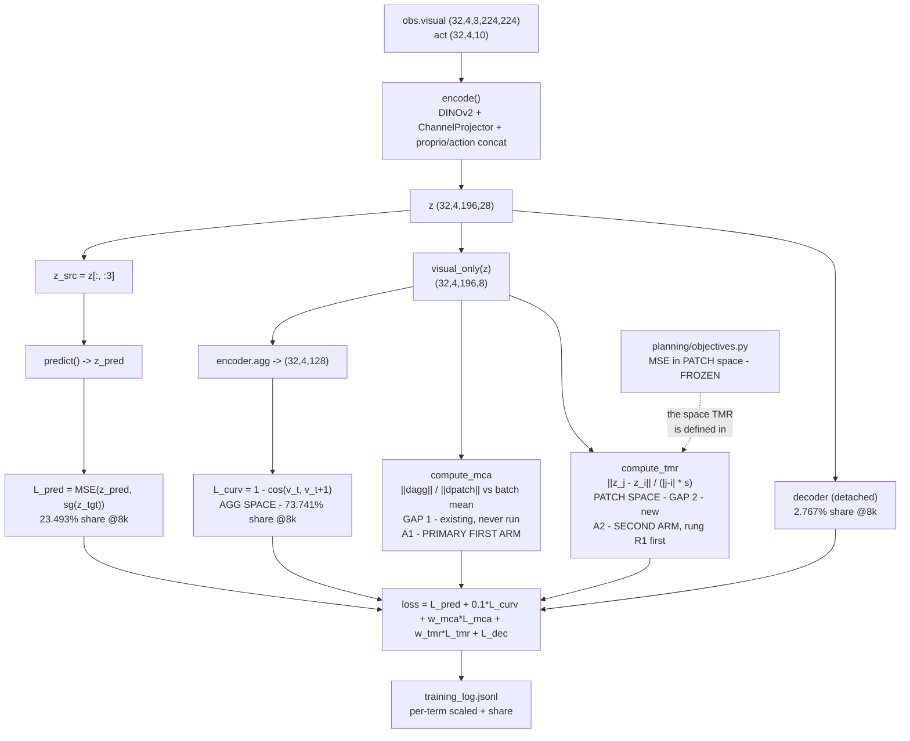
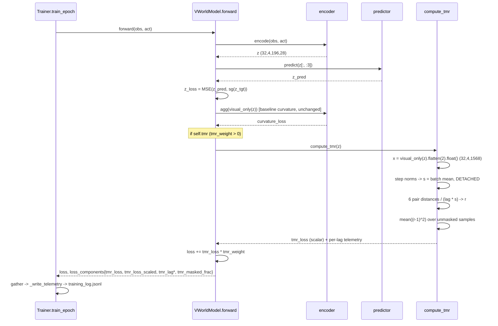
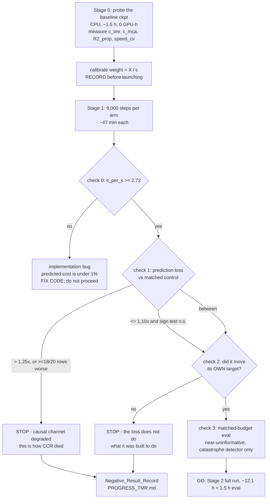

# Design Document: Temporal-Metric Regularization (TMR)

## Overview

TMR is a new **training-time** loss term in the latent world model, config-gated and off by
default. The paper's `L_curv` constrains the *direction* of consecutive latent velocities and
leaves their *magnitude* free. TMR constrains the quantity the planner actually consumes:
`||z_j - z_i||` as a function of `|j - i|`. It is a strict generalization of `L_curv` — its zero
set is `{straight} ∩ {constant speed}`, a proper subset of `L_curv`'s `{straight}` — so at small
weight the paper's result is recovered continuously and there is no cliff.

**Stated goal, carried verbatim:** novelty AND better PushT results first, then the other three
environments.

Two arms are designed here, and they are **not peers**. **MCA** (`compute_mca`, already in the
codebase, never run) is the **primary first arm**: it targets the *space mismatch* — straightening
is applied in the 128-d aggregated space while the planner scores MSE in the 1568-d patch space,
and `encoder.agg` is not an isometry. **TMR** (new) is the **second arm**: it targets the
*unparameterized magnitude*. The ordering is argued under **Arms and Budget** and rests on two
things a literature search and a re-read of the paper's appendix established: TMR's mathematical
object is already published in another domain (**Related Work / Novelty Positioning**, Iso-FM),
while nothing was found addressing the
regularization-space-versus-planning-space mismatch; and the paper's own four-variant ablation
(§Verified Findings, Gap 3) is direct evidence against patch-space *direction* pressure, an
objection MCA sidesteps entirely and TMR must argue its way past. Both are additive, both cost
under 1% step time, and both are judged at 8,000 steps against a bitwise-matched control before any
12-hour run is launched.

Target cell: PushT, `DINOv2 (patch)+proj, 14x14x8, L_curv ✓`. Paper 77.33 OL / 85.33 MPC; our
verified reproduction of that cell 75.33 ± 6.11 OL / 82.00 ± 2.00 MPC.

---

## Verified Findings (read out of the code, not assumed)

### Gap 1 — space mismatch. CONFIRMED.

| what | where | value |
|---|---|---|
| Target cell trains `training.straighten=aggcos1e-1` | `REPRODUCTION.md` §0 | `curvature_mode="aggcos"`, `straighten_scale=0.1` |
| `aggcos` applies `encoder.agg` before differencing | `models/visual_world_model.py: total_curvature` | `z = self.encoder.agg(tokens).reshape(b, t, -1)`, so curvature is minimized in **128-d** |
| `agg` for `dino_channel` | `conf/encoder/dino_channel.yaml`, `models/dino.py` | `agg_type: mlp` → `Linear(1568,512) → ReLU → Linear(512,512) → ReLU → Linear(512,128)` then `LayerNorm(128)` |
| Planner scores patch space | `planning/objectives.py: objective_fn_last` | `nn.MSELoss(reduction="none")` on `z_obs["visual"]`, `.mean()` over `(196, 8)` → **1568-d** |

`agg` is a 3-layer MLP with a terminal LayerNorm. It is not an isometry, not a similarity, and
not even injective (1568 → 128 discards 1440 dimensions, 91.8%). Straightness in the image of
`agg` therefore carries no guarantee about the space `planning/objectives.py` descends on.

`compute_mca` already targets exactly this: it penalizes `||Δagg|| / ||Δpatch||` for deviating
from its own batch mean, i.e. it pushes `agg` toward being a *similarity* (distance-preserving up
to one global constant), which is the weakest condition under which straightness transfers. It
adds no module and no parameter, was written, was never run (the CCR pilot ran `mca0`), and is
scale-invariant through `r_bar.detach().clamp_min(eps)`.

### Gap 2 — direction without parameterization. CONFIRMED.

`paper_tex/sec/1_main.tex` lines 112-115: `L_curv = 1 - C` with
`C = (v_t · v_{t+1}) / (||v_t|| ||v_{t+1}||)`. The denominators cancel every magnitude. Nothing in
the objective constrains `||v_t||`.

The paper's own claim (§ "Faithful distance") is that straightening makes Euclidean latent
distance track *geodesic* distance — "it learns to approximate the minimum number of steps
required to transition between states". That is a statement about `||z_j - z_i|| ∝ |j - i|`. The
paper supports it with distance heatmaps (`img:heatmap`, `app:heatmap`) and PCA plots, and never
reports a scalar. Direction alone is insufficient: a straight path traversed at varying speed has
`||z_j - z_i||` uncorrelated with elapsed time.

### Why patch-space `mode="cos"` fails, precisely

`total_curvature(..., mode="cos")` computes `F.cosine_similarity(v1, v2, dim=-1)` on tensors of
shape `(b, t-2, 196, 8)`. `dim=-1` is the **8-channel axis**, so it imposes `2 × 196 = 392`
independent local cosine constraints per sample over 8-dimensional vectors. The paper's own
reading (line ~377): "PushT has more complex object motions and the patch-wise cosine similarity
is unable to faithfully capture the global state changes."

TMR by contrast imposes **6 global scalar** constraints per sample (one per frame pair), each a
Frobenius norm over all 1568 entries. Averaging 1568 squared entries suppresses per-patch noise
instead of compounding it: 6 constraints versus 392, each aggregating 1568 dimensions instead of 8.

**This constraint-count argument is no longer sufficient on its own.** See Gap 3 immediately
below — the paper already ablated a *single global scalar in patch space* and it lost to `[agg]`.
The revised argument for patch space is in §4.1 and it is about the *quantity constrained*
(distance versus direction), not about how many constraints there are.

### Gap 3 — the paper already ablated a global patch-space cosine, and it lost. CONFIRMED, and it cuts against us.

`paper_tex/sec/2_appendix.tex` §`app:straightening` (and `1_main.tex` line ~275) ablates **four**
curvature variants for spatial features `z_t^v ∈ R^{m_v × d_v}`:

| variant | formula | code equivalent |
|---|---|---|
| **[patch]** | `C_t = (1/m_v) Σ_i cos(v_{t,i}, v_{t+1,i})` | `mode="cos"` |
| **[mean]** | average-pool patches to one vector, then cosine | not implemented |
| **[flatten]** | `C_t = cos(vec(v_t), vec(v_{t+1}))` — **one cosine over all `m_v·d_v` dims** | not implemented |
| **[agg]** | `C_t = cos(h_φ(v_t), h_φ(v_{t+1}))`, `h_φ` an MLP to 128-d | `mode="aggcos"` ← used in all main experiments |

**[flatten] is a single global scalar in patch space, and it underperformed [agg]** on PushT
(`img:ablation_str`, subfigure `fig:mpc_pusht`). The paper's stated reason, paraphrased: straightening
should act on *global* trajectory representations, whereas spatial tokens capture local, patch-level
variations that are only loosely aligned across time due to object motion and occlusion.

This **materially weakens the constraint-count argument as originally written in this design.** The
count of constraints is not what separated [flatten] from [agg]; both are one scalar per frame pair.
What separates them is that patch tokens are the wrong *units* for a global cosine. §4.1 argument 2
is revised accordingly.

**Two mitigating facts, recorded so the finding is not overstated.**

1. **All four variants beat no-straightening.** The figure caption states it directly: every cosine
   variant improves on no straightening; the aggregation head is merely best. Patch-space geometric
   pressure is *weaker* than agg-space pressure, not poison.
2. **We cannot read the size of the [flatten]-vs-[agg] gap.** `img:ablation_str` is a bar chart, not
   a table, and the repository ships only the compiled `.pdf` figures — no per-variant numbers exist
   in the LaTeX source. So "[flatten] lost" is established; "[flatten] lost by how much" is not.
   **Recorded as a limitation.** If the gap is 2 points the finding is a mild caution; if it is 20
   points it is close to disqualifying, and we cannot tell which.

### Gap 4 — the paper's own weight for patch-space variants is 10x smaller. CONFIRMED.

Same appendix section, verbatim in substance: `λ = 0.1` for **[agg]** and `λ = 0.01` for **all the
rest**, described as the values that yield the best performance.

So the paper's own tuning says patch-space geometric pressure must be roughly **10x gentler** than
agg-space pressure. The design's original single 15% loss-share target for a patch-space TMR term
was calibrated without this evidence and is very likely far too strong. §4.4 replaces it with an
ascending share ladder starting an order of magnitude lower. The 10x factor is an *agg-versus-patch*
statement, so it does **not** apply to `mca_weight`, which is an agg-space term — see §4.4.

---

## Architecture



Solid arrows are code paths added or already present in `models/visual_world_model.py`. The dotted
arrow is the argument, not a call: `planning/` is byte-frozen by `tests/test_scope_guard.py` and is
never touched.

## Sequence: One Training Step with TMR Enabled



No extra encoder pass. No extra predictor call. This is the structural difference from CCR, which
needed 5 extra `predict` calls, OOM'd a 45 GB slice, and cost 2.4x step time.

---

## Design Decisions Settled by Argument

### 4.1 Which space — patch (flattened 1568-d)

**Decision: patch space is the training space. The aggregated variant ships as a diagnostic and is
not a training arm.**

Three arguments for patch:

1. **The planner scores there.** `objective_fn_last` takes MSE over `z_obs["visual"]` of shape
   `(B, T, 196, 8)`. Any statement about the planner's cost landscape has to be a statement about
   that tensor. Gap 1 is precisely the observation that the paper's regularizer is not.
2. **A distance is robust to the exact failure the paper names for a patch-space cosine; a
   direction is not.**

   State the awkward fact first: **the paper already tried a single global scalar in patch space and
   it lost.** [flatten] computes `C_t = cos(vec(v_t), vec(v_{t+1}))`, one cosine over all
   `m_v · d_v = 1568` dimensions, and it underperformed [agg] on PushT (Verified Findings, Gap 3;
   `paper_tex/sec/2_appendix.tex` §`app:straightening`). The design originally justified patch-space
   TMR by counting constraints — 6 global scalars versus 392 local 8-d cosines — and **that argument
   is not sufficient on its own**, because [flatten] is also 6 global scalars and it still lost. The
   constraint count is not the discriminating variable.

   The argument the finding actually licenses is about *which quantity* is constrained. The paper's
   stated reason for the patch-space variants' weakness is that patch tokens are only *loosely
   aligned across time* due to object motion and occlusion. Consider what that misalignment does to
   each quantity:

   - **[flatten] constrains a direction.** `cos(vec(v_t), vec(v_{t+1}))` is a function of *where in
     the 1568-d space* the change points. If patches shuffle their contents between frames — an
     object translates across a patch boundary, or occludes a patch that was previously visible —
     the same physical motion writes its energy into a different set of coordinates. The direction
     of `vec(v_t)` swings hard, so `cos` collapses even when nothing about the underlying dynamics
     changed. Patch misalignment is *precisely* the mechanism that destroys a direction cosine.
   - **TMR constrains a Frobenius norm — a distance.** `||vec(v_t)||` is invariant to *which*
     coordinates carry the change; it only measures how much total change there is. Reshuffling
     energy among the 1568 coordinates leaves the norm approximately fixed (exactly fixed under a
     permutation of coordinates). So the total magnitude of change is stable under the same
     misalignment that wrecks the direction.

   Therefore **the paper's stated reason for [flatten]'s weakness does not transfer to TMR's
   quantity.** [flatten]'s failure is evidence against patch-space *direction* pressure, which is
   what both [patch] and [flatten] impose; TMR imposes patch-space *distance* pressure, and the named
   failure mechanism does not bite it.

   **This is an argument, not a measurement.** Three things keep it honest. (a) It is a claim about
   the mechanism the paper *named*; the paper reports a bar chart, not a mechanism study, so its true
   cause could be something else entirely. (b) The [flatten]-vs-[agg] gap size is unreadable
   (Gap 3), so the strength of the evidence being argued past is unknown. (c) It is **falsifiable at
   the Stage-1 gate**: if patch-space distance pressure is subject to the same weakness as
   patch-space direction pressure, check 1 (prediction loss against the bitwise-matched control) and
   check 3 are where it shows, for 0.8 GPU-h. The argument buys the right to run one cheap rung, not
   the right to skip the gate.

   Cross-reference: this is also why TMR is the **second** arm, not the first (**Arms and
   Budget**) — MCA carries no
   analogous objection because it never imposes anything in patch space; it only asks that `agg`
   preserve patch-space norm *ratios*.
3. **The aggregated variant is structurally incapable of satisfying TMR.** `agg` ends in
   `LayerNorm(128)`, so its output lies (up to the learned affine) on a sphere of radius
   `≈ sqrt(128) · rms(gamma)`. Every pairwise distance in that space is a **chord**, bounded above
   by `2R`, while `|j - i| · s` grows linearly in the lag. Proportionality at lag 3 is therefore
   unreachable by construction, and a TMR term in agg space would be minimized by shrinking `s`
   rather than by fixing geometry.

**Recorded: the aggregated variant should exist, as a measurement.** `tmr_space=agg` evaluated
read-only on the baseline checkpoint quantifies how much saturation the LayerNorm imposes, which
is a number about the paper's own geodesic-proxy claim in the space its regularizer acts on. It is
a probe output, never a training arm. The knob is validated eagerly and adds no tensor work when
unused.

**Channel selection: `visual_only`, matching the baseline curvature term.** Proprio is excluded
even though PushT's planning objective is `loss_visual + alpha * loss_proprio` with `alpha = 1`.
Reasons: (a) with `concat_dim=1` and `num_proprio_repeat=1` the 10-d proprio embedding is *tiled*
across all 196 patches, so a plain Frobenius norm would weight it `196 × 10 = 1960` dimensions
against visual's 1568 — far heavier than the planner's `alpha = 1` on per-group *means*; matching
the planner would need a group-weighted norm and a second calibration constant; (b) `agg_mlp`'s
input width is fixed at `196 × emb_dim`, so the `agg` diagnostic is visual-only by force, and
keeping both variants on identical channels is what makes them comparable; (c) the baseline
curvature term sets the precedent. **Recorded as a known limitation**, not as a non-issue.

### 4.2 Which pairs, and the exact window

Read out of `forward()` and the dataset, not guessed.

`datasets/pusht_dset.py:163` → `num_frames = num_hist + num_pred = 3 + 1 = 4`.
`datasets/traj_dset.py:71` → slices are `(i, start, start + num_frames * frameskip)`, i.e. the 4
frames are spaced **5 env steps** apart.

| tensor | shape | source |
|---|---|---|
| `obs["visual"]` | `(32, 4, 3, 224, 224)` | batch |
| `act` | `(32, 4, 10)` | `rearrange(act, "(n f) d -> n (f d)")`, n=4, f=5, d=2 |
| `z = self.encode(obs, act)` | `(32, 4, 196, 28)` | 8 visual + 10 proprio + 10 action, `concat_dim=1` |
| `self.visual_only(z)` | `(32, 4, 196, 8)` | `z[..., :-20]` |
| `x` (TMR working tensor) | `(32, 4, 1568)` | `.reshape(b, t, p*d).float()` |
| one-step diffs | `(32, 3, 1568)` → norms `(32, 3)` | `x[:,1:] - x[:,:-1]` |
| pair distances | `(32, 6)` | `torch.triu_indices(4, 4, offset=1)` |

**Decision: all pairs, no `max_lag` knob.** `T = 4` gives `T(T-1)/2 = 6` pairs — `(0,1) (0,2)
(0,3) (1,2) (1,3) (2,3)` with lags `1 2 3 1 2 1`. A window cap would be inert at this size and
would be one more knob to mis-set. If a future config raises `num_pred`, the pair count grows as
`T(T-1)/2`, which stays trivial at any plausible `T`.

**The lag ceiling is forced, and it is a real limitation.** `num_pred = 1` is a protocol
invariant, so `T = 4` and the largest lag is 3, i.e. 15 env steps. The planner's horizon is 25 env
steps = 5 latent steps. TMR therefore constrains proportionality over only ~60% of the planning
horizon. Reaching lag 5 would need imagined rollout frames — exactly CCR's cost model, which is
excluded by the <5% overhead constraint. **Recorded, with a falsifiable consequence:** the probe
measures distance-vs-lag out to lag 15 on held-out trajectories with longer windows, so
"generalization in lag beyond what training constrained" becomes a measurable prediction rather
than an assumption.

### 4.3 Relation to `L_curv` — TMR is a strict generalization

Write `v_t = z_{t+1} - z_t`, `v_{t+1} = z_{t+2} - z_{t+1}`, `a = ||v_t||`, `b = ||v_{t+1}||`,
`cosθ = ⟨v_t, v_{t+1}⟩ / (ab)`. Then

```
||z_{t+2} - z_t||^2 = ||v_t + v_{t+1}||^2 = a^2 + b^2 + 2ab·cosθ.
```

**TMR's zero set implies straightness.** `L_tmr = 0` forces `a = s`, `b = s` (lag-1 pairs) and
`||z_{t+2} - z_t|| = 2s` (the lag-2 pair). Substituting:
`4s^2 = s^2 + s^2 + 2s^2 cosθ ⟹ cosθ = 1 ⟹ L_curv = 0`.

**`L_curv`'s zero set does not imply TMR's.** `cosθ = 1` gives
`||z_{t+2} - z_t|| = a + b` for any `a, b`. TMR additionally requires `a + b = 2s` and `a = b = s`.
Take `a = 0.5s`, `b = 1.5s`, `cosθ = 1`: `L_curv = 0` exactly, while the lag-1 terms contribute
`(0.5-1)^2 + (1.5-1)^2 = 0.5` and the lag-2 term contributes `(2s/2s - 1)^2 = 0`. So
`L_tmr > 0` on a point where `L_curv = 0`.

Therefore `Z(L_tmr) ⊊ Z(L_curv)`: **straight AND constant speed**, versus straight only. `L_curv`
is the direction-only special case; TMR is a strict generalization, and
`||z_{t+2} - z_t|| = 2||z_{t+1} - z_t||` requires both properties, which is the identity the
paper's geodesic-proxy claim needs and its regularizer does not supply.

**One honest qualification.** The nesting is exact *within a single space*. As shipped, `L_curv`
runs in agg space (`aggcos`) and TMR in patch space, so they are not literally nested in the
implementation. What TMR-patch implies is patch-space straightness — the property `mode="cos"`
tried and failed to enforce, reached through 6 global scalars instead of 392 local cosines. That
is the intended reading and also a recorded risk: patch-space geometric pressure has a track
record of underperforming on PushT — not only `mode="cos"` / **[patch]** (the paper's line ~377),
but also **[flatten]**, which is itself a single global patch-space scalar (Verified Findings,
Gap 3). §4.1 argument 2 states why the *distance* form is expected to survive a mechanism that the
*direction* form did not, and states that this is an argument awaiting the Stage-1 gate.

**Why the continuity argument is load-bearing.** TMR is *additive*: the baseline term stays at
`aggcos1e-1`, untouched. The objective is
`L_pred + 0.1·L_curv + w_tmr·L_tmr + L_dec`, a one-parameter family whose `w_tmr = 0` endpoint is
the paper's objective **bitwise** (boolean gate, no tensor work). As `w_tmr → 0⁺` the gradient
field converges to the baseline's, so there is no configuration cliff between "the paper's result"
and "our arm" — the failure mode is a smooth degradation, which is what makes a small-`w_tmr`
fallback meaningful if the calibrated weight overshoots.

### 4.4 Weight calibration — measured, with the CCR mistake designed out

**The recorded mistake.** On CCR the rule was written as `lambda_cf = 0.024 / g` with the raw term
*assumed* to be `g × 0.41421`, a ratio. The term actually evaluated was a *level*,
`c = 0.228644` — 0.55x the assumed value — and separately `rho` was specified 10-20x below the
region `GDPlanner` explores. Two calibration errors, both from deriving a magnitude instead of
measuring it.

**Structural fix, not a reminder.** The calibration probe MUST obtain `c_tmr` by calling the
shipped `VWorldModel.compute_tmr` on the real `model_2.pth` checkpoint and the unmodified
validation loader. It must not reimplement the formula. A single implementation makes the
CCR-class mismatch (probe measures one quantity, training minimizes another) unrepresentable.

**The rule.** Share targets are resolved against the measured step-8,000 baseline total
`B = 0.056171` (curvature 0.041421 / 73.741%, prediction 0.013196 / 23.493%, decoder 0.001554 /
2.767%). For a target share `σ` of the *new* total, the scaled contribution is `X = σ/(1-σ) · B`.

**Revised: an ascending share ladder, not a single 15% target.** The original single `σ = 0.15`
target for TMR was set before Gap 4 was read out of the appendix. The paper's own tuning uses
`λ = 0.1` for the agg-space variant and `λ = 0.01` for **every patch-space variant**, stated as the
values that yield the best performance — a **10x** gap. TMR is a patch-space term. A 15% share is
very likely far too strong for one, so the ladder starts an order of magnitude below it and is
climbed only on evidence.

| rung | target share σ | scaled contribution `X = σ/(1-σ) · B` | weight | launch condition |
|---|---|---|---|---|
| **R1 (first and only initial launch)** | **0.02** | `0.02/0.98 × 0.056171 = 0.001146` | `w = 0.001146 / c_tmr` | unconditional (this is the TMR arm) |
| R2 | 0.05 | `0.05/0.95 × 0.056171 = 0.002956` | `w = 0.002956 / c_tmr` | R1 cleared the early-read gate **and** showed a directional signal on check 2 |
| R3 | 0.15 | `0.15/0.85 × 0.056171 = 0.009913` | `w = 0.009913 / c_tmr` | R2 cleared the gate **and** its check-2 improvement exceeded R1's |
| — | 0.30 (**hard ceiling**, never a target) | `0.30/0.70 × 0.056171 = 0.024073` | `w_max = 0.024073 / c_tmr` | never launched; asserted against in `calibrateWeight` |

Rescaled shares at each rung (the numbers the launch decision is actually read against):

| rung | curvature | prediction | TMR | decoder |
|---|---|---|---|---|
| R1 `σ=0.02` | 72.3% | 23.0% | 2.0% | 2.7% |
| R2 `σ=0.05` | 70.1% | 22.3% | 5.0% | 2.6% |
| R3 `σ=0.15` | 62.7% | 20.0% | 15.0% | 2.4% |
| ceiling `σ=0.30` | 51.6% | 16.4% | 30.0% | 1.9% |

**Why 2% is the first rung, derived from the 10x evidence rather than from taste.** The baseline
curvature term is an **agg-space** term at the paper's best agg weight `λ = 0.1`, and it is measured
at **73.741%** of the total at step 8,000. The paper's best *patch-space* weight is `1/10` of its
best agg-space weight. So a patch-space geometric term at *comparable effective pressure* to what
the paper found optimal sits at order `73.741% / 10 ≈ 7%`. Two readings follow, and the conservative
one is the one adopted:

- 7% is the *estimate of the optimum*, not a safe starting point. It is derived by transplanting a
  ratio the paper tuned for a cosine term onto a distance term, in a different loss, at a different
  point in training. Every step of that transplant could be wrong by a factor of a few.
- Starting **below** the estimated optimum is the conservative read, because the failure mode is
  asymmetric. Too-weak means a null result at the gate for 0.8 GPU-h, and the ladder's next rung
  fixes it. Too-strong means degrading the prediction channel — the channel CCR's failure identified
  as causal — and a too-strong first rung cannot be distinguished from "the mechanism does not work",
  which forecloses the whole arm on one badly chosen constant.

`σ = 0.02` is roughly a third of the 7% estimate, i.e. one rung of headroom below it, and R2 at 5%
brackets the estimate from below while R3 at 15% is the original target retained as the top rung.
The ladder therefore spans an order of magnitude around the evidence-derived estimate rather than
betting on a single point.

`c_tmr` is **pending measurement**. Order-of-magnitude prediction, recorded so the measurement can
falsify it: `L_tmr` is a squared relative error; by the triangle inequality `r ≤ 1` for a typical
pair, and a moderately curved trajectory plausibly gives `r ≈ 0.5-0.9` at lag 3, so
`c_tmr ≈ 0.05-0.3` and, at R1, `w ≈ 0.004-0.023`. If the measurement lands outside that band, the
prediction was wrong and the share rule — not the predicted number — is what governs.

**Prediction headroom is still the binding constraint.** At every rung the prediction share stays
far above the 11.75% floor CCR used (23.0% at R1, 20.0% even at R3). The prediction channel is the
one measured to be causal: CCR's +16.9% degradation there (8/8 consecutive rows, sign test
p ≈ 0.004) was the leading indicator of its failure and the only statistically solid number in that
comparison. Starting at R1 gives that channel the most headroom of any rung, which is a second
independent reason to start low.

**Why 30% is the ceiling, not the target — retained unchanged.** The curvature-family share *drifts
upward* over a full run: 31.4% @200 → 65.4% @3000 → 73.7% @8000 → 80.5% @35.6k → 82.7% @123.9k,
driven by prediction falling 0.1585 → 0.0061 while curvature fell only 0.0770 → 0.0290. A geometric
term calibrated at 15% should be expected to drift to roughly 17-19% by the end of the run, which
leaves headroom under 30%. A term calibrated *at* 30% has none, and past the ceiling the prediction
share collapses. The same drift argument applies at the lower rungs and is in fact a *reason* they
are viable: a term calibrated at 2% is expected to drift to roughly 2.3-2.5%, so a rung that looks
almost inert at step 8,000 still exerts pressure that grows, not shrinks, over the remaining 116,000
steps. (The CCR record's note that "λ = 0.1 was 4-15x too strong" was itself wrong once `c` was
measured; the share window, not the raw weight, is the invariant.)

**Sweep policy: one rung first, never a parallel launch.** Launch **R1 only**. R2 is launched only
after R1 has cleared the early-read gate and shown a directional signal on check 2; R3 only after R2
does the same with a larger effect. The ladder is climbed on evidence, one rung at a time — it is
never launched in parallel, and no rung is skipped. Launching multiple arms up front is how CCR spent
26 GPU-h. Cost consequence: the ladder is 0.8 GPU-h per rung, so the *worst* case of climbing all
three is 2.4 GPU-h, still under a fifth of one full run.

**`mca_weight` is an agg-space term and the 10x patch penalty does NOT apply to it.** `compute_mca`
constrains `||Δagg|| / ||Δpatch||` — a ratio of norms whose *constrained output* lives in agg space,
the same space as the paper's `[agg]` variant at `λ = 0.1`. Gap 4's 10x factor is an
agg-versus-patch statement about where geometric pressure is applied, so it has no bearing on MCA.
MCA keeps the **original single-target calibration** against its own measured `c_mca`, with the
same `σ = 0.15` target and `σ = 0.30` ceiling: `X = 0.009913`, `mca_weight = 0.009913 / c_mca`.
`compute_mca` is a squared relative deviation of norm ratios and, given the LayerNorm, its raw
value is expected to be large (`c_mca` plausibly `O(0.1-1)`, i.e. `mca_weight ≈ 0.01-0.1`) —
**measure it, do not assume**, via the same shipped-implementation route as `c_tmr`.

### 4.5 Overhead

**Compute.** DINOv2 ViT-S/14 at 224² is ~4.6 GFLOPs/image; the batch is `32 × 4 = 128` images per
step → ~590 GFLOPs for the encoder pass alone, before the predictor, decoder and backward. TMR's
work: 6 pairwise subtractions of `(32, 1568)` tensors, 6 norms, one mean —
`~6 × 32 × 1568 × 3 ≈ 0.9 MFLOPs` forward, similar backward. Ratio ≈ `3e-6`. The `float()` upcast
touches `32 × 4 × 1568 = 200k` elements.

**Memory.** Six difference tensors of `(32, 1568)` in fp32 = 1.2 MB. Compare CCR: `models/vit.py`
materializes `dots` of shape `(32, 16, 588, 588)` = 177M elements = 354 MB in bf16, kept three
times per layer across `depth=6`, i.e. ~8 GB per `predict` call, and CCR added five of them →
~40 GB on a 45 GB slice → `torch.OutOfMemoryError`. **TMR adds no predictor call, so this entire
failure mode is absent.**

**MCA** adds one `encoder.agg` call on `(128, 196, 8)`: `128 × (1568·512 + 512·512 + 512·128)` ≈
0.17 GFLOPs, ~0.03% of the encoder pass. (The baseline `aggcos` term already calls `agg` on the
same tensor; deduplicating would mean editing the curvature path, so it is deliberately left as a
second call.)

**Predicted step-time overhead: <1%. Budgeted ceiling: 5%.**

| arm | it/s | 123,858 steps |
|---|---|---|
| baseline (measured, 619 records, median) | 2.862 | **12.02 h** (recorded 12.04 h) |
| TMR at 1% overhead (predicted) | 2.833 | 12.14 h |
| TMR at 5% overhead (budget ceiling) | 2.719 | 12.65 h |
| CCR, for contrast (measured) | 1.198 | 28.8 h |

**Step-rate floor: `it_per_s >= 2.72` at steady state.** Unlike CCR's 1.91 floor — which was
derived from a wrong cost model and could never have been met by any configuration adding five
rollouts — this floor is 5% off a predicted <1% cost, so a breach means the implementation is
wrong, not that the bound was unrealistic. A breach is actionable: read it, then fix the code.

**8,000-step pilot: `8000 / 2.86 = 2797 s ≈ 47 min`** per arm (the matched control took 46:47).

---

## Components and Interfaces

### 5.1 `models/visual_world_model.py` — additive

**Purpose**: own the TMR term. No new module, no new parameter, no new buffer. (`VWorldModel` is
built *after* `accelerator.prepare()` in `train.py` and is never itself prepared, so any module
created in `__init__` would keep CPU parameters and kill the run seconds into epoch 1 —
`SHORT_BUDGET_PILOTS.md` §9.)

```python
TMR_SPACES = ("patch", "agg")   # 'agg' is a diagnostic, not a training arm (§4.1)
TMR_NORMS = ("batch", "sample") # 'sample': pre-registered remedy, see 4.4 + Honest Probability

class VWorldModel(nn.Module):
    def __init__(self, ..., mca_weight=0.0,
                 tmr_weight=0.0, tmr_space="patch", tmr_norm="batch", **kwargs):
        ...
        self.tmr_weight = float(0.0 if tmr_weight is None else tmr_weight)
        self.tmr_space  = str("patch" if tmr_space is None else tmr_space)
        self.tmr_norm   = str("batch" if tmr_norm  is None else tmr_norm)
        self.tmr = self.tmr_weight > 0          # cheap boolean gate

    def compute_tmr(self, z, eps=1e-6, motion_frac=0.1): ...
```

**Responsibilities**
- Parse and validate `tmr_weight >= 0`, `tmr_space ∈ TMR_SPACES`, `tmr_norm ∈ TMR_NORMS`
  **eagerly in `__init__`, even when disabled** (string/scalar comparisons only, zero tensor work
  on the off path). A typo in an unused knob that surfaces only once the term is enabled is exactly
  the class of mistake a pilot cannot afford.
- Emit one startup log line mirroring the CCR/MCA lines, including `self._param_device()` so the
  device the term will compute on is visible in the two-minute smoke check.
- Compute `compute_tmr` and add `tmr_loss * self.tmr_weight` to `loss`.
- Publish `tmr_loss`, `tmr_loss_scaled` and the telemetry-only keys `tmr_lag1`, `tmr_lag2`,
  `tmr_lag3`, `tmr_masked_frac`, `tmr_speed_cv` into `loss_components`.

**Contract on the disabled path**: with `tmr_weight = 0` the only cost is one attribute lookup and
one comparison, `loss_components` gains no key, and the objective is **bitwise** the baseline's.

`motion_frac` is a default argument, not a config knob — mirroring `_cos_curvature`'s hardcoded
`step_thresh=1e-6`. Three config knobs is the whole surface.

### 5.2 `train.py` — additive

- Forward `tmr_weight=self.cfg.training.get("tmr_weight")`, `tmr_space=...`, `tmr_norm=...` to
  `hydra.utils.instantiate(self.cfg.model, ...)`. Hydra keys are the single source of truth; no
  Python literal fallback that could drift from the yaml (an absent key arrives as `None` and the
  model resolves the default).
- Extend `LOSS_SIGNATURE_KEYS` with `"tmr_weight", "tmr_space", "tmr_norm"` and
  `LOSS_SIGNATURE_DEFAULTS` with `0.0, "patch", "batch"`. This is what stops a TMR arm silently
  auto-resuming a baseline directory. Keys absent from an older run's `loss_config.json` are read
  as their defaults, so the baseline run stays resumable — verify this, because a multi-hour
  Full_Run depends on resume working and it was already broken once for DINOv2 runs.
- Extend `TELEMETRY_TERMS` with `("tmr_loss_scaled", "tmr")`, placed after `mca`. This keeps the
  shares summing to ~100% and makes `summarize_training_log.py`'s term table, `--compare` deltas
  and `--collapse-check` work on TMR **with no change to that file's term logic** — it is already
  generic over term names.
- Add `_tmr_telemetry_block(components)`, mirroring `_ccr_telemetry_block` exactly: `enabled` is
  derived from the presence of `tmr_loss_scaled` in `loss_components` (what ran), never re-read
  from config (what was asked for), and a disagreement logs a warning. The per-lag values,
  `masked_frac` and `speed_cv` live in this block rather than in `terms`.

### 5.3 `conf/train.yaml` — additive

```yaml
  # --- Temporal-Metric Regularization (default OFF) ---
  tmr_weight: 0.0      # weight on L_tmr; 0 disables the whole path
  tmr_space: patch     # 'patch' (training) | 'agg' (diagnostic only, see design 4.1)
  tmr_norm: batch      # 'batch' (global speed, the paper's geodesic claim) | 'sample'
```

### 5.4 `custom_resolvers.py` — new sibling resolver, `ccr_tag` untouched

`ccr_tag` takes exactly four positional arguments and returns `""` at defaults, which is what keeps
the baseline run directory name byte-identical. Rather than change its arity, add:

```python
TMR_TAG_DEFAULTS = (0.0, "patch", "batch")

def tmr_tag(tmr_weight, tmr_space, tmr_norm) -> str:
    given  = (tmr_weight, tmr_space, tmr_norm)
    filled = tuple(d if v is None else v for v, d in zip(given, TMR_TAG_DEFAULTS))
    values = (float(filled[0]), str(filled[1]), str(filled[2]))
    if values[0] == 0.0:
        return ""                    # off: space/norm describe nothing
    return "_tmr{}_sp{}_nm{}".format(_fmt_num(values[0]), values[1], values[2])
```

and append `${tmr_tag:${training.tmr_weight},${training.tmr_space},${training.tmr_norm}}` to
`hydra.run.dir` and `hydra.sweep.dir` in `conf/train.yaml`, after the existing `${ccr_tag:...}`.

Two properties this buys: at defaults both tags are empty, so `training.straighten=aggcos1e-1`
alone still resolves to `pusht_aggmlpcos1e-1_agg32_projchannel_dim8_hw14_sgTrue_lr1e-05` — the
legacy name, so the existing baseline checkpoint and its telemetry stay addressable; and a TMR arm
gets its own directory, so the "two arms resolve to one directory and silently resume each other"
failure that already cost this project a run cannot recur.

### 5.5 `probe_ccr_curvature.py` — extended, not duplicated

Add a third read-only readout alongside `curvature_gap` and `state_readout_r2`:

```python
def metric_fidelity_readout(model, windows, max_lag): ...
    # returns {"tmr_raw", "spearman_rho", "r2_proportional", "r2_affine",
    #          "speed_cv", "per_lag": {lag: {"mean_ratio", "std_ratio"}}}
```

- `tmr_raw` is obtained by **calling `model.compute_tmr`** on the same windows the training loader
  produces (`T = 4`). This is the `c_tmr` of §4.4 and the structural fix for the CCR calibration
  error.
- `spearman_rho` and `r2_*` are computed on **longer** windows, obtained without editing
  `datasets/`: `load_windows` already calls `hydra.utils.call(cfg.env.dataset, num_hist=...,
  num_pred=..., frameskip=...)`, and every dataset builds its slicer as `num_frames = num_hist +
  num_pred`, so passing `num_pred = max_lag - num_hist + 1` yields `T = max_lag + 1` frames. Default
  `--max-lag 15` → `T = 16`, lags 1..15, i.e. 75 env steps, three planning horizons.
- `r2_proportional` is the R² of a **zero-intercept** fit `dist = k · lag`. This is the right
  functional form: TMR's target is proportionality, and an intercept-bearing fit would flatter a
  monotone-but-concave curve, which is exactly the saturating failure mode. `r2_affine` is reported
  alongside so the gap between them is visible (that gap *is* the saturation).
- `speed_cv` = `std(||v_t||) / mean(||v_t||)` over held-out one-step displacements. This is the
  scalar the paper never reports and TMR exists to reduce.
- New CLI flags: `--readout {curvature,metric,all}` (default `all`), `--max-lag N` (default 15),
  `--tmr-space {patch,agg}` (default `patch`). Everything already in the script is reused: path
  validation, checkpoint fingerprinting, `_warm_dino_hub`, `_plain_tensor_attrs_to_cpu` (needed —
  `models/vit.py:58` assigns its causal mask as a plain attribute pinned to `cuda`, so
  `.to("cpu")` never moves it), the wall-clock `Budget`, and the report/fingerprint schema.

### 5.6 `summarize_training_log.py` — one addition

The term table, `--compare` and `--collapse-check` are already generic over term names and need no
change. Add one flag: `--prediction-gate REF_DIR`, which evaluates the early-read gate's check 1 mechanically —
per-row `prediction` deltas at every matched `global_iter`, the count of same-direction rows over
the last 20, the one-sided sign-test p-value, and the GO / STOP / MIDDLE verdict against the
pre-registered bounds. CCR's leading indicator had to be assembled by hand from row deltas after
the fact; this makes it a command.

### 5.7 Reused unchanged

`run_ccr_pilot.sh` (already takes arbitrary `training.*` overrides and applies the whole
Blackwell/MIG env recipe, refuses to start on a busy slice, and its wait loop reads
`ps -o stat=` for zombies), `ccr_acceptance_gate.py` (takes seed lists as arguments),
`aggregate_results.py`, `eval_pusht_3seeds.sh`.

**Frozen, never touched**: `planning/*`, `datasets/*`, `plan.py`, `models/vit.py`,
`models/dino.py`. `tests/test_scope_guard.py` enforces byte-identity on the first three.
`PROGRESS_TMR.md` is the one new file and is added to `ALLOWED_FILES`.

---

## Data Models

```python
# Exact shapes at the PushT target cell. b=32, t=4, p=196, d=8, proprio=10, action=10.
z            : Tensor  # (32, 4, 196, 28)  float, autocast bf16
visual_only(z): Tensor # (32, 4, 196, 8)
x            : Tensor  # (32, 4, 1568)     float32 (upcast, see 7.1 postconditions)
step_norms   : Tensor  # (32, 3)           ||x[:, t+1] - x[:, t]||_2
per_sample   : Tensor  # (32,)             mean over t of step_norms
s            : Tensor  # ()  if tmr_norm='batch'; (32, 1) if 'sample'. DETACHED.
i, j         : Tensor  # (6,) each         torch.triu_indices(4, 4, offset=1)
lag          : Tensor  # (6,)              j - i == [1, 2, 3, 1, 2, 1]
dist         : Tensor  # (32, 6)           ||x[:, j] - x[:, i]||_2
ratio        : Tensor  # (32, 6)           dist / (lag * s)
keep         : Tensor  # (32,) bool        per_sample >= motion_frac * batch_mean
tmr_loss     : Tensor  # ()                mean over kept rows of (ratio - 1)^2
```

**`loss_components` keys added** (all 0-dim tensors; `train.py` already `.item()`s the whole dict
each step after `gather_for_metrics`, so these add no new synchronization point):

| key | in `TELEMETRY_TERMS` | meaning |
|---|---|---|
| `tmr_loss` | no | raw `L_tmr`, the quantity `c_tmr` calibrates against |
| `tmr_loss_scaled` | **yes** → `"tmr"` | `L_tmr * tmr_weight`; drives shares and `enabled` |
| `tmr_lag1` / `tmr_lag2` / `tmr_lag3` | no (`tmr` block) | `mean((r-1)^2)` restricted to that lag |
| `tmr_masked_frac` | no (`tmr` block) | fraction of samples dropped as static |
| `tmr_speed_cv` | no (`tmr` block) | `std(step_norms) / mean(step_norms)` |

**Why the per-lag split is worth logging.** The lag-1 pairs are the ones that define `s`, so their
mean ratio is ≈1 by construction and `tmr_lag1` measures the **variance of one-step speed** — a
pure constant-speed penalty. `tmr_lag2` and `tmr_lag3` mix straightness and speed. Reading them
separately says which sub-property the encoder is actually fixing, which is the difference between
"TMR worked" and "TMR flattened the speed distribution and did nothing geometric".

**Telemetry record shape** (one new block, everything else unchanged):

```json
{"global_iter": 8000, "epoch": 1, "it_per_s": 2.84, "loss": 0.0661,
 "terms": {"prediction": {"scaled": 0.0132, "share": 0.1996},
           "curvature":  {"scaled": 0.0414, "share": 0.6265},
           "tmr":        {"scaled": 0.0099, "share": 0.1500},
           "decoder":    {"scaled": 0.0016, "share": 0.0235}},
 "enabled_terms": ["prediction", "curvature", "tmr", "decoder"],
 "ccr": {"enabled": false, "lambda_cf": 0.0},
 "tmr": {"enabled": true, "raw": 0.1502, "tmr_weight": 0.0076, "space": "patch",
         "norm": "batch", "lag1": 0.061, "lag2": 0.148, "lag3": 0.284,
         "masked_frac": 0.031, "speed_cv": 0.482}}
```

The `terms` block above is illustrative of the **R3** rung (`σ = 0.15`) so that the share arithmetic
is visible against the original numbers; the `tmr_weight` shown is the **R1** rung
(`0.001146 / 0.1502 ≈ 0.0076`). The first launch is R1, whose `terms.tmr.share` will read ≈ 0.020
and whose `prediction` share will read ≈ 0.230 (§4.4).

---

## Key Functions with Formal Specifications

### 7.1 `compute_tmr(z, eps=1e-6, motion_frac=0.1) -> Tensor`

```python
def compute_tmr(self, z, eps=1e-6, motion_frac=0.1): ...
```

**Preconditions**
- `z` has shape `(b, t, p, d_total)` with `t >= 2` and `b >= 1`.
- `self.tmr_space in TMR_SPACES`; `self.tmr_norm in TMR_NORMS` (both validated in `__init__`).
- `self.tmr_space == "agg"` implies `hasattr(self.encoder, "agg")` (checked at first use with the
  same message shape `total_curvature` uses for `aggcos`).
- Called only when `self.tmr` is True.
- No precondition on `z` being finite: a non-finite `z` is already fatal upstream in `z_loss`.

**Postconditions**
- Returns a 0-dim tensor in the autograd graph of `z`, `>= 0`, finite for any finite `z`
  (guaranteed by `clamp_min(eps)` on every denominator).
- **Scale invariance**: for any `α > 0`, `compute_tmr(α·z) == compute_tmr(z)` up to float error —
  the numerator and `s` both scale by `α`. So the term cannot be satisfied by shrinking the
  representation, which is the `compute_mca` `r_bar.detach()` precedent.
- **Collapse is penalized, not rewarded**: as `||Δz|| → 0` uniformly, `s → 0` and `clamp_min(eps)`
  binds, so `ratio → 0` and the loss → 1 per pair, its maximum for `r ∈ [0,1]`.
- `s` carries **no gradient** (`.detach()`), so the only descent direction is changing the shape of
  the trajectory, never the choice of the normalizer.
- Reduction is over kept rows only; `keep.any() == False` returns an exact zero that is still
  attached to the graph (`per_pair.mean() * 0.0`), so a degenerate batch cannot break backward.
- Writes only `loss_components` entries; mutates no model state, no parameter, no buffer.
- Computes in **float32**: `x` is `.float()`-upcast. Under bf16 autocast a 1568-term squared sum has
  ~8 mantissa bits, and `L_tmr` is a *squared relative* error formed by dividing two such sums, so
  bf16 rounding would land at the same order as the signal at small `L_tmr`. The upcast costs
  200k elements.

**Loop invariants**: none — the implementation is fully vectorized (`torch.triu_indices`), with no
Python loop over pairs or frames. This is deliberate: a per-pair loop at `T=4` would be 6 kernel
launches per step and the launch overhead, not the arithmetic, would be the cost.

### 7.2 `compute_mca(z, eps=1e-6) -> Tensor` — existing, unchanged

Already implemented and reviewed. Formal properties, stated here because this design promotes it to
a first-class arm and its behavior was never measured:

**Preconditions**: `z` shape `(b, t, p, d_total)` with `t >= 2`; `hasattr(self.encoder, "agg")`;
called only when `self.mca` is True.

**Postconditions**: `>= 0`; scale-invariant in `z` through `r_bar.mean().detach().clamp_min(eps)`;
zero iff every velocity's `||Δagg|| / ||Δpatch||` ratio equals the batch mean ratio, i.e. iff `agg`
acts as a **similarity** on the observed velocity set — the weakest condition under which
agg-space straightness transfers to patch space. Gradients flow into `agg_mlp`, `agg_post_norm`
**and** the projector, since `v_patch` depends on the encoder.

**Recorded caveat**: because `agg_post_norm` is a `LayerNorm`, `||Δagg||` is a chord on a sphere
while `||Δpatch||` is unbounded, so `c_mca` may be large and the achievable minimum may be bounded
away from 0. That bound is itself the interesting measurement (Negative_Result_Record, N2).

### 7.3 `forward(obs, act)` — loss assembly, additive

**Preconditions**: unchanged from the current implementation.

**Postconditions (new clauses only)**
- If `self.tmr` is False: `loss` and `loss_components` are **bitwise identical** to the
  pre-feature implementation for every input, and no `tmr_*` key exists.
- If `self.tmr` is True: `loss_new == loss_old + compute_tmr(z) * tmr_weight`, and the six `tmr_*`
  keys are present. The prediction, curvature, MCA and decoder terms are computed by unchanged code
  in unchanged order, so the shared-term equality check at `rtol=0.05` on the step-200 row (which
  passed for CCR) remains the right smoke test.
- The TMR term is placed **after** the `mca` block and before the decoder block, so `enabled_terms`
  ordering is `prediction, curvature, ccr, mca, tmr, decoder` — stable across runs.

---

## Algorithmic Pseudocode

### 8.1 The TMR term

```pascal
ALGORITHM computeTMR(z, tmr_space, tmr_norm, eps, motion_frac)
INPUT:  z of shape (b, t, p, d_total);  t >= 2
OUTPUT: loss (scalar, >= 0), telemetry map

BEGIN
  ASSERT t >= 2
  ASSERT tmr_space IN {patch, agg} AND tmr_norm IN {batch, sample}

  // Step 1: project into the space the loss is defined in
  feats <- visual_only(z)                              // (b, t, p, d)
  IF tmr_space = agg THEN
    ASSERT encoder HAS agg
    x <- reshape(encoder.agg(reshape(feats, (b*t, p, d))), (b, t, -1))
  ELSE
    x <- reshape(feats, (b, t, p*d))                   // (b, t, 1568)
  END IF
  x <- toFloat32(x)                                    // see 7.1: bf16 is not enough

  // Step 2: the scale normalizer, detached so it is never a descent direction
  step       <- norm(x[:, 1:] - x[:, :-1], axis=-1)    // (b, t-1)
  perSample  <- mean(step, axis=1)                     // (b,)
  batchMean  <- mean(perSample)                        // ()
  IF tmr_norm = sample THEN
    s <- unsqueeze(clampMin(detach(perSample), eps), 1) // (b, 1)
  ELSE
    s <- clampMin(detach(batchMean), eps)               // ()
  END IF

  // Step 3: all frame pairs i < j.  t = 4 -> 6 pairs, lags [1,2,3,1,2,1]
  (i, j) <- triuIndices(t, offset = 1)
  dist   <- norm(x[:, j] - x[:, i], axis=-1)           // (b, nPairs)
  lag    <- toFloat(j - i)                             // (nPairs,)
  ratio  <- dist / (lag * s)                           // broadcast
  perPair<- (ratio - 1)^2                              // (b, nPairs)

  // Step 4: drop windows with no measurable motion.
  // WITHOUT THIS the loss is broken, not merely noisy: a static window gives
  // dist ~ 0 for every pair, so ratio ~ 0 and perPair ~ 1, an order of magnitude
  // above the expected c_tmr ~ 0.05-0.3.  Static windows would dominate the term
  // and the only way to reduce them is to MANUFACTURE latent motion for
  // observations that did not change.  Precedent: _cos_curvature's step_thresh.
  keep <- detach(perSample) >= motion_frac * clampMin(detach(batchMean), eps)
  IF any(keep) THEN
    loss <- mean(perPair[keep])
  ELSE
    loss <- mean(perPair) * 0                          // keeps the graph, adds nothing
  END IF

  telemetry <- { raw: loss,
                 lag_k: mean(perPair[keep, where lag = k]) FOR k IN unique(lag),
                 masked_frac: 1 - mean(keep),
                 speed_cv: std(step) / clampMin(mean(step), eps) }
  RETURN (loss, telemetry)
END
```

**Preconditions**: `t >= 2`; enums validated; `agg` present iff `tmr_space = agg`.
**Postconditions**: `loss >= 0`, finite, scale-invariant, differentiable w.r.t. `z` only;
`s` detached; telemetry values detached.
**Loop invariants**: none (vectorized). The only iteration is over the *distinct lag values* when
building telemetry, at most `t - 1 = 3` of them, and it touches no gradient path.

### 8.2 The loss assembly (delta only)

```pascal
ALGORITHM forwardLossAssembly(z, act)
BEGIN
  ... unchanged: z_loss, vcreg, curvature, ccr, mca ...

  IF self.tmr THEN                     // one attribute lookup, one compare when off
    (tmrLoss, tel) <- computeTMR(z, ...)
    loss <- loss + tmrLoss * self.tmr_weight
    components[tmr_loss]        <- tmrLoss
    components[tmr_loss_scaled] <- tmrLoss * self.tmr_weight
    components[tmr_lag1..lag3]  <- tel.lag_k
    components[tmr_masked_frac] <- tel.masked_frac
    components[tmr_speed_cv]    <- tel.speed_cv
  END IF

  ... unchanged: decoder ...
END
```

**Postcondition**: `self.tmr = False` leaves both `loss` and `components` bitwise unchanged.

### 8.3 Weight calibration

```pascal
ALGORITHM calibrateWeight(checkpoint, trainCfg, targetShare, term)
INPUT:  the measured baseline checkpoint, its resolved hydra.yaml,
        targetShare in (0, 0.30], term IN {tmr, mca}
OUTPUT: weight
BEGIN
  ASSERT targetShare <= 0.30                       // the hard ceiling of 4.4

  // The TMR ladder of 4.4 is discrete and ascending; no off-ladder share is calibratable,
  // and a higher rung requires the lower one to have cleared the gate first.
  IF term = tmr THEN
    ASSERT targetShare IN {0.02, 0.05, 0.15}       // R1, R2, R3
    ASSERT targetShare = 0.02 OR previousRungClearedGate(targetShare)
  ELSE
    ASSERT targetShare = 0.15                      // MCA is agg-space: no 10x patch penalty (4.4)
  END IF

  model <- loadProbeModel(checkpoint, trainCfg)    // CPU, read-only, fingerprinted
  windows <- loadWindows(trainCfg, n = 64)         // unmodified val loader, T = 4
  configure(model, tmr_weight = 1.0)               // so the gate fires; weight is irrelevant to raw

  // MEASURED, not derived.  Calls the SHIPPED implementation, never a copy.
  // This is the structural fix for the CCR error where the probe measured a ratio
  // and training minimized a level.
  c <- mean over windows of model.computeTMR(encode(window))

  B <- 0.056171                                    // baseline total at global_iter 8000
  X <- (targetShare / (1 - targetShare)) * B
  weight <- X / c

  RECORD (c, X, weight, targetShare) IN PROGRESS_TMR.md BEFORE launching
  ASSERT weight * c <= 0.024073                    // the 30% ceiling, in absolute terms
  RETURN weight
END
```

**Preconditions**: checkpoint exists and its sha256 matches the recorded baseline
(`4d68b528…`, 265,381,955 bytes); `targetShare <= 0.30`.
**Postconditions**: `weight * c == X` to float precision; the tuple is written down before any GPU
time is spent; `weight` is finite and positive whenever `c > 0`.
**Loop invariant** (over probe windows): the running mean of `computeTMR` is an unbiased estimate of
`c` under the validation sampling distribution, and no window is encoded twice.

---

## Example Usage

```bash
# ---------- Stage 0: calibration + the free paper-facing measurements (CPU, ~1.5 h, 0 GPU-h)
RUN_DIR=$PWD/checkpoints/test/pusht_aggmlpcos1e-1_agg32_projchannel_dim8_hw14_sgTrue_lr1e-05

python probe_ccr_curvature.py \
  --ckpt "$RUN_DIR/checkpoints/model_2.pth" \
  --train-cfg "$RUN_DIR/hydra.yaml" \
  --readout metric --max-lag 15 --tmr-space patch \
  --out probe_outputs/tmr_baseline_patch.json

# the agg-space DIAGNOSTIC (design 4.1): how much does the LayerNorm saturate distance?
python probe_ccr_curvature.py --ckpt "$RUN_DIR/checkpoints/model_2.pth" \
  --train-cfg "$RUN_DIR/hydra.yaml" --readout metric --tmr-space agg \
  --out probe_outputs/tmr_baseline_agg.json

# ---------- Stage 1: 8,000-step arms against the bitwise-matched control (~47 min each)
# The control is FREE: checkpoints_ctrl8k already holds a bitwise reproduction of the
# baseline's first 8,000 steps (40/40 telemetry rows agree to +0.000000).
CTRL=$PWD/checkpoints_ctrl8k/test/pusht_aggmlpcos1e-1_agg32_projchannel_dim8_hw14_sgTrue_lr1e-05

# A1 - PRIMARY FIRST ARM: MCA (free, never run, targets Gap 1, more novel post-search - see 10, 12).
# mca_weight from calibrateWeight(..., targetShare=0.15, term=mca) against measured c_mca.
# Agg-space term, so Gap 4's 10x patch penalty does not apply.
CKPT_BASE=$PWD/checkpoints_mca8k bash run_ccr_pilot.sh pilot training.mca_weight=<w_mca>

# A2 - SECOND ARM: TMR (new, targets Gap 2).  Rung R1 ONLY (sigma = 0.02, see 4.4).
# R2 (0.05) and R3 (0.15) are launched later, one at a time, only on evidence.
CKPT_BASE=$PWD/checkpoints_tmr8k_r1 bash run_ccr_pilot.sh pilot \
  training.tmr_weight=<w_tmr_R1> training.tmr_space=patch training.tmr_norm=batch

# ---------- The early-read gate (design 11)
python summarize_training_log.py <arm_dir> --compare "$CTRL" --collapse-check \
  --reference-it-per-s 2.862 --iter 8000 --prediction-gate "$CTRL"

python probe_ccr_curvature.py --ckpt <arm_dir>/checkpoints/model_latest.pth \
  --train-cfg <arm_dir>/hydra.yaml --readout metric --max-lag 15 \
  --out probe_outputs/tmr_arm8k.json
# and the identical command against the control checkpoint, then diff the two reports.

# ---------- Stage 2: full run, only for an arm that cleared the gate (~12.1 h + 1.5 h eval)
bash run_ccr_pilot.sh full training.tmr_weight=<w_tmr>
bash run_ccr_pilot.sh eval <full_run_dir>
python ccr_acceptance_gate.py --cand-ol-seeds ... --cand-mpc-seeds ... \
                              --base-ol-seeds 74 82 70 --base-mpc-seeds 82 80 84
```

```python
# The default-off contract, as a two-line check.
model_off = VWorldModel(..., straighten="aggcos1e-1", tmr_weight=0.0)
_, _, _, loss_off, comp_off = model_off(obs, act)
assert "tmr_loss" not in comp_off and "tmr_loss_scaled" not in comp_off

# Strict generalization, as a two-line check (design 4.3).
# straight but NOT constant speed: L_curv == 0 exactly, L_tmr > 0.
u = torch.randn(1, 1568)
z = torch.stack([torch.zeros_like(u), 0.5 * u, 2.0 * u, 3.0 * u], dim=1)  # cos(v_t, v_t+1) == 1
assert cos_curvature(z) == 0.0
assert compute_tmr_on(z) > 0.0
```

---

## Correctness Properties

These are checked with **hypothesis** (already a dev dependency; `.hypothesis/` exists in the repo).
Each statement quantifies over all inputs explicitly.

### Property 1: The disabled path is bitwise the baseline

∀ `obs, act`: with `tmr_weight = 0`, `loss` and every `loss_components` value are **bitwise** equal
to the pre-feature implementation, and no `tmr_*` key exists. This is what lets
`straighten=aggcos1e-1` alone reproduce the measured 75.33 / 82.00 without a retrain.

### Property 2: Scale invariance

∀ `z`, ∀ `α > 0`: `compute_tmr(α·z) ≈ compute_tmr(z)` within fp32 tolerance. Numerator and `s`
scale together, so the term cannot be satisfied by shrinking the representation.

### Property 3: Non-negativity and finiteness

∀ finite `z`: `compute_tmr(z) >= 0` and is finite — including all-equal frames, exactly one
non-static sample, and `b = 1`.

### Property 4: Exact zero on the target geometry

∀ unit `u`, ∀ `s > 0`: `z_t = t·s·u` gives `compute_tmr(z) == 0` to fp32 tolerance. Straight **and**
constant speed is the zero set.

### Property 5: Strictly positive where `L_curv` is zero

∀ `u`, ∀ `a ≠ b`: a straight trajectory with step lengths `a, b, b` has `L_curv = 0` exactly and
`compute_tmr > 0`. This is the strict-generalization claim of §4.3, as an executable check.

### Property 6: TMR zero implies patch-space `L_curv` zero

∀ `z` with `compute_tmr(z) < ε`: `total_curvature(z, mode="cos")` on the same tensor is `< δ(ε)`.
Checked numerically over random near-optimal constructions; the algebra is in §4.3.

### Property 7: The normalizer carries no gradient

∀ `z`: the gradient of `compute_tmr` w.r.t. `z` equals the gradient of the same expression with `s`
replaced by its numeric value. The only descent direction is the shape of the trajectory, never the
choice of normalizer.

### Property 8: Batch-permutation invariance of the reduction

∀ `z`, ∀ permutation `π` of the batch axis: `compute_tmr(z[π]) ≈ compute_tmr(z)`. `tmr_norm='batch'`
makes `s` a batch statistic, so the reduction must still be order-independent.

### Property 9: Static windows are excluded, not amplified

∀ `z`, ∀ count of appended zero-motion samples: `compute_tmr` changes by less than fp32 tolerance
and `tmr_masked_frac` rises accordingly. **Without the motion mask this property fails**, which is
the executable justification for step 4 of the algorithm.

### Property 10: Frozen sources are byte-identical to the base revision

`planning/*.py`, `datasets/*.py` and `plan.py` hash equal to the base revision, and every changed
path is in the `test_scope_guard.py` allowlist. Extends the guard's existing Property 9.

### Property 11: Enum and range validation is eager

∀ invalid `tmr_space` / `tmr_norm` / negative `tmr_weight`: `__init__` raises, **even when
`tmr_weight = 0`**. A typo in an unused knob must not survive until the run that enables it.

### Property 12: Telemetry `enabled` reflects what ran, not what was configured

∀ configs: the `tmr` block's `enabled` equals `"tmr_loss_scaled" in loss_components`, never the
config value, and a disagreement logs a warning. Mirrors the CCR fix, where a config-derived field
read `3` on a CCR-disabled baseline and so confirmed nothing.

### Property 13: Term shares still sum to ~100%

∀ telemetry records: `Σ terms[*].share ≈ 1.0` within 0.01 with `tmr` present. Guards the
`TELEMETRY_TERMS` edit and the share arithmetic the pilot verdict is read from.

### Property 14: Probe and training agree by construction

∀ windows: the probe's `tmr_raw` is produced by calling `VWorldModel.compute_tmr`, and no second
implementation of the formula exists in the repository. Enforced by a test asserting
`probe_ccr_curvature` contains no independent norm-ratio computation. This is the structural fix for
the CCR calibration error.

### Property 15: The baseline run-directory name is unchanged

At all defaults `${ccr_tag:...}${tmr_tag:...}` resolves to the empty string, so the run directory
stays the legacy `pusht_aggmlpcos1e-1_agg32_projchannel_dim8_hw14_sgTrue_lr1e-05` and the existing
checkpoint and telemetry remain addressable.

### Property 16: Legacy resume survives the loss-signature change

A `loss_config.json` written before `tmr_*` existed compares equal to a current default launch
(missing keys read as `LOSS_SIGNATURE_DEFAULTS`), so the baseline checkpoint stays resumable.

**Not a property, a measurement**: step-time overhead. Asserting `<5%` in a unit test would measure
the test machine, not the pod. It is a pilot gate (early-read gate, check 0) read from `it_per_s`.

---

## The Early-Read Gate (First-Class)

Pre-registered **before** any arm is launched. Written down because the CCR round demonstrated that
a rule invented after the data gets fitted to the data, and because the pod is **bitwise
deterministic** (40/40 telemetry rows agree to `+0.000000` on re-run) — so the matched control is
*exact*, there is no run-to-run variance to subtract, and every difference below is attributable
entirely to the term.

Cost of the whole gate: **~1.6 GPU-h for two arms**, against 12.1 h per arm for a full run. The
control is free (reuse `checkpoints_ctrl8k`; a lost prefix can always be regenerated exactly).



### Check 0 — step rate

`it_per_s >= 2.72` at steady state (rows past 400; a 50-step smoke read 1.890 it/s on a pod whose
sustained rate is 2.862, so warmup rows are artifacts and must not be used). Predicted cost is
under 1%, so a 5% breach means the implementation is wrong — unlike CCR's 1.91 floor, this is a
bug detector, not an unmeetable bound.

### Check 1 — prediction-loss share and value against the bitwise-matched control

**This is the causal channel.** Planning descends on latent distance *through the predictor*, so a
degraded predictor loses success rate whatever the geometry does. CCR's +16.9% here — 8 of 8
consecutive rows in the same direction, sign test p ≈ 0.004 — was the leading indicator of failure
and the only statistically solid number in that comparison. Read at matched `global_iter` against
the control's own rows, which are exact.

Reference: control `prediction` (scaled) at `global_iter` 8000 = **0.013196**.

| condition | verdict |
|---|---|
| `prediction <= 0.014516` (≤ +10%) **and** ≤ 14 of the last 20 matched rows worse (one-sided sign test p > 0.05) | **GO** on check 1 |
| `prediction > 0.016495` (> +25%) **or** ≥ 18 of the last 20 rows worse | **STOP** |
| anything else | **MIDDLE** — check 2 decides, no discretion |

Secondary, from the same rows: prediction *share* must stay `>= 11.75%` (predicted **23.0%** at the
R1 rung `σ = 0.02`, so this is slack by ~2x; 20.0% and ~1.7x slack at R3 — §4.4), and no term may
fall below the collapse threshold inside the
first 1,000 iterations. A term that is ~80% satisfied by step 8,000 — CCR's raw fell 79% — exerts
little pressure over the remaining 116,000 steps while the cost is paid for the full distance. Read
`tmr_loss` at 200 and 8000 and record the ratio: **measured cost with vanishing benefit is a STOP,
not a success**, even if it looks like the mechanism working.

### Check 2 — did the loss move its own target?

The quantity TMR exists to improve, measured on **held-out** trajectories at `--max-lag 15`
(T = 16 windows, 75 env steps), arm checkpoint versus control checkpoint, identical flags, identical
seed, identical window count:

| readout | rule |
|---|---|
| `r2_proportional` (zero-intercept fit of `dist` on `lag`) | must improve by **>= 0.05 absolute** over the control |
| `tmr_raw` (the objective itself, via the shipped `compute_tmr`) | must fall by **>= 30%** vs the control |
| `speed_cv` | must fall (directional, reported not gated) |
| `spearman_rho` | reported; monotonicity without proportionality is the diagnostic signature of saturation |

Failing both gated rows = **STOP**: the loss did not move its own target, so nothing downstream can
be attributed to it. Passing them and failing check 3 is the interesting case, and it is what the
Negative_Result_Record is for.

**Thresholds are unchanged by the share ladder, and the interaction is stated rather than papered
over.** The `>= 0.05` absolute `r2_proportional` improvement and the `>= 30%` fall in `tmr_raw` were
pre-registered and stay as written. A rung as gentle as R1 (`σ = 0.02`) may well fail to reach them
— and that is not a STOP for the *arm*, it is exactly the **R2 launch condition** of §4.4: R1 clears
the gate (checks 0 and 1) but shows only a *directional* signal on check 2, so the term is not
harmful and the pressure is too weak, which the next rung addresses. What *is* a STOP is R1 clearing
check 1 while `tmr_raw` and `r2_proportional` move in the **wrong** direction, or any rung failing
check 1. Distinguishing "too weak" from "does not work" is the whole reason the ladder is ascending
rather than a single point, and it is why check 2 reports the direction and magnitude, not just the
verdict.

**Stated fairly:** `r2_proportional` will not approach 1.0 for any encoder. A trajectory that
revisits states cannot have distance proportional to lag, and training only constrains lags 1-3
while this measures 1-15. The comparison is arm-versus-control, never against 1.0. The absolute
value is the paper-facing number (Negative_Result_Record, N1); the *difference* is the gate.

### Check 3 — matched-budget success rate

8,000-step checkpoints, 1 seed, unmodified Evaluation_Protocol, OL and MPC. Training is bitwise
deterministic and `plan.py` seeds episodes from `seed` with a deterministic planner
(`sample_type=zero`, `action_noise=0`), so this is an **exact paired difference**, not an estimate:
counts of episodes, 2 percentage points each.

**Honest statement of its power: it is nearly uninformative.** Control @8k measured 16.0 OL /
18.0 MPC. Both arms sit near the floor, where a real difference is swamped: at `p ≈ 0.17` the
per-arm binomial SE is ~5.2 pts, so distinguishing arms at 2 SE needs `Δ >= ~11` points — 5 to 6
episodes out of 50. The test is also structurally biased against any new term, whose cost is
immediate while its benefit may need budget to convert. **Use it as a catastrophe detector only:**
`Δ <= -10` on either setting is a red flag worth acting on; anything inside `±10` carries no
information and must not be reported as either support or refutation.

### Acceptance gate for a full run (unchanged from the user's target)

| setting | our baseline | paper | operational bar |
|---|---|---|---|
| open-loop | 75.33 ± 6.11 (74, 82, 70) | 77.33 ± 6.18 | **79.33** (+4.0) |
| MPC | 82.00 ± 2.00 (82, 80, 84) | 85.33 ± 4.99 | **87.00** (+5.0) |

Both settings, 3 data-sampling seeds (100/200/300), `n_evals=50`. Evaluated with
`ccr_acceptance_gate.py`. Note the open-loop per-seed spread on a *single* checkpoint — 74, 82,
70 — as the noise reality of this comparison; the pairing (deterministic training, identical
episode sets) is what makes a +4 detectable at all, and even then +4 on a 3-seed mean is roughly
1.3 SE. That is a real limit on what a single positive result can claim.

---

## Error Handling

| # | condition | response | recovery |
|---|---|---|---|
| E1 | `tmr_weight < 0` | `ValueError` in `__init__`, listing the value | fix the override; nothing was written |
| E2 | `tmr_space`/`tmr_norm` not in the enum | `ValueError` in `__init__`, **even when disabled** (P11) | fix the override |
| E3 | `tmr_space="agg"` and encoder has no `agg` | `ValueError` at first `compute_tmr`, message shaped like `total_curvature`'s `aggcos` check | use `tmr_space=patch`, or an encoder with an agg head |
| E4 | `t < 2` | `ValueError` naming `t` and the requirement | TMR needs 2 frames (`L_curv` needs 3); unreachable at `num_hist=3, num_pred=1` |
| E5 | Degenerate batch, every sample masked as static | `loss = 0` attached to the graph; `tmr_masked_frac = 1.0` in telemetry | none needed; a *sustained* high `masked_frac` is a dataset finding to record, not a crash |
| E6 | `s = 0` (uniform collapse) | `clamp_min(eps)` binds; `ratio → 0`; loss → its maximum | the term penalizes collapse rather than rewarding it (§7.1); `stop_grad=True` remains the primary defense |
| E7 | Run-directory collision between a TMR arm and the baseline | `_guard_run_dir` raises before *any* artifact is written, naming the differing signature keys | the `tmr_tag` resolver already gives each arm its own directory; the guard is the backstop |
| E8 | Telemetry write fails | existing behavior: warn once, disable telemetry, keep training | the pilot verdict is read from this file — fix the path and relaunch before spending GPU time |
| E9 | Non-finite `L_tmr` | cannot arise from finite `z` (every denominator is clamped); a non-finite `z` is already fatal in `z_loss` | if seen, it is an upstream numerics bug, not a TMR bug |
| E10 | Probe cannot resolve the DINOv2 hub module | existing `_warm_dino_hub`; and `_plain_tensor_attrs_to_cpu` for `models/vit.py:58`'s cuda-pinned mask | both already fixed in `probe_ccr_curvature.py` |

**Operational failure modes, from the CCR record — carried forward because they cost real time.**
One job per `1g.45gb` MIG slice. `nvidia-smi` does not enumerate MIG processes — use `ps`.
`kill <driver_pid>` does **not** stop a run (`setsid` puts driver, `train.py` and ~16 dataloader
workers in one process group) — use `kill -- -<driver_pid>` and verify with
`ps -eo pid,stat,etime,cmd | grep '[p]ython train'`. `kill -0` succeeds on zombies because PID 1
does not reap in this container — any wait loop must read `ps -p <pid> -o stat=` and treat `Z` or an
empty state as finished. A naive wait loop already burned 2 h 39 m of idle GPU once, on a slice
whose job had finished. The PID counter has wrapped, so a PID alone does not identify a job —
match on `cmd` too. Never Ctrl-Z a GPU job.

---

## Testing Strategy

### Unit tests

- `tests/test_tmr_zero_bitwise.py` — **Property 1**. Two `VWorldModel` instances differing only in
  `tmr_weight` (0 vs > 0); with 0, `loss` and every `loss_components` value are bitwise equal to a
  reference built from the pre-feature code path, and no `tmr_*` key exists. Same shape as the
  existing `tests/test_agg_zero_bitwise.py`.
- `tests/test_tmr_validation.py` — **Property 11**, error cases E1-E4. Every invalid enum and a
  negative weight raise in `__init__` with `tmr_weight = 0`.
- `tests/test_tmr_generalizes_curv.py` — **Properties 4, 5, 6**. The three constructions of §4.3,
  executed: straight+constant-speed → `L_tmr = 0`; straight+varying-speed → `L_curv = 0` and
  `L_tmr > 0`; `L_tmr ≈ 0` ⟹ patch-space `L_curv ≈ 0`.
- `tests/test_tmr_telemetry.py` — **Properties 12, 13**. `enabled` derived from `loss_components`;
  shares sum to ~1.0 with `tmr` present; the `tmr` block is omitted when the term did not run.
- `tests/test_tmr_run_dir.py` — **Properties 15, 16**. `tmr_tag` empty at defaults; a legacy
  `loss_config.json` lacking `tmr_*` compares equal to a default launch.
- `tests/test_scope_guard.py` — **Property 10**. Add `PROGRESS_TMR.md` to `ALLOWED_FILES`.
  Frozen-source assertions unchanged.

### Property-based tests

**Library: hypothesis** (already a dev dependency; `.hypothesis/examples/` is in the repo).
Strategies generate `(b, t, p, d)` float32 tensors with `b ∈ [1, 6]`, `t ∈ [2, 6]`, small `p, d`,
values bounded away from overflow, plus explicit degenerate cases (all-equal frames, one non-static
sample among static ones, a single sample).

- **Property 2** scale invariance — `α` drawn log-uniform over `[1e-3, 1e3]`.
- **Property 3** non-negativity and finiteness over the full strategy including degenerates.
- **Property 7** normalizer detachment — autograd gradient vs the hand-substituted-constant gradient.
- **Property 8** batch-permutation invariance.
- **Property 9** static-window robustness — append `k` zero-motion samples and assert the loss is
  unchanged and `masked_frac` tracks `k`. This test **fails without the mask**, which is why it is
  the one that justifies step 4 of the TMR algorithm.
- **Property 14** single-implementation — assert the probe module contains no independent norm-ratio
  computation and that `tmr_raw` is produced by `VWorldModel.compute_tmr`.

Run with `pytest`. Existing suite is 16/16 on the pod; the new tests must keep it green.

### Integration / measurement (not unit tests)

- Shared-term equality against the control at the step-200 row within `rtol = 0.05` — the same
  smoke check that validated CCR as a clean twin of the baseline.
- Step-rate measurement from telemetry, steady-state rows only (early-read gate, check 0).
- The two probe readouts, arm versus control, identical flags and seed (early-read gate, check 2).
- Resume verification before any 12-hour run: relaunch into the arm's directory and confirm it
  resumes rather than restarting or raising. `train.py` resume was silently broken for DINOv2 runs
  and nobody noticed because every run had started fresh.

---

## Related Work / Novelty Positioning

This section exists so that nobody is surprised at review time. It is written against our own
interest where the evidence goes that way. Everything below is a paraphrase with an inline link; no
source is quoted at length.

### The closest prior art is a direct hit on TMR's mathematical object

**[Isokinetic Flow Matching (Iso-FM)](https://arxiv.org/abs/2604.04491), ICML 2026.** A lightweight,
Jacobian-free regularizer that penalizes **pathwise acceleration** through a finite-difference
approximation of the material derivative, used to straighten generative flow paths so that few-step
ODE sampling stays accurate.

**Penalizing acceleration is the same mathematical object as TMR.** A trajectory with zero
acceleration has constant velocity, which means constant direction *and* constant magnitude — which
is exactly `Z(L_tmr) = {straight} ∩ {constant speed}` as derived in §4.3. The two terms differ in
their finite-difference form (Iso-FM differences velocities; TMR compares chord length to lag) but
they constrain the same property of the same kind of curve, and both are motivated as a
straightening prior.

Stated plainly: **TMR's mathematical novelty is limited.** The domain differs (generative flow
matching versus world-model latents for planning), the purpose differs (few-step sampling fidelity
versus planner cost-landscape fidelity), the object being straightened differs (a probability-flow
ODE path versus an encoder's temporal trajectory), and there is no shared baseline or benchmark. But
"we propose a new loss that penalizes acceleration" is not a claim we can make as if it were new.
**Iso-FM must be cited as closest prior art in any writeup of TMR.**

Also relevant, and in the same direction: **[OAT-FM](https://arxiv.org/html/2509.24936)** treats
"enforcing constant velocity" as an **existing baseline it improves on**, which is independent
evidence that constant-speed regularization is established rather than novel in the flow-matching
literature.

### Papers that share our problem framing but solve it with a learned head

**[Temporal-Distance-JEPA](https://arxiv.org/abs/2607.25337)** states our exact framing: JEPA-style
planners inherit their ranking from embedding geometry — typically latent Euclidean distance — which
is a byproduct of representation learning rather than a cost mined from logged experience. That is
the same observation this design builds on, arrived at independently.

**The solution class is different, and that is the distinction that matters.** They *mine a directed
temporal cost*: same-trajectory positives, cross-trajectory negatives, and a rollout-consistency
term, producing a learned cost head. We do the opposite — we **reshape the geometry** so the
planner's *unmodified* Euclidean cost in `planning/objectives.py` is the right cost, and we touch no
planner code at all (`planning/` is byte-frozen). Add-a-head and fix-the-geometry are different
contributions; a reviewer who knows this paper should see the difference immediately, and this
paragraph exists so we can point at it.

Two more in the same family, both learned heads, both in goal-conditioned RL rather than world-model
planning:

- **[Offline GCRL with Quasimetric Representations](http://arxiv.org/pdf/2509.20478v1)** — fits a
  learned quasimetric to transit time.
- **[Contrastive Successor Features](https://arxiv.org/html/2406.17098)** — same "distance should be
  time" intuition through a contrastive/successor-feature objective.

Shared intuition ("latent distance ought to be temporal distance"), different instrument (a learned
(quasi)metric rather than a regularizer on the encoder), different setting (GCRL rather than latent
world-model planning).

### One near-collision checked and cleared, recorded so the check is on record

**[Latent Geometry Beyond Search / Amortizing Planning in World Models](https://arxiv.org/abs/2605.08732)**
regularizes latent geometry for "smoothness and uniformity", and on the title alone it reads like a
collision. It is **not** one. In the LeWM lineage, "uniformity" is the
[SIGReg isotropic-Gaussian latent-marginal regularizer](https://le-wm.github.io/) — it shapes the
*distribution* of latents toward an isotropic Gaussian marginal. That is **distributional, not
kinematic**: it says nothing about how far apart two latents are as a function of the time between
them, and it has no notion of a trajectory's speed or curvature. TMR and MCA are statements about
*temporal* geometry along a trajectory. Recorded here with the reason, so that the distinction was
demonstrably checked rather than assumed.

### The bar we are aiming at

**The target paper is an [accepted ICML 2026 poster](https://icml.cc/virtual/2026/poster/64904)**
(NYU / Brown / Toronto, with Yann LeCun a coauthor). Recorded as context for how hard the acceptance
gate is: we are proposing to beat *their own reported cell* by +4 OL / +5 MPC by adding **one** loss
term, on the cell they themselves report as their weakest straightening gain. This is a difficulty
statement, not a deference statement — the gaps identified in Verified Findings are real regardless
of venue — but a reviewer will weigh it, and so should we.

### What remains novel, stated conservatively

- **(a) The space-mismatch observation and its fix (MCA).** Nothing found in the search addresses the
  mismatch between the space a geometric regularizer acts in and the space the planner scores in.
  Every related paper either regularizes geometry without asking where the planner's cost lives, or
  learns a cost head so the question does not arise. This is the strongest remaining claim, and it is
  why MCA is the first arm.
- **(b) The critique that `L_curv` is scale-blind.** The paper's geodesic-proxy claim is a statement
  about `||z_j - z_i||` versus `|j - i|`, i.e. about *parameterization*. Its regularizer cancels every
  magnitude in the cosine denominators and therefore never imposes the property the claim rests on.
  This is a defensible critique even where the *fix* (TMR) is not novel — an argument about someone
  else's paper does not require a new loss function.
- **(c) The Stage-0 scalars.** The paper supports the geodesic-proxy claim with distance heatmaps and
  PCA plots and never with a number. `r2_proportional`, `r2_affine`, `spearman_rho`, `speed_cv` and
  `c_mca`, measured on the paper's own checkpoint, are numbers for a claim that had none. Cheap,
  obtainable before any GPU time, and independent of whether any arm wins (N1, N2).

**What is NOT a defensible headline claim: "we propose a new loss function", for TMR.** Given Iso-FM,
that framing would not survive review. The defensible framing is a **targeted analysis-plus-fix of
one paper**: here is a property your claim needs, here is the measurement showing your regularizer
does not impose it, here is the space mismatch nobody has measured, here is the fix, here is what
happened when we ran it.

### Novelty and beating the number are separate axes

Worth stating explicitly, because conflating them leads to bad decisions:

- **If an arm clears the acceptance gate, it publishes regardless of Iso-FM.** Different domain,
  different baseline, a planning benchmark rather than a sampling one, plus the mechanism finding
  (which space the geometry has to be right in). A success rate improvement on a published cell is
  not diminished by a related regularizer in generative modeling.
- **If no arm clears the gate, novelty is moot** and the Stage-0 measurements are the deliverable
  (N1, N2, N3 under Negative_Result_Record). Those are obtained for ~1.5 h of CPU and are valuable
  whichever way the arms go.
- Consequently the search results changed the **arm ordering** and the **framing**, and changed the
  experimental plan not at all beyond that.

---

## Arms and Budget

**Ordering decision: MCA is the primary first arm; TMR is second.** They were previously presented
as peers. They are not peers, and the reordering is the consequence of two findings.

| arm | order | targets | new code | overhead | cost to gate | status |
|---|---|---|---|---|---|---|
| **A0 baseline** | — | — | none | — | 0 (measured: 75.33 / 82.00, `model_2.pth`) | done |
| **A0' control @8k** | — | — | none | — | 0 (`checkpoints_ctrl8k`, bitwise) | done |
| **A1 +MCA** | **FIRST (primary)** | Gap 1 (space mismatch) | none — `compute_mca` exists, never run | <0.1% | 0.8 GPU-h | to run first |
| **A2 +TMR** | **SECOND** | Gap 2 (unparameterized magnitude) | `compute_tmr` | <1% | 0.8 GPU-h per rung, R1 first (§4.4) | to run after A1 |
| **A3 MCA+TMR** | — | both | none beyond A1+A2 | <1% | 0.8 GPU-h | **out of scope for the first pass** |

### Why MCA goes first

**1. Novelty — MCA is the more novel arm post-search.** The literature search recorded under
**Related Work / Novelty Positioning** found
TMR's mathematical object already published: [Iso-FM](https://arxiv.org/abs/2604.04491) (ICML 2026)
penalizes pathwise acceleration with a Jacobian-free finite-difference scheme, and penalizing
acceleration constrains velocity direction and magnitude jointly — the same object as TMR. The same
search found **nothing** addressing the regularization-space-versus-planning-space mismatch: papers
that share our problem framing ([Temporal-Distance-JEPA](https://arxiv.org/abs/2607.25337), the
quasimetric GCRL line) all solve it by *learning a cost head*, not by asking whether the space the
regularizer acts in is the space the planner scores in. MCA is the arm whose *idea* survived the
search intact.

**2. Probability — MCA amplifies a mechanism already demonstrated to work.** Three distinct reasons,
all pointing the same way:

- **It does not introduce a new mechanism.** `L_curv` in agg space is *already the paper's winning
  configuration*. MCA does not replace or compete with it; it asks that the map from patch space to
  agg space preserve norm ratios, so that the straightness the paper already achieves *transfers* to
  the space `planning/objectives.py` scores. Amplifying a demonstrated mechanism is a better bet than
  installing an undemonstrated one.
- **It is a weak constraint, so it does not undo what the paper credits.** MCA contributes **one
  scalar per velocity** — the deviation of a norm ratio from the batch mean. It says nothing about
  direction, nothing about which patches move, nothing about the internal structure of `h_φ`. So it
  does **not** collapse `[agg]` back toward `[flatten]`: the aggregation head keeps every degree of
  freedom the paper's ablation credits it with (learning *which* global summary to straighten), and is
  only asked not to distort magnitudes wildly while doing it. This matters directly against Gap 3 —
  the finding that patch-space *pressure on the aggregation itself* loses to a free learned head.
- **It is rotation-neutral, and TMR is not.** The load-bearing objection under **Honest Probability
  Assessment** is that curvature
  regularization suppresses rotational state, and that TMR should make it worse: for constant angular
  velocity `ω` at radius `R`, the chord after `k` steps is `2R·sin(kω/2)`, sublinear in `k`, while TMR
  demands `chord ∝ k`. **MCA imposes no chord-versus-lag linearity at all.** It compares `||Δagg||`
  to `||Δpatch||` for the *same* velocity, at lag 1 only, so a rotating trajectory satisfies it
  exactly as easily as a straight one. The `2R·sin(kω/2)` sublinearity objection simply does not
  apply. On **PushT — the one cell with headroom in both settings and the only Table 1 task with
  rotational state** — that is the difference between an arm in tension with the known bottleneck and
  an arm orthogonal to it.

**3. The paper hands us the argument.** `app:straightening` chose `[agg]` *because* straightening
should act on global trajectory representations (Gap 3). Having made that choice, the paper never
verifies that the global representation's geometry relates to the 1568-d patch space
`planning/objectives.py` actually scores. MCA **is** that verification (`c_mca` measured on the
paper's own checkpoint, N2, for zero GPU time) **plus** the fix (the term, trained). The paper's own
stated reasoning creates the gap MCA fills.

**4. Cost.** Zero new code — `compute_mca` is written, reviewed, and has never been run. `<0.1%`
overhead: one extra `encoder.agg` call on `(128, 196, 8)` ≈ 0.17 GFLOPs against ~590 GFLOPs for the
encoder pass. **~0.8 GPU-h to a verdict.** It is the cheapest informative experiment available in
this repository.

**What TMR must do that MCA does not.** TMR has to argue past Gap 3 (§4.1 argument 2: distance is
robust to the patch-misalignment mechanism the paper names, direction is not) and past the rotation
objection (§13), and it has to climb a share ladder because Gap 4 says its natural weight is 10x
smaller than the design originally assumed. None of that makes it a bad arm — it makes it the
**second** arm.

### A3 remains out of scope

**Decision on A3: out of scope, with a written condition for readmitting it.** For it: the two terms
attack different gaps and are complementary — MCA makes `agg` a similarity so the paper's agg-space
straightness *transfers* to patch space, while TMR directly parameterizes patch-space distance; they
could compose rather than compete. Against it, and decisive for a first pass: the objective is
already 73.7% geometric at 8k and drifts to ~82% by the end, so a third geometric term squeezes the
prediction share that CCR's failure proved is the causal channel; two weights would have to be
co-calibrated so their *combined* share stays under the 30% ceiling, which is a 2-D calibration off
a single measurement; and the CCR round cost ~26 GPU-h partly by launching more arms than the
evidence supported.

**Readmission condition, pre-registered:** A3 is launched only if **both** A1 and A2 clear the
early-read gate **and** at least one of them produces a positive full-run result. Otherwise A3 is
recorded as not run, with this reasoning.

### Budget

Ordered by execution, MCA first:

| # | stage | cost |
|---|---|---|
| 0 | Stage 0 — probe + calibration of **both** `c_mca` and `c_tmr` (CPU) | ~1.5 h CPU, **0 GPU-h** |
| 1 | Stage 1, **A1 = MCA** 8k pilot (primary first arm) | **0.8 GPU-h** (control free) |
| 2 | Stage 1, **A2 = TMR rung R1** (`σ = 0.02`) 8k pilot | **0.8 GPU-h** |
| 2b | Stage 1, TMR rung R2 (`σ = 0.05`) — **only** if R1 cleared the gate with a directional signal | 0.8 GPU-h |
| 2c | Stage 1, TMR rung R3 (`σ = 0.15`) — **only** if R2 did the same, with a larger effect | 0.8 GPU-h |
| 3 | Stage 1b — matched 8k eval, 1 seed, per arm (optional; see check 3's power) | 0.4 GPU-h each |
| 4 | Stage 2 — full run + 3-seed eval, **per arm that passes** | 12.1 + 1.5 = **13.6 GPU-h** |
| — | best case (MCA stops at the gate, TMR R1 stops at the gate) | **~1.6 GPU-h** |
| — | typical case (MCA gated, R1 too weak, R2 gated) | ~2.4 GPU-h |
| — | worst case (full ladder climbed, both arms pass, both run to completion) | **~31 GPU-h** |

The asymmetry is the design. CCR spent ~26 GPU-h to reach a negative result; TMR's gate reaches the
same class of verdict for ~2.4 GPU-h, and — see Negative_Result_Record — the paper-facing measurements land in Stage 0,
before any GPU time at all.

---

## Honest Probability Assessment

**Revised after Gap 3, Gap 4 and the literature search. MCA is now the higher-probability arm as
well as the more novel one, which is why it goes first.** Combined estimate for at least one arm
clearing +4 OL *and* +5 MPC on 3-seed means: **~18-24%**, still at or below the user's 20-30%.

| bar | probability | was | moved by |
|---|---|---|---|
| **MCA** beats our baseline on open-loop (point estimate) | ~40% | ~35% (implied) | Gap 3 (+), TDJ framing (+) |
| **MCA** beats it on MPC (point estimate) | ~32% | — | rotation-neutrality (+) |
| **MCA clears +4 OL and +5 MPC** | **12-18%** | 10-15% | up |
| TMR beats our baseline on open-loop (point estimate) | ~33% | ~40% | Gap 3 (−), Gap 4 (−) |
| TMR beats it on MPC (point estimate) | ~25% | ~30% | Gap 3 (−) |
| **TMR clears +4 OL and +5 MPC** | **8-13%** | 12-18% | down |
| **at least one of the two arms clears both** | **~18-24%** | ~20-25% | roughly flat (MCA up, TMR down) |
| at least one arm yields a defensible open-loop-only improvement | ~35% | ~35% | unchanged |
| TMR measurably improves its own target at **some rung** of the ladder | ~70% | ~75% | Gap 4 (−, weaker rungs) |
| TMR measurably improves its own target at **rung R1** (`σ = 0.02`) | **~35%** | n/a — new row | Gap 4 |
| **no arm degrades the prediction channel enough to fail check 1** | **~80%** | n/a — new row | Gap 4 (+) |
| Stage-0 measurements (N1, N2) are obtained regardless of outcome | ~95% | ~95% | unchanged |

### Which direction each new finding pushes, stated explicitly

**Gap 3 ([flatten] was ablated and lost) pushes TMR DOWN and MCA UP.** Down for TMR because the
design's second argument for patch space was a constraint count, and [flatten] is the same count and
still lost — the replacement argument (§4.1 argument 2, distance survives patch misalignment where
direction does not) is a mechanism claim the paper's bar chart cannot confirm, so TMR now rests on a
thinner argument than it did. Up for MCA in relative terms, because MCA never puts pressure on patch
tokens or on the aggregation head's freedom, so the finding does not touch it. Two things keep the
downward move from being larger: all four variants beat no-straightening (so patch-space pressure is
weak, not harmful), and the gap size is unreadable from a bar chart, so the evidence being argued
past is of unknown strength. Net: TMR's dual-gate probability from 12-18% to **8-13%**.

**Gap 4 (patch-space `λ` is 10x smaller) pushes TMR's *harm* probability DOWN and its *effect size*
DOWN too.** The two moves partly cancel. Starting at `σ = 0.02` instead of `0.15` makes it much less
likely that TMR degrades the prediction channel — the failure mode that killed CCR — which is why
"no arm fails check 1" is now an explicit ~80% row. But a term at 2% of the loss is also much less
likely to shift held-out geometry by the pre-registered `>= 0.05` `r2_proportional` margin, which is
why the "improves its own target" estimate splits into ~70% at *some* rung and only ~35% at R1. The
net effect on the dual-gate number is small and slightly negative: the ladder mostly converts a
single high-variance bet into three cheap sequential ones, which improves the *information per
GPU-hour* far more than it improves the odds of a win.

**The literature search (Related Work / Novelty Positioning) does not move the outcome numbers at
all, and that is the honest
reading.** Iso-FM being prior art changes what TMR can *claim*, not whether it *works* — a term does
not perform worse because someone published a relative in another field. It moves the arm ordering
(MCA is the more novel arm) and it moves the framing of a paper, not the probability of a success
rate. [Temporal-Distance-JEPA](https://arxiv.org/abs/2607.25337) independently stating our exact
problem framing is weak positive evidence that the framing is real and that reviewers will recognize
it, which nudges MCA's point estimates up slightly. Neither finding touches the acceptance gate.

**One thing the findings do not change: the bar.** The target paper is an accepted ICML 2026 poster
(Related Work / Novelty Positioning). Beating its own reported cell by +4 OL / +5 MPC with one added
loss term remains the hardest
part of this plan, and none of the four findings makes it easier.

**For the direction, honestly weighed — MCA first, matching the arm order.** MCA is free, already
written, and closes a space mismatch nothing has ever measured: the paper straightens in a 128-d
space reached through a non-isometric, non-injective MLP, and then plans on MSE in 1568-d patch
space. It does not install a new mechanism, it makes the paper's own winning mechanism *transfer*.
It is a one-scalar-per-velocity constraint, so it leaves the aggregation head the freedom the
paper's ablation credits, and it is rotation-neutral, so the objection below does not reach it. The
paper's own justification for choosing `[agg]` is what opens the gap MCA fills.

TMR, second, aims at the quantity the planner literally consumes — patch-space distance. It is a
strict superset of the constraint that already works, so the paper's result is the `w_tmr → 0`
endpoint of a continuous family and there is no cliff to fall off. Gap 2 is real and unaddressed:
the paper's geodesic-proxy claim is a statement about `||z_j - z_i||` versus `|j-i|`, and it is
supported by heatmaps and never by a scalar. The experiment is cheap enough that its own failure is
affordable, and the share ladder makes each rung cheaper still.

**Against it, and this is the load-bearing objection.** `PROGRESS_CCR.md` §6f established, on this
exact cell and against a matched control, that **curvature regularization suppresses rotational
state**: `block_angle` readout R² is 0.183 in the paper's own trained model against 0.50-0.80 for
the four positional dimensions, it *degrades with training* (0.278 @8k → 0.183 @124k in CCR-off
runs), and Table 1's straightening gains are largest exactly on the pure-position tasks (+50.00
UMaze GD, +10.67 Medium, +10.67 Wall) and smallest on PushT (+7.33), the only task with rotational
state. Rotation *is* curvature: a rotating object traces an arc, so its velocity direction changes
by construction.

TMR plausibly makes this **worse, not better**. For a constant angular velocity `ω` and radius `R`,
the chord after `k` steps is `2R·sin(kω/2)` — sublinear in `k`, and eventually decreasing. TMR
demands `chord ∝ k`. So TMR actively penalizes constant-speed rotation, and it constrains *more* of
the geometry than `L_curv` does: `L_curv` only sees adjacent velocity directions, while TMR sees
chord-versus-lag at every lag up to 3, i.e. 15 env steps of accumulated rotation at frameskip 5.
On the one cell where the dual gate is achievable, the bottleneck looks like representation quality
on block orientation, and TMR is another geometric term in tension with it.

Partial mitigation, not a rebuttal: in *patch* space a block rotation moves a localized subset of
patches, so the global Frobenius difference grows roughly monotonically in angle over small angles,
and PushT motion is translation-dominated. At lag ≤ 3 the arc is near-linear while total rotation
stays under ~60°. That softens the objection; it does not remove it. The R1 rung (`σ = 0.02`, §4.4)
softens it further in a second way — a term at 2% of the loss cannot suppress much of anything — but
that cuts both ways, since it cannot *fix* much either.

**This objection does not apply to MCA, which is the third reason MCA goes first.** MCA compares
`||Δagg||` to `||Δpatch||` for the *same* velocity, at lag 1 only. It imposes no chord-versus-lag
linearity, so there is no `2R·sin(kω/2)` versus `k·s` conflict to have: a constant-speed rotation
satisfies MCA exactly as easily as a straight line, provided `agg` scales both the same way. On
PushT — the only Table 1 cell with headroom in both settings and the only one with rotational
state — an arm that is orthogonal to the known bottleneck is worth more than an arm in tension with
it, independent of which has the prettier mechanism story.

**Four further reasons the number is not higher.** (1) Diminishing returns: straightening itself
delivered +7.33 OL / +6.66 MPC on this cell, and a second-order refinement asked for +4/+5 is being
asked for most of what the first-order effect produced. (2) Patch-space geometric pressure has a
track record here, and it is **worse than this design originally recorded**: not only `mode="cos"` /
**[patch]** (the paper's own reported failure on PushT) but also **[flatten]** — a single global
cosine over all 1568 patch dimensions — underperformed `[agg]` in the paper's four-variant ablation
(Gap 3). The constraint-count defense does not survive that, because [flatten] has the same count.
TMR's remaining defense is that it constrains a *distance* rather than a *direction*, and distance is
robust to the patch-misalignment mechanism the paper names as the cause (§4.1 argument 2) — an
argument, not a measurement, resting on one explanatory sentence attached to a bar chart whose
numbers we cannot read. (3) A global constant speed discards *within-trajectory* speed information, which is
exactly the information the predictor needs to know how far a given action moves the state — the
most likely mechanism for a prediction-loss regression, i.e. the channel CCR died on. (This is why
`tmr_norm=sample` exists as the pre-registered remedy, and why check 1 is check 1.) (4) The last two
interventions on this codebase were negative, which is weak evidence about the search space, and it
should move the prior down rather than be ignored.

**A limit on what a win could claim.** +4 on a 3-seed mean is ~1.3 SE even with exact pairing. A
positive result at the bar is real but thin, and would need the third seed and the paired per-episode
vectors to be reported alongside, not a mean in isolation.

---

## Negative_Result_Record Path

`PROGRESS_TMR.md`, created at Stage 0 and updated at every decision point, in the shape of
`PROGRESS_CCR.md`: what was predicted with the prediction written *before* the data, what was
measured, which gate stopped it, every error made, and the transferable finding. The last two
interventions were negative and the record is what makes them worth having.

**Structural improvement over CCR: the paper-facing contributions land in Stage 0, before any GPU
time.** Three of them, each obtainable from the ~1.5 h CPU probe on the existing baseline
checkpoint, and each valuable whatever the planning outcome:

- **N1 — a scalar for the paper's geodesic-proxy claim.** The paper asserts Euclidean latent
  distance is a reliable geodesic proxy and supports it with distance heatmaps and PCA plots only.
  `r2_proportional`, `spearman_rho` and `speed_cv`, measured on the paper's own trained checkpoint
  over held-out trajectories out to lag 15, quantify a claim the paper never quantified. The gap
  between `r2_proportional` and `r2_affine` measures precisely how much of the apparent fidelity is
  monotonicity rather than proportionality.
- **N2 — how far `agg` is from a similarity.** This is now the Stage-0 measurement belonging to the
  **primary first arm** (Arms and Budget), and it is the one whose framing survived the literature
  search intact (Related Work / Novelty Positioning, item (a)). `c_mca` measured on the baseline
  checkpoint is a
  direct number for how much `encoder.agg` distorts velocity norms, i.e. how much of the paper's
  Theorem-1 conditioning argument survives the map into the space `planning/objectives.py` actually
  descends on. Paired with the `tmr_space=agg` diagnostic, which quantifies the LayerNorm's distance
  saturation, this is a measured statement about the paper's own argument, from the paper's own
  checkpoint, for zero GPU time.
- **N3 — does a *speed* constraint suppress rotational state the way a *direction* constraint
  does?** §6f is about `L_curv`, a direction penalty. TMR adds a speed penalty. `block_angle`
  readout under TMR versus the matched control at 8k, at `--num-windows 192` (the CCR round learned
  that at 64 windows the `block_angle` delta was mostly noise: −28% at n=64 collapsed to −9% at
  n=192), extends the finding to a second, independent kind of geometric constraint. A confirmation
  strengthens §6f into a general statement about curvature-family regularizers; a refutation bounds
  it to direction penalties. Either is a result.

**Four additional things this record must carry, from the findings that reordered the arms.**

1. **The [flatten] finding and its unreadable magnitude.** Record that the paper already ablated a
   single global patch-space cosine and it lost (Gap 3), that the design's original constraint-count
   argument did not survive it, and that the size of the gap is **unknown** because
   `img:ablation_str` is a bar chart with no accompanying table. If TMR fails, this is the first
   candidate explanation and it was on the record beforehand. If TMR succeeds, the distance-versus-
   direction argument of §4.1 gains real support and that is itself a finding about the paper's
   ablation.
2. **Which rung produced which result.** Every TMR row must carry its `σ` and its `tmr_weight`
   alongside `c_tmr`. A null result at `σ = 0.02` and a null result at `σ = 0.15` are different
   findings, and the CCR round proved that an uncalibrated weight makes a negative result
   uninterpretable.
3. **Whether the 10x transplant was right.** Gap 4's 10x agg-versus-patch ratio was measured by the
   paper for a *cosine* term and transplanted here onto a *distance* term. If the ladder's behavior
   across R1/R2/R3 is inconsistent with that transplant, say so — it is a transferable finding about
   how to calibrate patch-space geometric terms in this codebase.
4. **Novelty positioning as written before the outcome.** The Related Work section is dated and
   pre-outcome. If an arm wins, the record shows the prior art was known and disclosed in advance
   rather than discovered by a reviewer.

**Recording rules, carried from the CCR round.** Write the gate down before the data. Record the
share drift, not a single row — the shares are not converged and calling them converged off two
points was a documented error. Report per-seed values, not just means, because 74/82/70 on one
checkpoint is the noise reality. State the limits of every conclusion in the same paragraph as the
conclusion: 8,000 steps is 6.5% of the budget, both arms sit near the success-rate floor, the
matched-budget test is structurally biased against any new term, and one seed does not establish
generalization to other episode sets. A negative result stated with its limits is a result; one
stated as proof is not.

---

## Scope, Dependencies, and Exclusions

**Changed files** (all already in the `test_scope_guard.py` allowlist except the last):

| file | change |
|---|---|
| `models/visual_world_model.py` | additive: 3 ctor args, `compute_tmr`, one gated block in `forward` |
| `train.py` | additive: 3 forwarded kwargs, 3 signature keys + defaults, 1 telemetry term, `_tmr_telemetry_block` |
| `conf/train.yaml` | additive: 3 keys, `${tmr_tag:...}` appended to `hydra.run.dir` / `hydra.sweep.dir` |
| `custom_resolvers.py` | additive: `tmr_tag` resolver; `ccr_tag` untouched, same arity, same behavior |
| `probe_ccr_curvature.py` | additive: `metric_fidelity_readout`, 3 CLI flags; existing readouts unchanged |
| `summarize_training_log.py` | additive: `--prediction-gate`; term logic unchanged (already generic) |
| `tests/*` | new test modules; `PROGRESS_TMR.md` added to `ALLOWED_FILES` |
| `PROGRESS_TMR.md` | new — the only new file |

**Byte-frozen, never touched**: `planning/*.py`, `datasets/*.py`, `plan.py` (asserted by
`test_scope_guard.py`), plus `models/vit.py` and `models/dino.py` (no reason to touch either — TMR
adds no predictor call, so the SDPA amendment that CCR needed is not needed here).

**Protocol invariants, unchanged** (`REPRODUCTION.md` is authoritative): encoder lr `1e-5` with
straightening, 2 epochs PushT / 20 Wall+PointMaze, batch 32, `num_hist=3`, `num_pred=1`,
`frameskip=5`, bf16, `stop_grad=True`, `straighten=aggcos1e-1`. Eval: `n_evals=50`, seeds
100/200/300, GD planner; OL `objective.mode=last, alpha=1, max_iter=1, n_taken_actions=25`; MPC
`mode=staged, alpha=1, max_iter=20, n_taken_actions=5`; `sub_planner` horizon 25, lr 0.1,
`sample_type=zero`, `action_noise=0`, `opt_steps=100`.

**Dependencies**: no new runtime dependency. `torch`, `einops`, `hydra`, `omegaconf`, `accelerate`
as today; `hypothesis` and `pytest` for tests, already dev dependencies.

**Environment ordering, in scope after PushT**: PushT first — it is the only Table 1 cell with
headroom in both settings, since paper MPC is 100.00 Wall, 100.00 UMaze, 98.67 Medium and a +5 MPC
margin is arithmetically impossible there. Wall / UMaze / Medium follow only if PushT produces a
positive result, and on those cells the claim would necessarily be open-loop-only.

**Explicitly excluded**: the shelved `aggregated-space-planning-cost` work. `plan_agg.py` and
`agg_objectives.py` stay on disk untouched and its tasks 11-16 are abandoned. Nothing in this design
imports either file, and neither appears in any command above. CCR remains off in every arm
(`lambda_cf=0`, `ccr_rho=0`).
